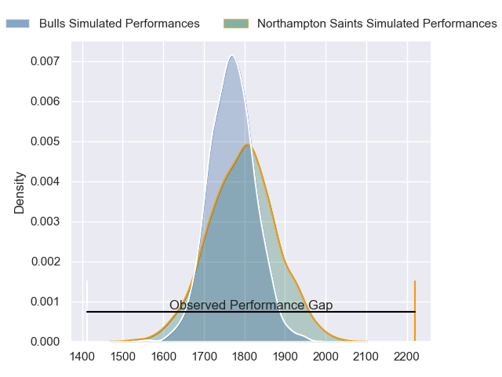
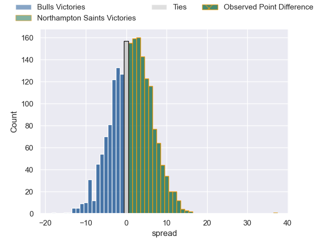
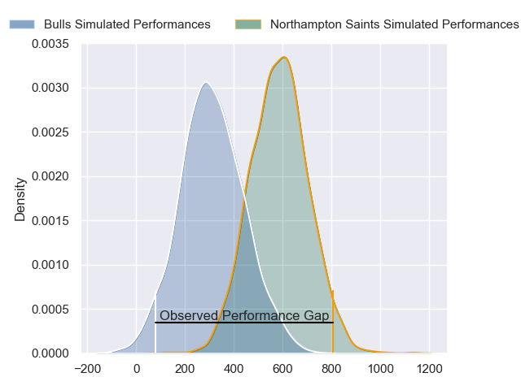
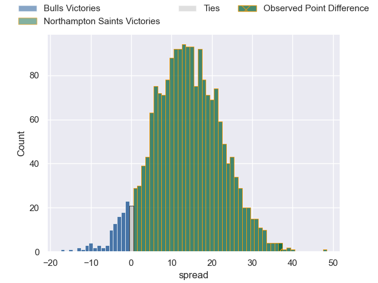
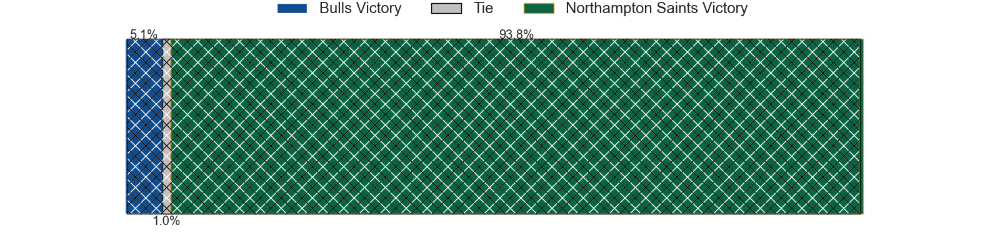

---  
layout: page  
title: Bulls at Northampton Saints; 22-59  
date: 2024-04-13 18:00:00 -0500  
categories: "European Rugby Champions Cup 2023" match review  
---
# Bulls at Northampton Saints; 22-59

# Club Level Predictions

The first set of predictions treats a club as the smallest object, as the club develops its members, organizes a gameplan, and deploys its players as needed for each match. This club model has a prediction of 0.544, which translates to predicting Northampton Saints to win by 1.5.

Our Over/Under is 55.5 - and combined with the spread above, we have a predicted scoreline of 27 to 28

Each club has a rating and a rating deviation (similar to a Glicko rating), and expected performances can be generated. This allows for simulated matches and spreads like the ones below.
## Projected Performances - Club Model

## Projected Spreads - Club Model

## Projected Results - Club Model

# Player Level Predictions - Version 2

Treating teams instead as an entity made up of the currently active players, I have ratings for each player in an altogether different system. These can be combined to form team ratings once teamsheets are announced, weighting starters a bit higher than the reserves. After the match is played, players can be weighted by their minutes on the field, allowing for an accurate measure of the team's composition. With these compiled team ratings, we can make predictions, measure inaccuracy, and update the individual player ratings.
## Prediction without Player Minutes: Northampton Saints by 15.5

Northampton Saints by 7.3 on a neutral pitch

## Projected Performances - Player Model

## Projected Spreads - Player Model

## Projected Results - Player Model

|   Away Minutes | Away Player         |   Away Percentile |   Number |   Home Percentile | Home Player        |   Home Minutes |
|---------------:|:--------------------|------------------:|---------:|------------------:|:-------------------|---------------:|
|             51 | Simphiwe Matanzima  |             77.22 |        1 |             49.38 | Emmanuel Iyogun    |             58 |
|             60 | Akker van der Merwe |             99.41 |        2 |             91.75 | Curtis Langdon     |             52 |
|             51 | Mornay Smith        |             78.84 |        3 |              2.76 | Trevor Davison     |             58 |
|             80 | Janko Swanepoel     |             83.13 |        4 |             96.17 | Alex Moon          |             80 |
|             80 | JF van Heerden      |             38.4  |        5 |             20.88 | Alex Coles         |             69 |
|             80 | Nizaam Carr         |             91.76 |        6 |             97.91 | Courtney Lawes     |             52 |
|             80 | Celimpilo Gumede    |             37.24 |        7 |             98.72 | Sam Graham         |             52 |
|             71 | Cameron Hanekom     |             28.65 |        8 |             67.08 | Juarno Augustus    |             80 |
|             66 | Zak Burger          |             85.89 |        9 |             95.16 | Alex Mitchell      |             69 |
|             66 | Chris William Smith |             34.87 |       10 |             82.05 | Fin Smith          |             80 |
|             80 | Stravino Jacobs     |             32.66 |       11 |             95.83 | Ollie Sleightholme |             80 |
|             60 | Harold Vorster      |             95.75 |       12 |             90.9  | Fraser Dingwall    |             61 |
|             80 | Henry Immelman      |             34.95 |       13 |             96.48 | Tommy Freeman      |             80 |
|             80 | Sebastian de Klerk  |             34.91 |       14 |             87.16 | George Hendy       |             80 |
|             80 | Devon Williams      |             84.46 |       15 |             69.92 | James Ramm         |             80 |
|             20 | Jan-Hendrik Wessels |             47.74 |       16 |             83.5  | Sam Matavesi       |             28 |
|             29 | Dylan Smith         |            nan    |       17 |             97.81 | Alex Waller        |             22 |
|             29 | Francois Klopper    |            nan    |       18 |             98.76 | Paul Hill          |             22 |
|              9 | Merwe Olivier       |            nan    |       19 |             91.03 | Temo Mayanavanua   |             11 |
|              0 | Reinhardt Ludwig    |             73.9  |       20 |             58.12 | Angus Scott-Young  |             28 |
|             14 | Keagan Johannes     |            nan    |       21 |             68.68 | Lewis Ludlam       |             28 |
|             14 | Jaco van der Walt   |             65.38 |       22 |             20.63 | Tom James          |             11 |
|             20 | Cornal Hendricks    |            nan    |       23 |             94.36 | George Furbank     |             19 |

