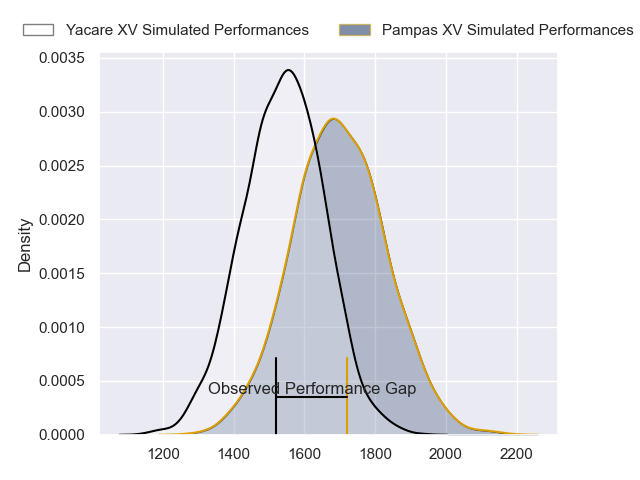
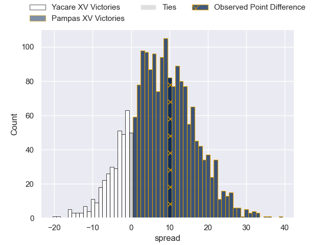
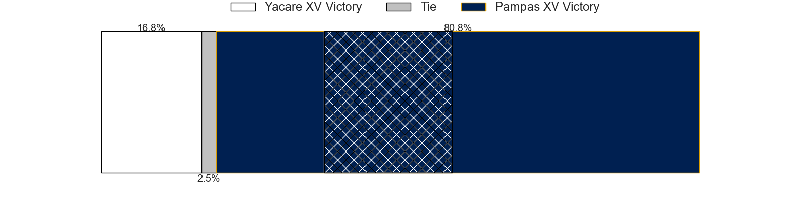
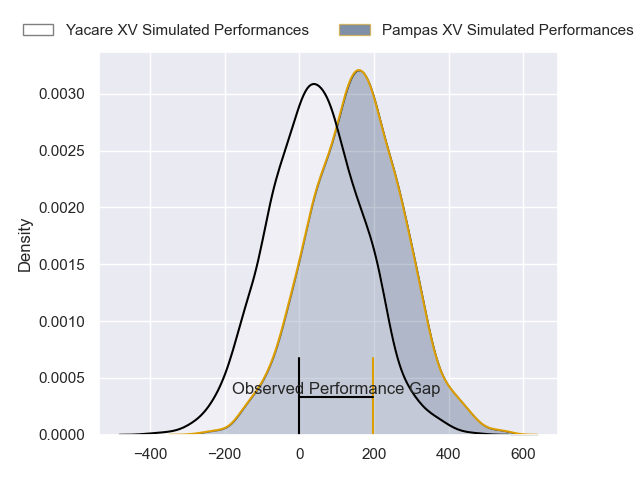
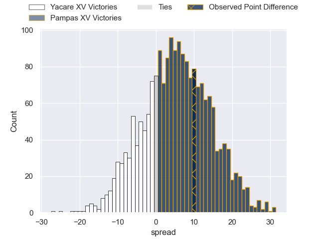

---  
layout: page  
title: Yacare XV at Pampas XV; 12-22  
date: 2024-04-13 18:00:00 -0500  
categories: "Super Rugby Americas 2024" match review  
---
# Yacare XV at Pampas XV; 12-22

# Club Level Predictions

The first set of predictions treats a club as the smallest object, as the club develops its members, organizes a gameplan, and deploys its players as needed for each match. This club model has a prediction of 0.702, which translates to predicting Pampas XV to win by 7.9.

Our Over/Under is 53.5 - and combined with the spread above, we have a predicted scoreline of 23 to 31

Each club has a rating and a rating deviation (similar to a Glicko rating), and expected performances can be generated. This allows for simulated matches and spreads like the ones below.
## Projected Performances - Club Model

## Projected Spreads - Club Model

## Projected Results - Club Model

# Player Level Predictions - Version 2

Treating teams instead as an entity made up of the currently active players, I have ratings for each player in an altogether different system. These can be combined to form team ratings once teamsheets are announced, weighting starters a bit higher than the reserves. After the match is played, players can be weighted by their minutes on the field, allowing for an accurate measure of the team's composition. With these compiled team ratings, we can make predictions, measure inaccuracy, and update the individual player ratings.
## Prediction without Player Minutes: Pampas XV by 6.8

Pampas XV by 4.6 on a neutral pitch

## Projected Performances - Player Model

## Projected Spreads - Player Model

## Projected Results - Player Model

|   Away Minutes | Away Player                 |   Away Percentile |   Number |   Home Percentile | Home Player               |   Home Minutes |
|---------------:|:----------------------------|------------------:|---------:|------------------:|:--------------------------|---------------:|
|             64 | Ezequiel Reyes              |             55.94 |        1 |             81.2  | Matias Medrano            |              8 |
|             61 | Axel Zapata                 |             17.06 |        2 |             33.92 | Ramiro Gurovich           |             66 |
|             58 | Rolando Edgar Portillo      |             22.03 |        3 |             86.32 | Estanislao Carullo        |             51 |
|             68 | Lucio Anconetani            |             29.71 |        4 |              2.27 | Eliseo Fourcade           |             61 |
|             80 | Mariano Garcete Elli        |             20.29 |        5 |             39.86 | Marcelo Toledo            |             80 |
|             80 | Juan Cruz Perez Rachel      |             23.06 |        6 |             52.49 | Manuel Bernstein          |             80 |
|             80 | Felipe Puertas              |              6.49 |        7 |             70.57 | Nicolas Damorim           |             74 |
|             68 | Ramiro Nicolas Parada       |             21.95 |        8 |             48.78 | Joaquin Moro              |             80 |
|             74 | Juan Cruz Strada            |             18.75 |        9 |             60.62 | Ignacio Inchauspe         |             74 |
|             80 | Joaquin Lamas               |             90.75 |       10 |             41    | Manuel Nogues             |             61 |
|             80 | Juan Daniel Gonzalez        |             10.31 |       11 |             39.07 | Jeronimo Ulloa            |             80 |
|             56 | Sebastian Urbieta           |             11.76 |       12 |             83.79 | Justo Piccardo            |             71 |
|             80 | Ramiro Amarilla             |             33.37 |       13 |             44.9  | Bruno Heit                |             80 |
|             80 | Arturo Lopez                |             48.92 |       14 |             59.12 | Santiago Pernas           |             80 |
|             80 | Ramiro Moyano               |             22.69 |       15 |             26.68 | Benjamin Elizalde         |             80 |
|             24 | Tomas Vanni                 |             27.29 |       16 |             46.53 | Javier Angel Coronel      |             29 |
|             22 | Luis Enrique Quinteros      |              9.02 |       17 |             70.05 | Rodrigo Fernandez Criado  |             19 |
|             19 | Ignacio Palillo Neri        |            nan    |       18 |             11.75 | Joaquin de la Vega Mendia |             19 |
|             16 | Daniel Cabral               |            nan    |       19 |             49.41 | Ignacio Bottazini         |             14 |
|             12 | Juan José Heisecke Schauman |            nan    |       20 |             78.63 | Juan Pablo Castro Collado |              9 |
|             12 | Ariel Nuñez                 |            nan    |       21 |             73    | Simon Benitez Cruz        |              6 |
|              6 | Gonzalo Bareiro             |            nan    |       22 |            nan    | Juan Pedro Bernasconi     |              6 |
|            nan | nan                         |            nan    |       23 |              7.69 | Javier Corvalan           |             72 |

