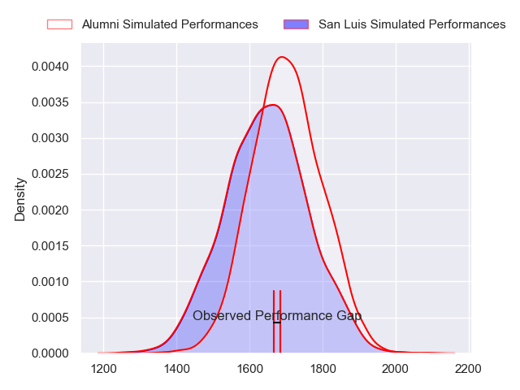
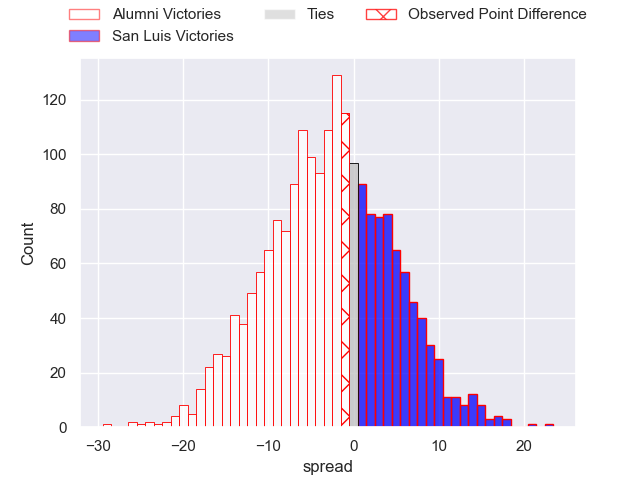
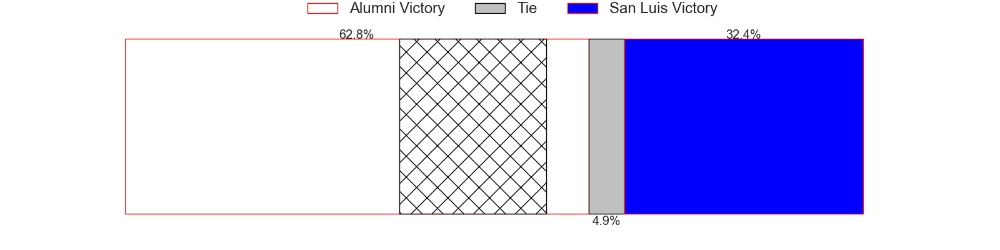
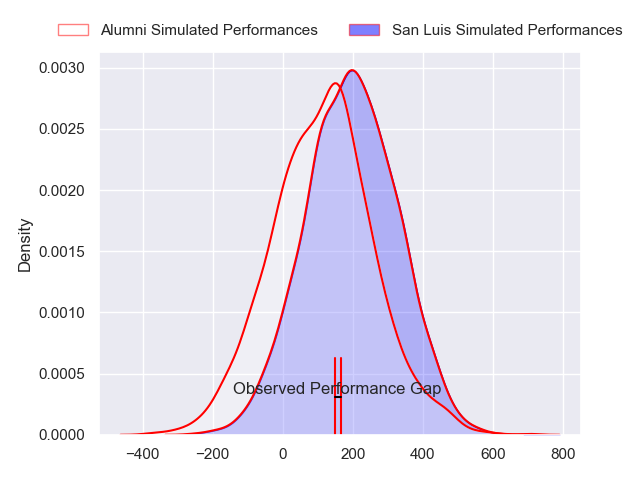
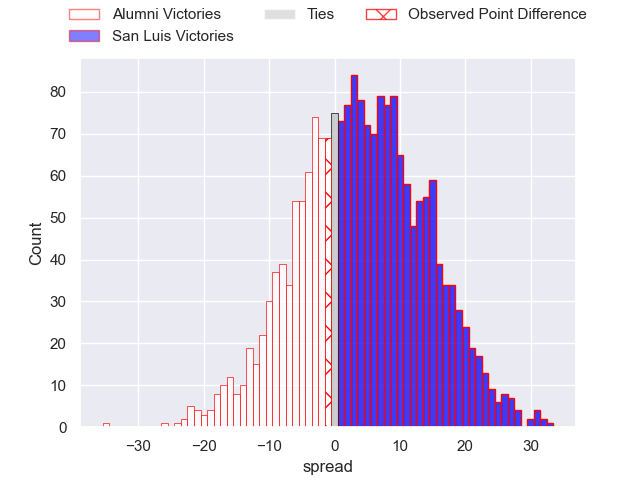
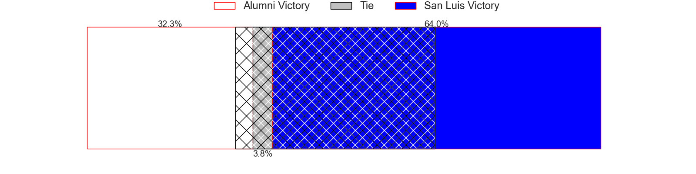

---  
layout: page  
title: Alumni at San Luis; 18-17  
date: 2024-04-13 18:00:00 -0500  
categories: "URBA Top 12 2024" match review  
---
# Alumni at San Luis; 18-17

# Club Level Predictions

The first set of predictions treats a club as the smallest object, as the club develops its members, organizes a gameplan, and deploys its players as needed for each match. This club model has a prediction of 0.424, which translates to predicting Alumni to win by 2.8.

Our Over/Under is 43.5 - and combined with the spread above, we have a predicted scoreline of 23 to 20

Each club has a rating and a rating deviation (similar to a Glicko rating), and expected performances can be generated. This allows for simulated matches and spreads like the ones below.
## Projected Performances - Club Model

## Projected Spreads - Club Model

## Projected Results - Club Model

# Player Level Predictions - Version 2

Treating teams instead as an entity made up of the currently active players, I have ratings for each player in an altogether different system. These can be combined to form team ratings once teamsheets are announced, weighting starters a bit higher than the reserves. After the match is played, players can be weighted by their minutes on the field, allowing for an accurate measure of the team's composition. With these compiled team ratings, we can make predictions, measure inaccuracy, and update the individual player ratings.
## Prediction without Player Minutes: San Luis by 4.1

Alumni by 0.1 on a neutral pitch

## Projected Performances - Player Model

## Projected Spreads - Player Model

## Projected Results - Player Model

|   Away Minutes | Away Player                |   Away Percentile |   Number |   Home Percentile | Home Player                |   Home Minutes |
|---------------:|:---------------------------|------------------:|---------:|------------------:|:---------------------------|---------------:|
|             89 | Federico Lucca             |             70.16 |        1 |             30.03 | Alejo Garcia               |             89 |
|             89 | Tomas Bivort               |             67.58 |        2 |             36.35 | Franco Cantalupo           |             89 |
|             89 | Bautista Vidal             |             68.45 |        3 |             35.46 | Mateo Calistro             |             89 |
|             89 | Manuel Mora                |             68.3  |        4 |             37.44 | Ramiro Bruni               |             89 |
|             89 | Nicolas Promanzio          |             56.22 |        5 |             39.35 | Santiago Canal             |             89 |
|             89 | Ignacio Cubilla            |             62.76 |        6 |             36.77 | Manuel Gnecco              |             89 |
|             89 | Juan Anderson              |             64.04 |        7 |             32.6  | Nahuel Curti               |             89 |
|             89 | Tobias Moyano              |             62.16 |        8 |             42.01 | Agustin Torello            |             89 |
|             89 | Tomas Passerotti           |             66.32 |        9 |             37.05 | Martin Aereboe             |             89 |
|             89 | Joaquin Luzzi              |             58.72 |       10 |             27.44 | Isidro Lazzarini           |             89 |
|             89 | Luca Sabato                |             64.08 |       11 |             36.37 | Eduardo Ruesta             |             89 |
|             89 | Franco Battezzati          |             59.83 |       12 |             34.22 | Guillermo Chaves Lucesole  |             89 |
|             89 | Alejo Chavez               |             61.17 |       13 |             33.25 | Benjamin Marban            |             89 |
|             89 | Ramon Fuentes              |             66.33 |       14 |             33.45 | Segundo Galan              |             89 |
|             89 | Santiago Gonzalez Iglesias |             51.63 |       15 |             33.83 | Valentino Quattrocchi      |             89 |
|              0 | Ezequiel Oliva             |            nan    |       16 |            nan    | Facundo Suarez             |              0 |
|              0 | Santiago Alduncin          |             61.24 |       17 |            nan    | Agustin Fitzsimons Herrera |              0 |
|              0 | Juan Bottoni               |            nan    |       18 |            nan    | Joaquin Napolitano         |              0 |
|              0 | Maximo Lamelas             |            nan    |       19 |             35.87 | Facundo Alvarez Amado      |              0 |
|              0 | Juan Cruz Alvarinas        |            nan    |       20 |            nan    | Franco Gnecco              |              0 |
|              0 | Santiago Ambroa            |            nan    |       21 |            nan    | Juan Vaca                  |              0 |
|              0 | Tomas Corneille            |             52.13 |       22 |            nan    | Felipe Crispo              |              0 |
|              0 | Juan Berreta               |            nan    |       23 |            nan    | Lautaro Grys Arana         |              0 |

