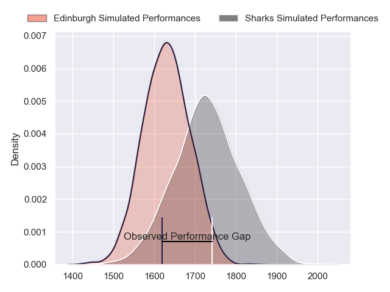
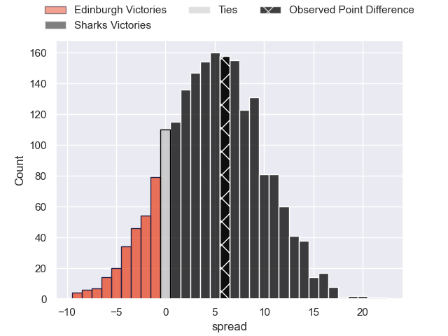
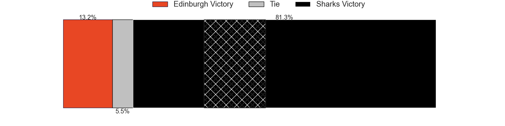
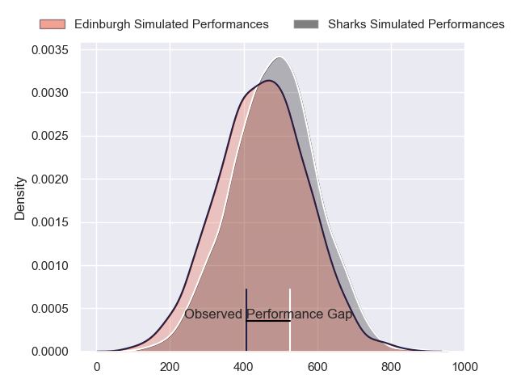
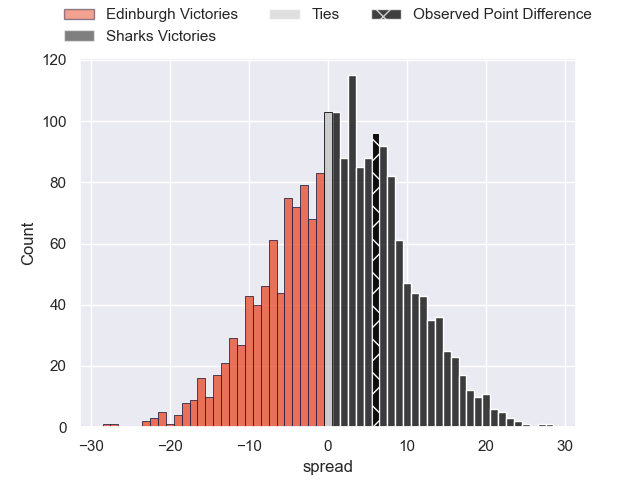

---  
layout: page  
title: Edinburgh at Sharks; 30-36  
date: 2024-04-13 18:00:00 -0500  
categories: "European Rugby Challenge Cup 2023" match review  
---
# Edinburgh at Sharks; 30-36

# Club Level Predictions

The first set of predictions treats a club as the smallest object, as the club develops its members, organizes a gameplan, and deploys its players as needed for each match. This club model has a prediction of 0.641, which translates to predicting Sharks to win by 5.1.

Our Over/Under is 51.5 - and combined with the spread above, we have a predicted scoreline of 23 to 28

Each club has a rating and a rating deviation (similar to a Glicko rating), and expected performances can be generated. This allows for simulated matches and spreads like the ones below.
## Projected Performances - Club Model

## Projected Spreads - Club Model

## Projected Results - Club Model

# Player Level Predictions - Version 2

Treating teams instead as an entity made up of the currently active players, I have ratings for each player in an altogether different system. These can be combined to form team ratings once teamsheets are announced, weighting starters a bit higher than the reserves. After the match is played, players can be weighted by their minutes on the field, allowing for an accurate measure of the team's composition. With these compiled team ratings, we can make predictions, measure inaccuracy, and update the individual player ratings.
## Prediction without Player Minutes: Sharks by 3.6

Edinburgh by 0.8 on a neutral pitch

## Projected Performances - Player Model

## Projected Spreads - Player Model

## Projected Results - Player Model

|   Away Minutes | Away Player         |   Away Percentile |   Number |   Home Percentile | Home Player         |   Home Minutes |
|---------------:|:--------------------|------------------:|---------:|------------------:|:--------------------|---------------:|
|             63 | Pierre Schoeman     |             90.98 |        1 |             99.81 | Ox Nche             |             69 |
|             58 | Ewan Ashman         |             81.76 |        2 |             96.47 | Bongi Mbonambi      |             58 |
|             66 | WP Nel              |             98.96 |        3 |             56.41 | Vincent Koch        |             74 |
|             84 | Sam Skinner         |             77.33 |        4 |             98.45 | Eben Etzebeth       |             84 |
|             63 | Grant Gilchrist     |             94.75 |        5 |             59.07 | Emile van Heerden   |             74 |
|             84 | Jamie Ritchie       |            100    |        6 |             71.38 | James Venter        |             38 |
|             84 | Hamish Watson       |             54.35 |        7 |             85.28 | Vincent Tshituka    |             84 |
|             58 | Viliame Mata        |             75.85 |        8 |             57.32 | Phepsi Buthelezi    |             84 |
|             58 | Ben Vellacott       |             77.29 |        9 |             84.38 | Jaden Hendrikse     |             63 |
|             84 | Ben Healy           |             76.75 |       10 |             55.75 | Siya Masuku         |             74 |
|             84 | Duhan van der Merwe |             82.67 |       11 |             99.55 | Makazole Mapimpi    |             84 |
|             84 | Matt Currie         |             80.07 |       12 |             46.94 | Ethan Hooker        |             70 |
|             66 | Mark Bennett        |             64.35 |       13 |             86.55 | Lukhanyo Am         |             84 |
|             70 | Jacob Henry         |             25.48 |       14 |             74.63 | Werner Kok          |             84 |
|             84 | Wes Goosen          |             92.52 |       15 |             91.52 | Aphelele Fassi      |             84 |
|             26 | Dave Cherry         |             56.27 |       16 |            nan    | Dan Jooste          |             26 |
|             21 | Boan Venter         |             15.86 |       17 |             33.14 | Ntuthuko Mchunu     |             15 |
|             18 | D'Arcy Rae          |             53.18 |       18 |             51.95 | Hanru Jacobs        |             10 |
|             21 | Jamie Hodgson       |             88.78 |       19 |             54.77 | Corne Rahl          |             10 |
|             26 | Luke Crosbie        |             93.74 |       20 |             40.79 | Jeandre Labuschagne |             46 |
|             26 | Ali Price           |             83.75 |       21 |             55.42 | Grant Williams      |             21 |
|             18 | James Lang          |             92.44 |       22 |             86    | Curwin Bosch        |             10 |
|             14 | Chris Dean          |              9.36 |       23 |             48.98 | Francois Venter     |             14 |

