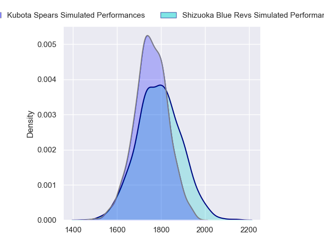
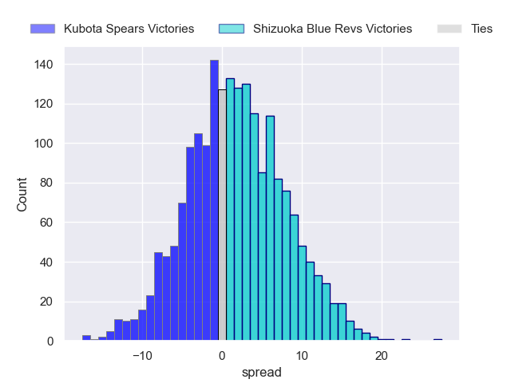
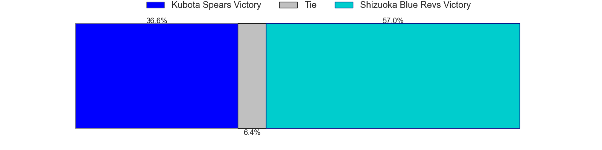
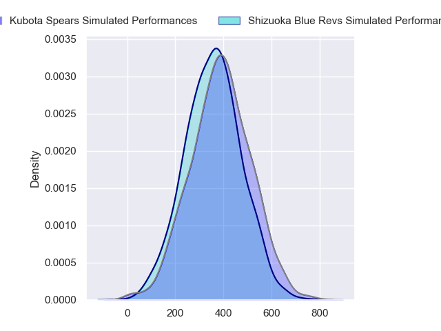
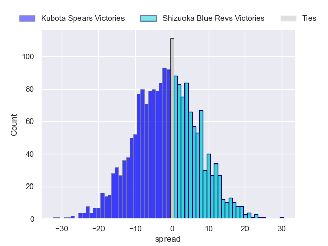
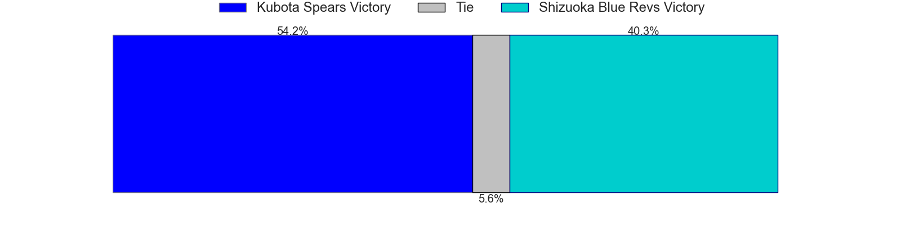

---  
layout: page  
title: Kubota Spears at Shizuoka Blue Revs; 31-31  
date: 2024-04-13 18:00:00 -0500  
categories: "Japan Rugby League One 2023" match review  
---
# Kubota Spears at Shizuoka Blue Revs; 31-31

# Club Level Predictions

The first set of predictions treats a club as the smallest object, as the club develops its members, organizes a gameplan, and deploys its players as needed for each match. This club model has a prediction of 0.557, which translates to predicting Shizuoka Blue Revs to win by 2.0.

Our Over/Under is 51.5 - and combined with the spread above, we have a predicted scoreline of 25 to 27

Each club has a rating and a rating deviation (similar to a Glicko rating), and expected performances can be generated. This allows for simulated matches and spreads like the ones below.
## Projected Performances - Club Model

## Projected Spreads - Club Model

## Projected Results - Club Model

# Player Level Predictions - Version 2

Treating teams instead as an entity made up of the currently active players, I have ratings for each player in an altogether different system. These can be combined to form team ratings once teamsheets are announced, weighting starters a bit higher than the reserves. After the match is played, players can be weighted by their minutes on the field, allowing for an accurate measure of the team's composition. With these compiled team ratings, we can make predictions, measure inaccuracy, and update the individual player ratings.
## Prediction without Player Minutes: Shizuoka Blue Revs by 0.5

Kubota Spears by 2.7 on a neutral pitch

## Projected Performances - Player Model

## Projected Spreads - Player Model

## Projected Results - Player Model

|   Away Minutes | Away Player         |   Away Percentile |   Number |   Home Percentile | Home Player        |   Home Minutes |
|---------------:|:--------------------|------------------:|---------:|------------------:|:-------------------|---------------:|
|             53 | Kota Kaishi         |             83.98 |        1 |             44.14 | Takayoshi Mohara   |             75 |
|             53 | Dane Coles          |             99.8  |        2 |             97.45 | Takeshi Hino       |             73 |
|             53 | Opeti Helu          |             71.21 |        3 |             90.09 | Heiichiro Ito      |             53 |
|             80 | Ruan Botha          |             97.97 |        4 |             88.76 | Eishin Kuwano      |             80 |
|             53 | David Bulbring      |             72.25 |        5 |             94.14 | Murray Douglas     |             52 |
|             80 | Lappies Labuschagne |             85.38 |        6 |             94.78 | Yuya Odo           |             80 |
|             68 | Takeo Suenaga       |             78.42 |        7 |             53.25 | Shoji Takuma       |             53 |
|             80 | Faulua Makisi       |             81.08 |        8 |             57.25 | Malgene Ilaua      |             40 |
|             67 | Shinobu Fujiwara    |             31.16 |        9 |             96.63 | Bryn Hall          |             40 |
|             80 | Bernard Foley       |             98.72 |       10 |             34.1  | Kakeru Okumura     |             80 |
|             80 | Suryung Kim         |             77.14 |       11 |             85.02 | Malo Tuitama       |             80 |
|             80 | Harumichi Tatekawa  |             58.74 |       12 |             54    | Sylvian Mahuza     |             75 |
|             53 | Sione Teaupa        |             74.88 |       13 |             89.68 | Charles Piutau     |             80 |
|             67 | Koga Nezuka         |             83.33 |       14 |             61.49 | Keagan Faria       |             80 |
|             80 | Yuhei Shimada       |             18.55 |       15 |             74.44 | Futo Yamaguchi     |             80 |
|             29 | Hayate Era          |            nan    |       16 |             51.6  | Sione Vuna         |             42 |
|             29 | Yota Kaminori       |             50.62 |       17 |             60.63 | Kodai Okazaki      |             42 |
|             29 | Kengo Kitagawa      |             85.22 |       18 |             55.48 | Sean Vete          |             29 |
|             29 | JD Schickerling     |              3.11 |       19 |             45.48 | Vueti Tupou        |             30 |
|             29 | Rikus Pretorius     |             37.99 |       20 |             49.54 | Richard Goh Jones  |             29 |
|             15 | Tomoki Kishioka     |             44.87 |       21 |            nan    | Richmond Tongatama |              9 |
|             15 | Halatoa Vailea      |             72.3  |       22 |             40.99 | Kenta Yamashita    |              7 |
|             14 | Finau Tupa          |             69.37 |       23 |             76.58 | Jonathan Faauli    |              7 |

