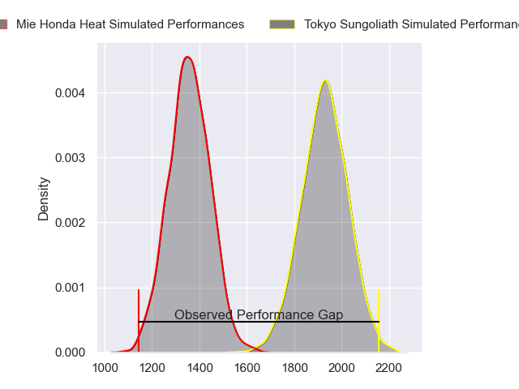
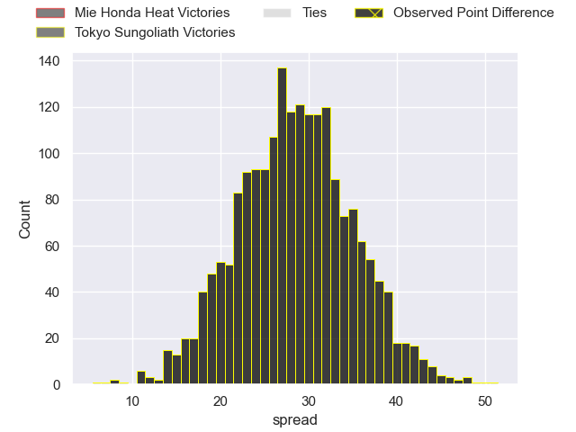
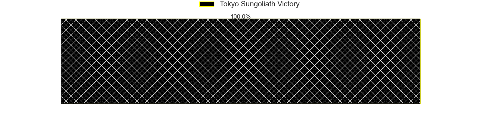
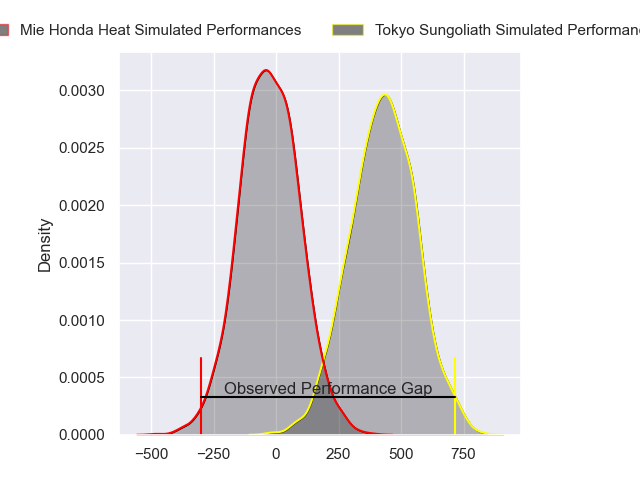
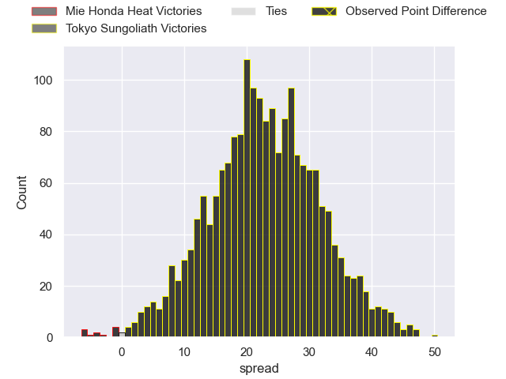
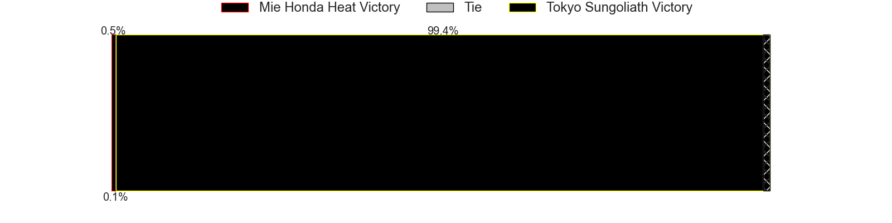

---  
layout: page  
title: Mie Honda Heat at Tokyo Sungoliath; 10-60  
date: 2024-04-13 18:00:00 -0500  
categories: "Japan Rugby League One 2023" match review  
---
# Mie Honda Heat at Tokyo Sungoliath; 10-60

# Club Level Predictions

The first set of predictions treats a club as the smallest object, as the club develops its members, organizes a gameplan, and deploys its players as needed for each match. This club model has a prediction of 0.96, which translates to predicting Tokyo Sungoliath to win by 28.5.

Our Over/Under is 68.5 - and combined with the spread above, we have a predicted scoreline of 20 to 49

Each club has a rating and a rating deviation (similar to a Glicko rating), and expected performances can be generated. This allows for simulated matches and spreads like the ones below.
## Projected Performances - Club Model

## Projected Spreads - Club Model

## Projected Results - Club Model

# Player Level Predictions - Version 2

Treating teams instead as an entity made up of the currently active players, I have ratings for each player in an altogether different system. These can be combined to form team ratings once teamsheets are announced, weighting starters a bit higher than the reserves. After the match is played, players can be weighted by their minutes on the field, allowing for an accurate measure of the team's composition. With these compiled team ratings, we can make predictions, measure inaccuracy, and update the individual player ratings.
## Prediction without Player Minutes: Tokyo Sungoliath by 23.9

Tokyo Sungoliath by 20.6 on a neutral pitch

## Projected Performances - Player Model

## Projected Spreads - Player Model

## Projected Results - Player Model

|   Away Minutes | Away Player         |   Away Percentile |   Number |   Home Percentile | Home Player         |   Home Minutes |
|---------------:|:--------------------|------------------:|---------:|------------------:|:--------------------|---------------:|
|             47 | Takumi Fuji         |             15.25 |        1 |             92.37 | Yukio Morikawa      |             80 |
|             47 | Lee Seung Hyok      |              5.3  |        2 |             72.3  | Kosuke Horikoshi    |             80 |
|             47 | Matthys Basson      |             21.64 |        3 |             87.42 | Shinnosuke Kakinaga |             80 |
|             80 | Yoji Akiyama        |             24.16 |        4 |             97.13 | Sam Jeffries        |             80 |
|             62 | Franco Mostert      |             90.31 |        5 |             98.68 | Harry Hockings      |             80 |
|             80 | Ryota Kobayashi     |              3.36 |        6 |             58.82 | Ryuga Hashimoto     |             80 |
|             47 | Kosuke Hattori      |             47.8  |        7 |             53.6  | Kai Yamamoto        |             80 |
|             80 | Ryo Furuta          |              2.46 |        8 |             27.76 | Tamati Ioane        |             80 |
|             47 | Shogo Nezuka        |             14.95 |        9 |             86.53 | Yutaka Nagare       |             80 |
|             80 | Gwangtee Oh         |             18.97 |       10 |             71.54 | Mikiya Takamoto     |             80 |
|             62 | Kanta Watanabe      |             23.76 |       11 |             74.44 | Shota Emi           |             80 |
|             80 | Dawid Kellerman     |             11.89 |       12 |             47.57 | Isaiah Punivai      |             80 |
|             51 | Soki Watanabe       |             16.02 |       13 |             75.12 | Taiga Ozaki         |             80 |
|             80 | Haruhiko Uemura     |             14.64 |       14 |             92.91 | Seiya Ozaki         |             80 |
|             80 | Tom Banks           |             80.2  |       15 |             95.49 | Kotaro Matsushima   |             80 |
|             33 | Koki Hida           |            nan    |       16 |            nan    | nan                 |            nan |
|             33 | Tatsuhiko Tsurukawa |              2.67 |       17 |            nan    | nan                 |            nan |
|             33 | Katsuyuki Hoshino   |             18.3  |       18 |            nan    | nan                 |            nan |
|             33 | Waimana Kapa        |             21.62 |       19 |            nan    | nan                 |            nan |
|             33 | Taichi Takenaka     |            nan    |       20 |            nan    | nan                 |            nan |
|             29 | Fraser Quirk        |              4.85 |       21 |            nan    | nan                 |            nan |
|             18 | Connor Wihongi      |            nan    |       22 |            nan    | nan                 |            nan |
|             18 | Mitch Hunt          |             62.82 |       23 |            nan    | nan                 |            nan |

