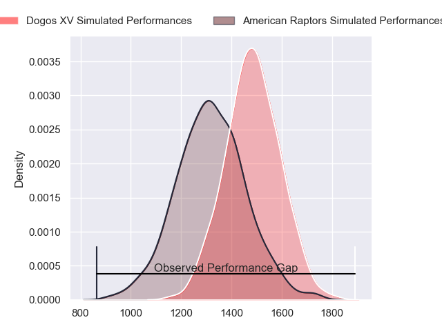
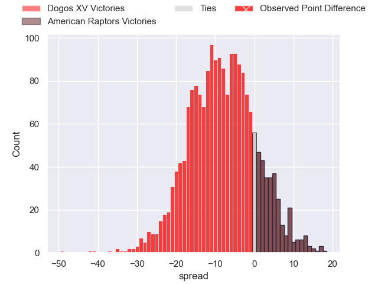
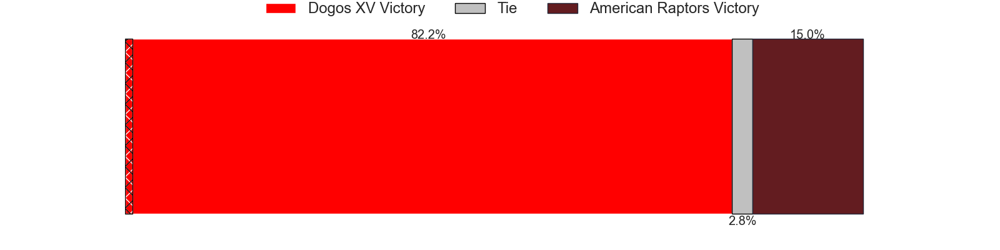
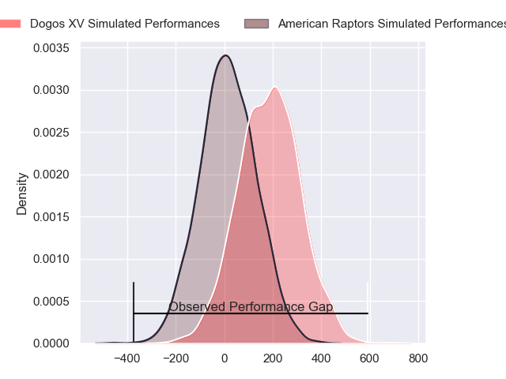
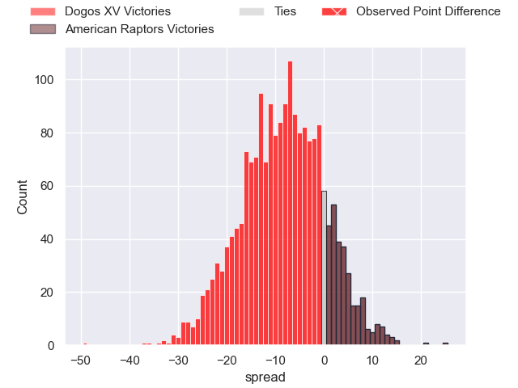
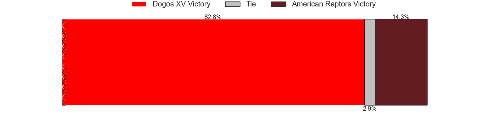

---  
layout: page  
title: Dogos XV at American Raptors; 63-14  
date: 2024-04-14 18:00:00 -0500  
categories: "Super Rugby Americas 2024" match review  
---
# Dogos XV at American Raptors; 63-14

# Club Level Predictions

The first set of predictions treats a club as the smallest object, as the club develops its members, organizes a gameplan, and deploys its players as needed for each match. This club model has a prediction of 0.285, which translates to predicting Dogos XV to win by 8.4.

Our Over/Under is 52.5 - and combined with the spread above, we have a predicted scoreline of 30 to 22

Each club has a rating and a rating deviation (similar to a Glicko rating), and expected performances can be generated. This allows for simulated matches and spreads like the ones below.
## Projected Performances - Club Model

## Projected Spreads - Club Model

## Projected Results - Club Model

# Player Level Predictions - Version 2

Treating teams instead as an entity made up of the currently active players, I have ratings for each player in an altogether different system. These can be combined to form team ratings once teamsheets are announced, weighting starters a bit higher than the reserves. After the match is played, players can be weighted by their minutes on the field, allowing for an accurate measure of the team's composition. With these compiled team ratings, we can make predictions, measure inaccuracy, and update the individual player ratings.
## Prediction without Player Minutes: Dogos XV by 10.0

Dogos XV by 12.3 on a neutral pitch

## Projected Performances - Player Model

## Projected Spreads - Player Model

## Projected Results - Player Model

|   Away Minutes | Away Player                 |   Away Percentile |   Number |   Home Percentile | Home Player           |   Home Minutes |
|---------------:|:----------------------------|------------------:|---------:|------------------:|:----------------------|---------------:|
|             66 | Boris Wenger                |             79.58 |        1 |             12.92 | Ma'ake Muti           |             66 |
|             71 | Tomas Bartolini             |             34.12 |        2 |             35.69 | Jackson Zabierek      |             45 |
|             45 | Octavio Filippa             |             81.1  |        3 |             43.78 | Facundo Pomponio      |             53 |
|             80 | Lautaro Simes               |             72.79 |        4 |              3.1  | Will Crawford         |             59 |
|             54 | Franco Molina               |             95.94 |        5 |             12.41 | Mikey Grandy          |             30 |
|             54 | Aitor Bildosola             |             53.53 |        6 |             20.51 | Shawn Clark           |             80 |
|             57 | Lorenzo Colidio             |             54.23 |        7 |             28.51 | Alexander Vainikolo   |             80 |
|             80 | Valentin Cabral             |             59.02 |        8 |              0.24 | Diego Magno           |             80 |
|             59 | Agustin Moyano              |             73.75 |        9 |              1.04 | Devereaux Ferris      |             64 |
|             80 | Gregorio Hernandez          |             59.75 |       10 |             27    | Ignacio Mieres        |             55 |
|             80 | Nahuel Romero               |             56.17 |       11 |             19.93 | Jake Hidalgo          |             40 |
|             80 | Leonardo Gea Salim          |             54.86 |       12 |             18.61 | Aki Pulu              |             80 |
|             80 | Felipe Mallia               |             55.1  |       13 |             74.19 | Thomas Morani         |             80 |
|             26 | Lautaro Cipriani            |             46.32 |       14 |             45.75 | Daytwon Sheridan      |             80 |
|             80 | Mateo Soler                 |             62.59 |       15 |             23.94 | Francisco Quinn       |             80 |
|             54 | Agustin De Vertiz           |            nan    |       16 |             56.32 | Tommy Clark           |             21 |
|             35 | Pedro Delgado               |            nan    |       17 |             16.71 | Javon Camp-Villalovos |             50 |
|             21 | Nicolas Viola               |            nan    |       18 |             18.13 | Watson Filikitonga    |             40 |
|             26 | Facundo Garcia Hamilton     |            nan    |       19 |             14.12 | Diego Fortuny         |             35 |
|             26 | Federico Rolotti            |            nan    |       20 |            nan    | Koby Baker            |             27 |
|             23 | Valentino DI Capua          |            nan    |       21 |             24    | Patrick Madden        |             25 |
|             14 | Octavio Barbatti            |            nan    |       22 |             22.92 | John LeFevre          |             16 |
|              9 | Santos Maria Juarez Estrada |            nan    |       23 |            nan    | Clay Markoff          |             14 |

