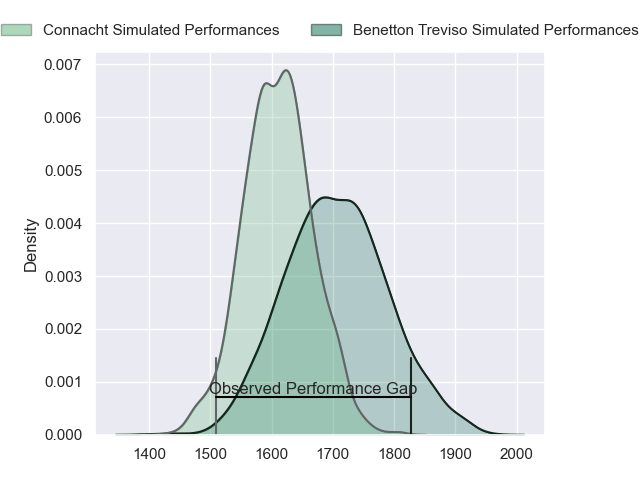
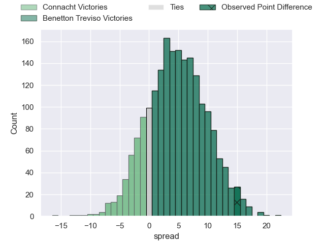
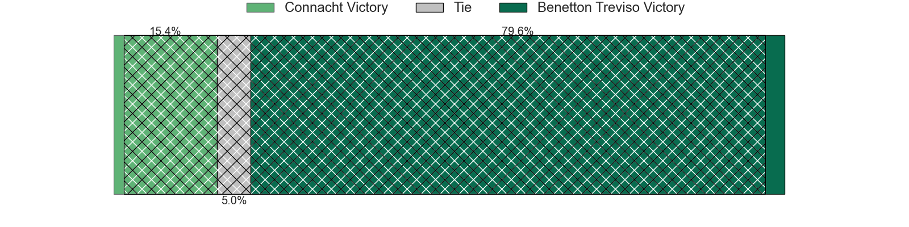
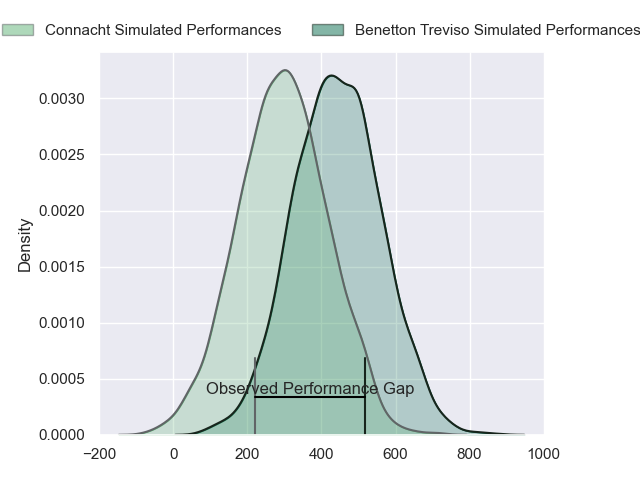
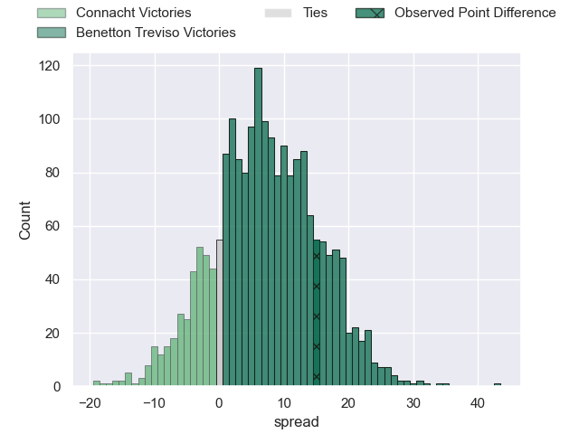
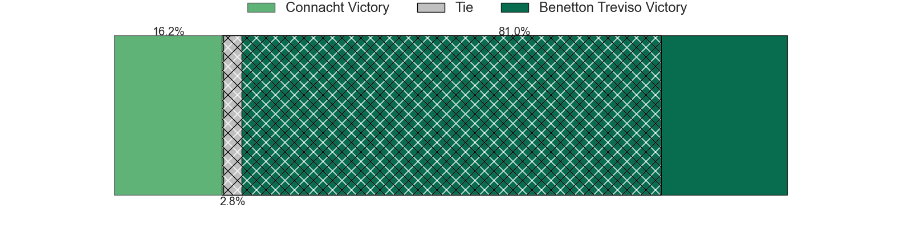

---  
layout: page  
title: Connacht at Benetton Treviso; 24-39  
date: 2024-04-14 18:00:00 -0500  
categories: "European Rugby Challenge Cup 2023" match review  
---
# Connacht at Benetton Treviso; 24-39

# Club Level Predictions

The first set of predictions treats a club as the smallest object, as the club develops its members, organizes a gameplan, and deploys its players as needed for each match. This club model has a prediction of 0.635, which translates to predicting Benetton Treviso to win by 4.9.

Our Over/Under is 49.5 - and combined with the spread above, we have a predicted scoreline of 22 to 27

Each club has a rating and a rating deviation (similar to a Glicko rating), and expected performances can be generated. This allows for simulated matches and spreads like the ones below.
## Projected Performances - Club Model

## Projected Spreads - Club Model

## Projected Results - Club Model

# Player Level Predictions - Version 2

Treating teams instead as an entity made up of the currently active players, I have ratings for each player in an altogether different system. These can be combined to form team ratings once teamsheets are announced, weighting starters a bit higher than the reserves. After the match is played, players can be weighted by their minutes on the field, allowing for an accurate measure of the team's composition. With these compiled team ratings, we can make predictions, measure inaccuracy, and update the individual player ratings.
## Prediction without Player Minutes: Benetton Treviso by 8.6

Benetton Treviso by 3.4 on a neutral pitch

## Projected Performances - Player Model

## Projected Spreads - Player Model

## Projected Results - Player Model

|   Away Minutes | Away Player           |   Away Percentile |   Number |   Home Percentile | Home Player         |   Home Minutes |
|---------------:|:----------------------|------------------:|---------:|------------------:|:--------------------|---------------:|
|             48 | Denis Buckley         |             87.51 |        1 |             89.9  | Thomas Gallo        |             47 |
|             66 | Dave Heffernan        |             65.23 |        2 |             85.27 | Gianmarco Lucchesi  |             59 |
|             48 | Finlay Bealham        |             96.47 |        3 |             95.9  | Simone Ferrari      |             47 |
|             53 | Joe Joyce             |             95.22 |        4 |             65.79 | Niccolo Cannone     |             80 |
|             80 | Darragh Murray        |             42.58 |        5 |             96.29 | Federico Ruzza      |             14 |
|             80 | Cian Prendergast      |             57.08 |        6 |             87.24 | Sebastian Negri     |             76 |
|             80 | Shamus Hurley-Langton |             59.28 |        7 |             96.64 | Michele Lamaro      |             80 |
|             48 | Paul Boyle            |             57    |        8 |             72.73 | Toa Halafihi        |             47 |
|             59 | Caolin Blade          |             75.79 |        9 |             70.32 | Alessandro Garbisi  |             76 |
|             80 | JJ Hanrahan           |             87.44 |       10 |             79.23 | Tomas Albornoz      |             80 |
|             80 | Shane Jennings        |             54.64 |       11 |             34.23 | Onisi Ratave        |             80 |
|             80 | Bundee Aki            |             98.67 |       12 |             93.2  | Juan Ignacio Brex   |             80 |
|             62 | David Hawkshaw        |             70.75 |       13 |             88.71 | Tommaso Menoncello  |             80 |
|             80 | Andrew Smith          |              8.9  |       14 |             19.37 | Ignacio Mendy       |              6 |
|             53 | Tiernan O'Halloran    |             86.72 |       15 |             88.97 | Rhyno Smith         |             80 |
|             14 | Eoin de Buitléar      |             57.76 |       16 |            nan    | Bautista Bernasconi |             21 |
|             32 | Peter Dooley          |             97.43 |       17 |             55.2  | Mirco Spagnolo      |             33 |
|             32 | Sam Illo              |            nan    |       18 |             65.68 | Giosue Zilocchi     |             33 |
|             27 | Niall Murray          |             89.83 |       19 |             74.28 | Eli Snyman          |             66 |
|             32 | Conor Oliver          |             82.37 |       20 |             53.71 | Alessandro Izekor   |              0 |
|             21 | Matthew Devine        |             46.95 |       21 |             91.4  | Lorenzo Cannone     |             33 |
|             18 | Cathal Forde          |             21.72 |       22 |             16    | Andy Uren           |              4 |
|             27 | Tom Farrell           |             52.55 |       23 |             68.72 | Jacob Umaga         |             74 |

