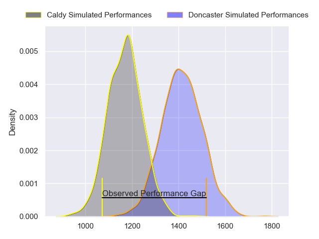
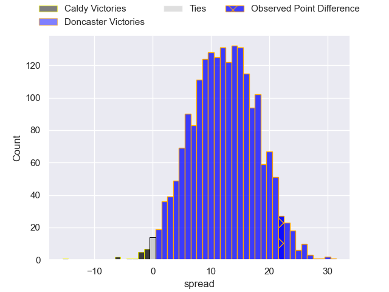
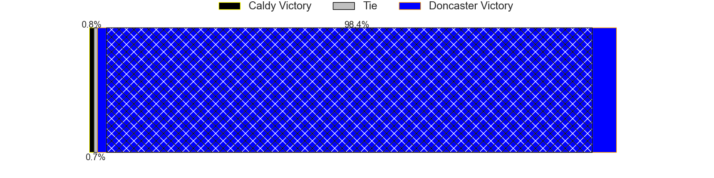
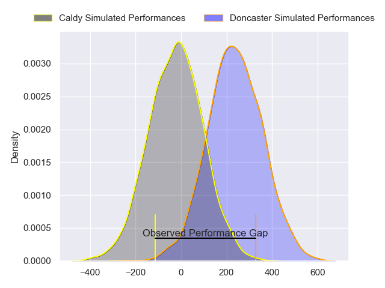
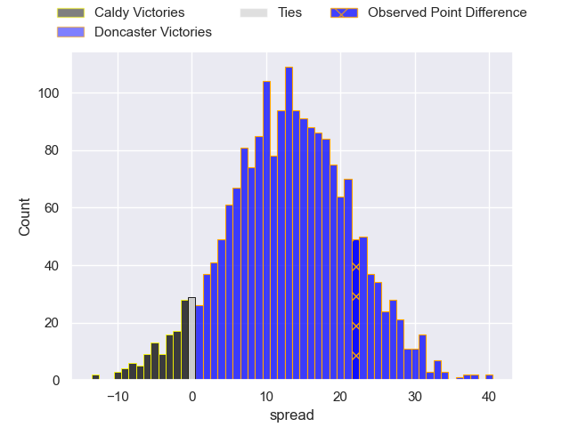
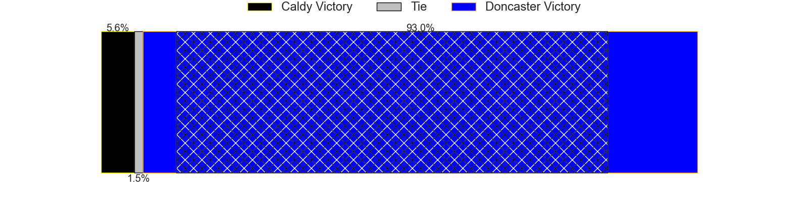

---  
layout: page  
title: Caldy at Doncaster; 7-29  
date: 2024-04-14 18:00:00 -0500  
categories: "RFU Championship 2023" match review  
---
# Caldy at Doncaster; 7-29

# Club Level Predictions

The first set of predictions treats a club as the smallest object, as the club develops its members, organizes a gameplan, and deploys its players as needed for each match. This club model has a prediction of 0.8, which translates to predicting Doncaster to win by 12.4.

Our Over/Under is 47.5 - and combined with the spread above, we have a predicted scoreline of 18 to 30

Each club has a rating and a rating deviation (similar to a Glicko rating), and expected performances can be generated. This allows for simulated matches and spreads like the ones below.
## Projected Performances - Club Model

## Projected Spreads - Club Model

## Projected Results - Club Model

# Player Level Predictions - Version 2

Treating teams instead as an entity made up of the currently active players, I have ratings for each player in an altogether different system. These can be combined to form team ratings once teamsheets are announced, weighting starters a bit higher than the reserves. After the match is played, players can be weighted by their minutes on the field, allowing for an accurate measure of the team's composition. With these compiled team ratings, we can make predictions, measure inaccuracy, and update the individual player ratings.
## Prediction without Player Minutes: Doncaster by 13.0

Doncaster by 9.5 on a neutral pitch

## Projected Performances - Player Model

## Projected Spreads - Player Model

## Projected Results - Player Model

|   Away Minutes | Away Player      |   Away Percentile |   Number |   Home Percentile | Home Player       |   Home Minutes |
|---------------:|:-----------------|------------------:|---------:|------------------:|:------------------|---------------:|
|             49 | Adam Aigbokhae   |             17.92 |        1 |             78.07 | Conor Davidson    |             57 |
|             40 | Matt Gallagher   |             53.83 |        2 |             45.38 | George Roberts    |             73 |
|             49 | Monty Weatherby  |             62.15 |        3 |             98.28 | Lewis Thiede      |             47 |
|             80 | Josiah Dickinson |             17.22 |        4 |             85.89 | Evan Mintern      |             55 |
|             80 | Adam McNamee     |             38.64 |        5 |             69.38 | Ben Murphy        |             80 |
|             80 | Sam Olyott       |             12.88 |        6 |             40.6  | Fyn Brown         |             47 |
|             40 | Ciaran Booth     |             60.79 |        7 |             57.54 | Archie Smeaton    |             80 |
|             67 | Callum Ridgway   |              7.62 |        8 |             21.38 | Harry Wilson      |             67 |
|             49 | Chris Pilgrim    |              8    |        9 |              4.84 | Ollie Fox         |             67 |
|             26 | Sam Rogers       |             48.46 |       10 |             90.26 | Russell Bennett   |             80 |
|             80 | William Robinson |             22.86 |       11 |             30.52 | Jack Metcalf      |             80 |
|             55 | Michael Barlow   |             36.65 |       12 |             11.04 | Connor Edwards    |             57 |
|             80 | Connor Wilkinson |             30.1  |       13 |             61.53 | Joe Margetts      |             80 |
|             80 | Nick Royle       |             11.15 |       14 |             41.89 | George Simpson    |             80 |
|             80 | Rhys Hayes       |             13.53 |       15 |             87.97 | Billy McBryde     |             80 |
|             54 | Lewis Barker     |              5.9  |       16 |             32.51 | Corrie Barrett    |             33 |
|             40 | Oliver Hearn     |             12.97 |       17 |             70.45 | Charlie Beckett   |             33 |
|             40 | Tristan Woodman  |            nan    |       18 |             44.5  | Adam Hopkinson    |             25 |
|             31 | Nathan Rushton   |             13.06 |       19 |             68.64 | Harrison Courtney |             23 |
|             31 | Joe Sproston     |             14.2  |       20 |             78.64 | Sam Bedlow        |             23 |
|             31 | Ollie Wynn       |            nan    |       21 |             82.74 | Alex Dolly        |             13 |
|             25 | Michael Cartmill |              3.76 |       22 |             54.76 | Rhys Tait         |             13 |
|             13 | Callum Atkinson  |             45.57 |       23 |             87.23 | Andrew Foster     |              7 |

