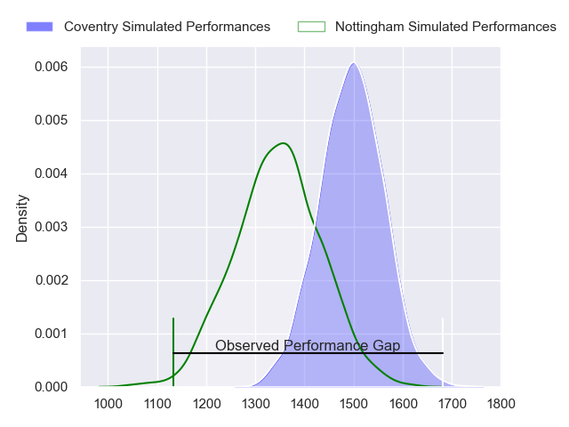
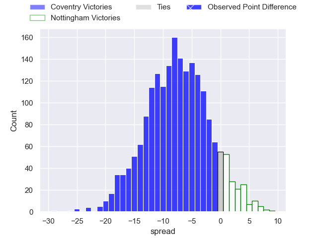
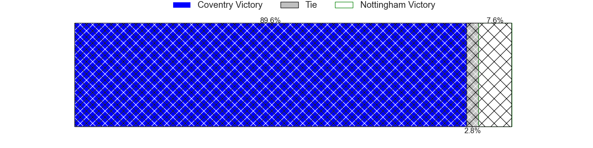
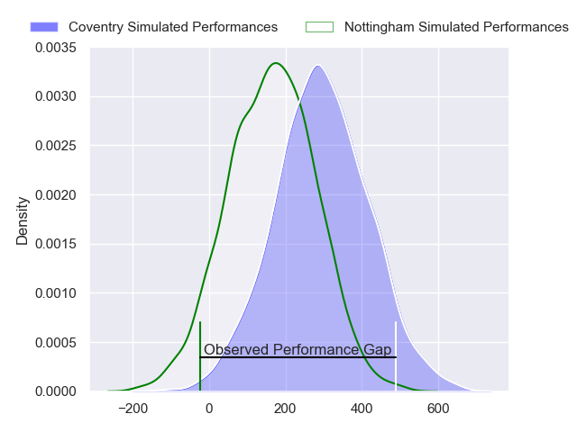
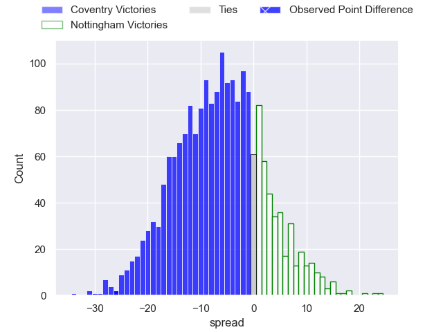
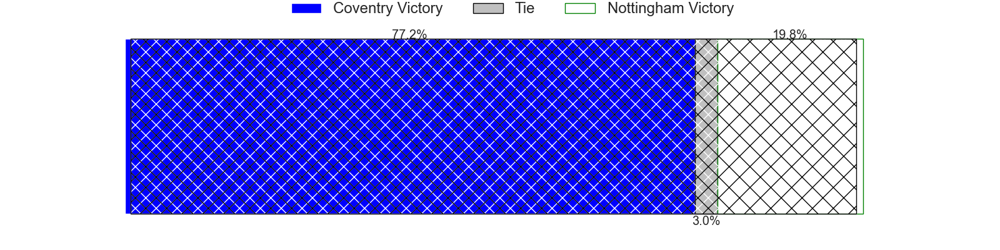

---  
layout: page  
title: Coventry at Nottingham; 52-26  
date: 2024-04-14 18:00:00 -0500  
categories: "RFU Championship 2023" match review  
---
# Coventry at Nottingham; 52-26

# Club Level Predictions

The first set of predictions treats a club as the smallest object, as the club develops its members, organizes a gameplan, and deploys its players as needed for each match. This club model has a prediction of 0.299, which translates to predicting Coventry to win by 7.5.

Our Over/Under is 58.5 - and combined with the spread above, we have a predicted scoreline of 33 to 26

Each club has a rating and a rating deviation (similar to a Glicko rating), and expected performances can be generated. This allows for simulated matches and spreads like the ones below.
## Projected Performances - Club Model

## Projected Spreads - Club Model

## Projected Results - Club Model

# Player Level Predictions - Version 2

Treating teams instead as an entity made up of the currently active players, I have ratings for each player in an altogether different system. These can be combined to form team ratings once teamsheets are announced, weighting starters a bit higher than the reserves. After the match is played, players can be weighted by their minutes on the field, allowing for an accurate measure of the team's composition. With these compiled team ratings, we can make predictions, measure inaccuracy, and update the individual player ratings.
## Prediction without Player Minutes: Coventry by 9.1

Coventry by 12.5 on a neutral pitch

## Projected Performances - Player Model

## Projected Spreads - Player Model

## Projected Results - Player Model

|   Away Minutes | Away Player        |   Away Percentile |   Number |   Home Percentile | Home Player             |   Home Minutes |
|---------------:|:-------------------|------------------:|---------:|------------------:|:------------------------|---------------:|
|             50 | Toby Trinder       |             93.04 |        1 |             60.82 | Archie Van der Flier    |             35 |
|             24 | Suva Ma'asi        |             73.48 |        2 |             80.94 | Harry Clayton           |             50 |
|             50 | Adam Nicol         |             62.25 |        3 |             14.87 | Jake Bridges            |             35 |
|             80 | James Tyas         |             72.61 |        4 |              1.91 | Sebastien Ferreira      |             80 |
|             48 | Obinna Nkwocha     |             61.48 |        5 |             35.65 | Come Clayver Joussain   |             50 |
|             80 | Tom Ball           |             88.75 |        6 |             59.05 | Kayde Sylvester         |             15 |
|             48 | Matt Kvesic        |             54.18 |        7 |             63.57 | Nathan Tweedy           |             80 |
|             17 | Senitiki Nayalo    |             97.54 |        8 |             51.11 | Richard Clift           |             70 |
|             59 | Will Chudley       |            100    |        9 |             13.68 | Will Yarnell            |             59 |
|             80 | Patrick Pellegrini |             86.41 |       10 |             11.79 | Morgan Bunting          |             59 |
|             50 | James Martin       |             94.03 |       11 |             53.27 | Harry Graham            |             80 |
|             80 | Thomas Hitchcock   |             54.49 |       12 |             41.5  | Dafydd-Rhys Tiueti      |             80 |
|             80 | Will Wand          |             70.15 |       13 |             12.26 | Marcus Alexander Ramage |             80 |
|             80 | Tobi Wilson        |             83    |       14 |             27.93 | David Williams          |             80 |
|             80 | Evan Mitchell      |             36.09 |       15 |             64.41 | Ellis Mee               |             80 |
|             63 | Chester Owen       |            nan    |       16 |            nan    | Jay Ecclesfield         |             65 |
|             56 | Jordon Poole       |             90.18 |       17 |             58.15 | Kai Owen                |             45 |
|             32 | Paddy Ryan         |             42.92 |       18 |             69.88 | Xavier Valentine        |             45 |
|             32 | Rhys Anstey        |             23.68 |       19 |             40.47 | Jack Dickinson          |             30 |
|             30 | Vilikesa Nairau    |             36.8  |       20 |             48.56 | Jack Shine              |             30 |
|             30 | Eliot Salt         |             34.22 |       21 |             29.26 | Josh Goodwin            |             21 |
|             30 | Ryan Hutler        |             58.11 |       22 |             24.36 | Micheal Stronge         |             21 |
|             21 | Toby Venner        |             61.89 |       23 |              2.91 | Jack Stapley            |             10 |

