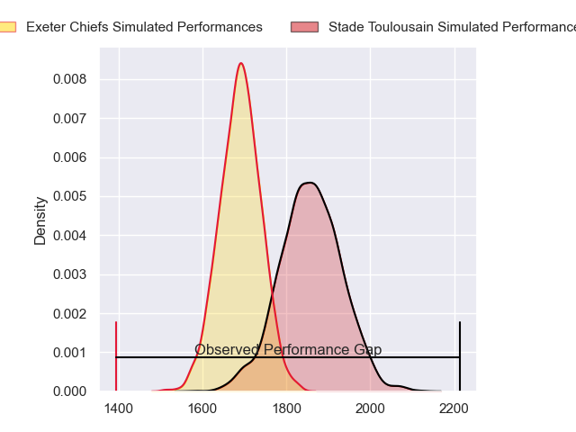
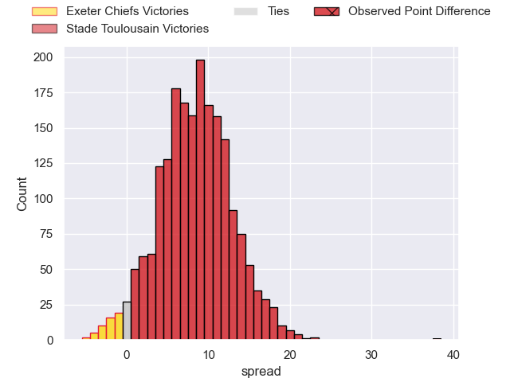
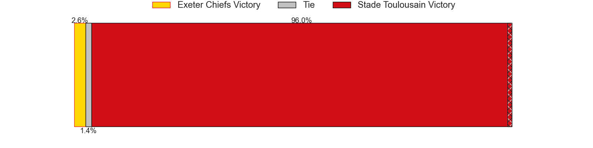
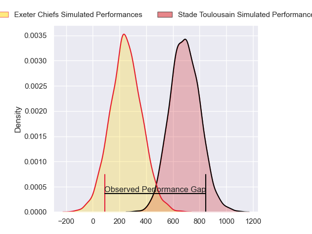
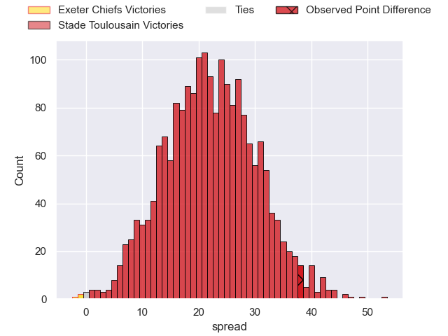
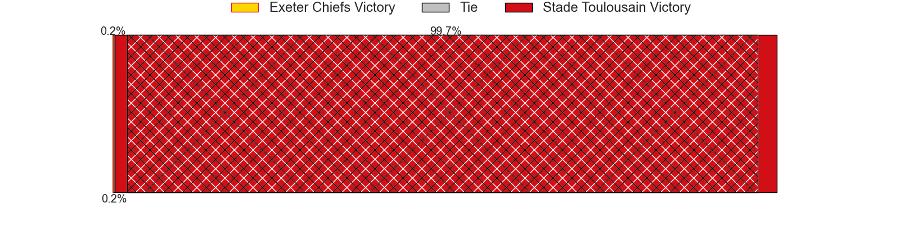

---  
layout: page  
title: Exeter Chiefs at Stade Toulousain; 26-64  
date: 2024-04-14 18:00:00 -0500  
categories: "European Rugby Champions Cup 2023" match review  
---
# Exeter Chiefs at Stade Toulousain; 26-64

# Club Level Predictions

The first set of predictions treats a club as the smallest object, as the club develops its members, organizes a gameplan, and deploys its players as needed for each match. This club model has a prediction of 0.724, which translates to predicting Stade Toulousain to win by 8.5.

Our Over/Under is 54.5 - and combined with the spread above, we have a predicted scoreline of 23 to 32

Each club has a rating and a rating deviation (similar to a Glicko rating), and expected performances can be generated. This allows for simulated matches and spreads like the ones below.
## Projected Performances - Club Model

## Projected Spreads - Club Model

## Projected Results - Club Model

# Player Level Predictions - Version 2

Treating teams instead as an entity made up of the currently active players, I have ratings for each player in an altogether different system. These can be combined to form team ratings once teamsheets are announced, weighting starters a bit higher than the reserves. After the match is played, players can be weighted by their minutes on the field, allowing for an accurate measure of the team's composition. With these compiled team ratings, we can make predictions, measure inaccuracy, and update the individual player ratings.
## Prediction without Player Minutes: Stade Toulousain by 25.3

Stade Toulousain by 17.9 on a neutral pitch

## Projected Performances - Player Model

## Projected Spreads - Player Model

## Projected Results - Player Model

|   Away Minutes | Away Player          |   Away Percentile |   Number |   Home Percentile | Home Player         |   Home Minutes |
|---------------:|:---------------------|------------------:|---------:|------------------:|:--------------------|---------------:|
|             49 | Scott Sio            |             94.76 |        1 |             93.99 | Cyril Baille        |             57 |
|             57 | Jack Yeandle         |             90.37 |        2 |             92.53 | Peato Mauvaka       |             53 |
|             44 | Ehren Painter        |             44.52 |        3 |             94.38 | Dorian Aldegheri    |             57 |
|             49 | Rusiate Tuima        |             29.31 |        4 |             75.36 | Richie Arnold       |             49 |
|             80 | Dafydd Jenkins       |             89.35 |        5 |             78.23 | Emmanuel Meafou     |             68 |
|             80 | Ethan Roots          |             72.27 |        6 |             91.18 | Jack Willis         |             80 |
|             80 | Christ Tshiunza      |             52.32 |        7 |             96.75 | Francois Cros       |             77 |
|             44 | Ross Vintcent        |             66.34 |        8 |             93.37 | Alexandre Roumat    |             80 |
|             51 | Tom Cairns           |             65.89 |        9 |             99.58 | Antoine Dupont      |             59 |
|             59 | Harvey Skinner       |             18.46 |       10 |             93.59 | Romain Ntamack      |             70 |
|             80 | Olly Woodburn        |             88.85 |       11 |             96.85 | Matthis Lebel       |             80 |
|             51 | Ollie Devoto         |             25.61 |       12 |             56.19 | Pita Ahki           |             80 |
|             80 | Henry Slade          |             96.12 |       13 |             55.46 | Paul Costes         |             80 |
|             80 | Immanuel Feyi-Waboso |             74.89 |       14 |             98.2  | Juan Cruz Mallia    |             80 |
|             80 | Josh Hodge           |              1.5  |       15 |            100    | Blair Kinghorn      |             57 |
|             23 | Jack Innard          |             55.01 |       16 |             99.02 | Julien Marchand     |             30 |
|             31 | Danny Southworth     |            nan    |       17 |             58.06 | Rodrigue Neti       |             23 |
|             36 | Marcus Street        |             22.12 |       18 |             77.69 | Joel Merkler        |             23 |
|             31 | Lewis Pearson        |             31.46 |       19 |             87.7  | Thibaud Flament     |             31 |
|             36 | Greg Fisilau         |             60.44 |       20 |             76.68 | Joshua Brennan      |             12 |
|             29 | Stu Townsend         |             81.26 |       21 |             45.05 | Paul Graou          |             21 |
|             21 | Will Haydon-Wood     |            nan    |       22 |             95.74 | Thomas Ramos        |             23 |
|             29 | Zack Wimbush         |             29    |       23 |             18.08 | Santiago Chocobares |             10 |

