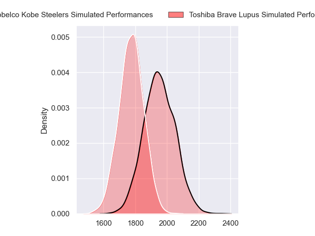
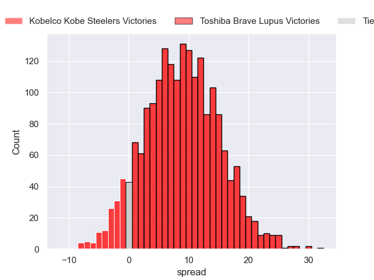
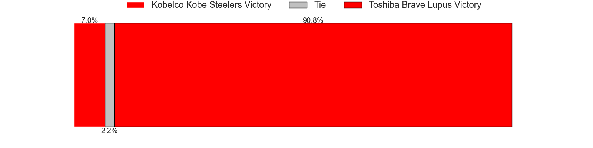
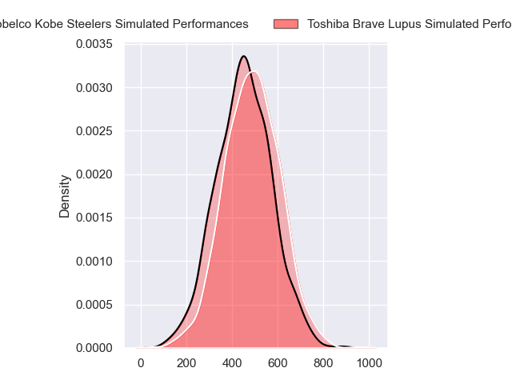
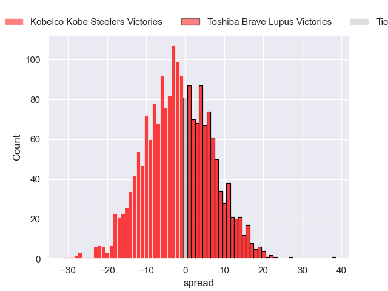

---  
layout: page  
title: Kobelco Kobe Steelers at Toshiba Brave Lupus; 40-40  
date: 2024-04-14 18:00:00 -0500  
categories: "Japan Rugby League One 2023" match review  
---
# Kobelco Kobe Steelers at Toshiba Brave Lupus; 40-40

# Club Level Predictions

The first set of predictions treats a club as the smallest object, as the club develops its members, organizes a gameplan, and deploys its players as needed for each match. This club model has a prediction of 0.734, which translates to predicting Toshiba Brave Lupus to win by 9.1.

Our Over/Under is 61.5 - and combined with the spread above, we have a predicted scoreline of 26 to 35

Each club has a rating and a rating deviation (similar to a Glicko rating), and expected performances can be generated. This allows for simulated matches and spreads like the ones below.
## Projected Performances - Club Model

## Projected Spreads - Club Model

## Projected Results - Club Model

# Player Level Predictions - Version 2

Treating teams instead as an entity made up of the currently active players, I have ratings for each player in an altogether different system. These can be combined to form team ratings once teamsheets are announced, weighting starters a bit higher than the reserves. After the match is played, players can be weighted by their minutes on the field, allowing for an accurate measure of the team's composition. With these compiled team ratings, we can make predictions, measure inaccuracy, and update the individual player ratings.
## Prediction without Player Minutes: Toshiba Brave Lupus by 1.4

Kobelco Kobe Steelers by 1.9 on a neutral pitch

## Projected Performances - Player Model

## Projected Spreads - Player Model

## Projected Results - Player Model

|   Away Minutes | Away Player              |   Away Percentile |   Number |   Home Percentile | Home Player       |   Home Minutes |
|---------------:|:-------------------------|------------------:|---------:|------------------:|:------------------|---------------:|
|             40 | Isileli Nakajima Vakauta |             85.99 |        1 |             83.41 | Sena Kimura       |             55 |
|             80 | Kenta Matsuoka           |             68.37 |        2 |             82.51 | Mamoru Harada     |             55 |
|             53 | Koo Ji-won               |              4.29 |        3 |             87.8  | Yuta Kokaji       |             55 |
|             59 | Gerard Cowley-Tuioti     |             81.94 |        4 |             91.51 | Warner Dearns     |             80 |
|             80 | Brodie Retallick         |             99.76 |        5 |             97.85 | Jacob Pierce      |             59 |
|             69 | Takara Imamura           |             49.42 |        6 |             77.38 | Shin Ito          |             80 |
|             80 | Ardie Savea              |             99.54 |        7 |             81.67 | Takeshi Sasaki    |             71 |
|             80 | Amanaki Saumaki          |             66.83 |        8 |             86.49 | Shannon Frizell   |             80 |
|             61 | Atsushi Hiwasa           |             88.63 |        9 |             74.53 | Yuhei Sugiyama    |             65 |
|             80 | Bryn Gatland             |             92.82 |       10 |             87.95 | Takuro Matsunaga  |             80 |
|             65 | Kanta Matsunaga          |             78.83 |       11 |             47.07 | Futoshi Mori      |             80 |
|             74 | Timothy Lafaele          |             50.61 |       12 |             79.13 | Nicholas McCurran |             60 |
|             80 | Seungsin Lee             |             13.11 |       13 |             45.75 | Rob Thompson      |             80 |
|             80 | Rakuhei Yamashita        |             93.81 |       14 |             79.28 | Jone Naikabula    |             65 |
|             53 | Ryohei Yamanaka          |             70.68 |       15 |             93.98 | Michael Collins   |             80 |
|             46 | Shigure Takao            |             64.25 |       16 |             51.47 | Daigo Hashimoto   |             31 |
|             33 | Hiroshi Yamashita        |             95.04 |       17 |             79.89 | Masataka Mikami   |             31 |
|             27 | Waisake Raratubua        |             78.83 |       18 |             84.56 | Teruo Makabe      |             31 |
|             33 | Michael Little           |             61.04 |       19 |            nan    | Kyosuke Kajikawa  |             27 |
|             25 | Kentaro Obata            |            nan    |       20 |             95.27 | Seta Tamanivalu   |             26 |
|             21 | Hiroaki Ushihara         |            nan    |       21 |            nan    | Kohei Takahashi   |             21 |
|             17 | Tiennan Costley          |             70.27 |       22 |             83.67 | Masaki Hamada     |             21 |
|             12 | Junta Hamano             |             15.77 |       23 |            nan    | Asaeli Lausii     |             15 |

