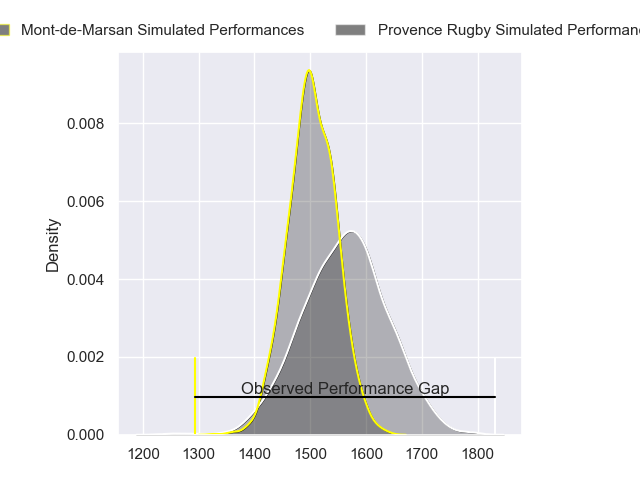
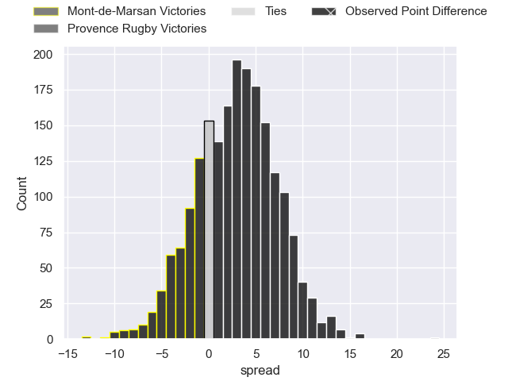
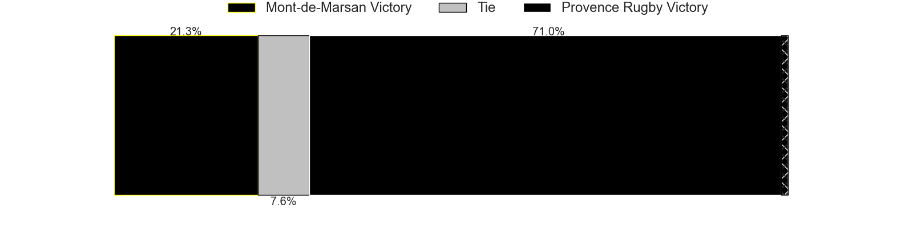
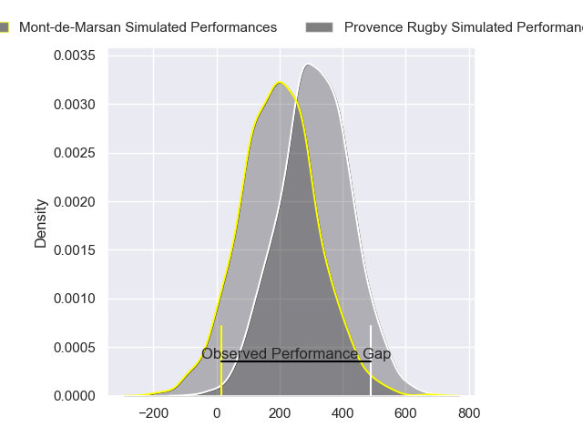
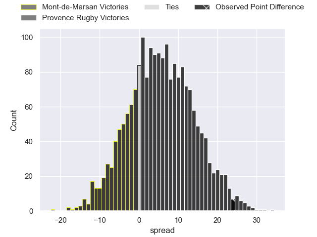
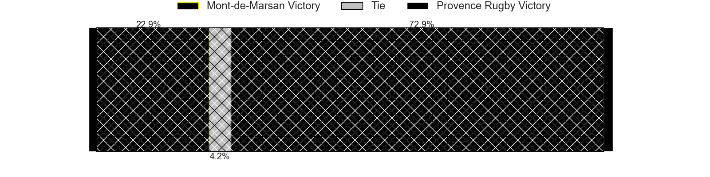

---  
layout: page  
title: Mont-de-Marsan at Provence Rugby; 22-46  
date: 2024-04-18 18:00:00 -0500  
categories: "Pro D2 2023" match review  
---
# Mont-de-Marsan at Provence Rugby; 22-46

# Club Level Predictions

The first set of predictions treats a club as the smallest object, as the club develops its members, organizes a gameplan, and deploys its players as needed for each match. This club model has a prediction of 0.578, which translates to predicting Provence Rugby to win by 2.8.

Our Over/Under is 49.5 - and combined with the spread above, we have a predicted scoreline of 23 to 26

Each club has a rating and a rating deviation (similar to a Glicko rating), and expected performances can be generated. This allows for simulated matches and spreads like the ones below.
## Projected Performances - Club Model

## Projected Spreads - Club Model

## Projected Results - Club Model

# Player Level Predictions - Version 2

Treating teams instead as an entity made up of the currently active players, I have ratings for each player in an altogether different system. These can be combined to form team ratings once teamsheets are announced, weighting starters a bit higher than the reserves. After the match is played, players can be weighted by their minutes on the field, allowing for an accurate measure of the team's composition. With these compiled team ratings, we can make predictions, measure inaccuracy, and update the individual player ratings.
## Prediction without Player Minutes: Provence Rugby by 7.9

Provence Rugby by 2.1 on a neutral pitch

## Projected Performances - Player Model

## Projected Spreads - Player Model

## Projected Results - Player Model

|   Away Minutes | Away Player               |   Away Percentile |   Number |   Home Percentile | Home Player           |   Home Minutes |
|---------------:|:--------------------------|------------------:|---------:|------------------:|:----------------------|---------------:|
|             57 | Thomas Bultel             |             39.18 |        1 |             47.57 | Nicolas Toth          |             47 |
|             48 | Samuel Lagrange           |             45.19 |        2 |             90.77 | Lucas Martin          |             60 |
|             30 | Mattéo Lalanne            |             56.24 |        3 |             99.14 | Tomas Francis         |             47 |
|             40 | Romain Durand             |             79.9  |        4 |             84.45 | Jérôme Dufour         |             80 |
|             80 | Myles Edwards             |             14.35 |        5 |             37.8  | Malohi Suta           |             55 |
|             80 | Yann Brethous             |             29    |        6 |             79.35 | Teimana Harrison      |             55 |
|             47 | Veresa Tuqovu Ramototabua |             54.99 |        7 |             66.01 | Charly Gambini        |             65 |
|             80 | Raphaël Robic             |             58.48 |        8 |             40.29 | Carl Axtens           |             80 |
|             50 | Nicolas Darquier          |             37.26 |        9 |             62.11 | Arthur Coville        |             57 |
|             80 | Joris Pialot              |             15.38 |       10 |             87.18 | Jimmy Gopperth        |             80 |
|             80 | Pierre Sayerse            |             62.61 |       11 |             58.9  | Léo Drouet            |             80 |
|             80 | Patricio Fernandez        |             31.8  |       12 |             88.23 | Kaveinga Finau        |             80 |
|             40 | Simon Desaubies           |             18.33 |       13 |             36.17 | Eto Bainivalu         |             55 |
|             50 | Semi Lagivala             |             54.62 |       14 |             17.12 | Adrien Lapegue-Lafaye |             80 |
|             80 | Théo Cortes               |             41.1  |       15 |             86.97 | Enzo Selponi          |             80 |
|             50 | Gheorghe Gajion           |             82.55 |       16 |             76.55 | Julius Nostadt        |             33 |
|             40 | Nacani Wakaya             |             85.44 |       17 |             62.82 | Paul Mallez           |             33 |
|             40 | Andrei Ostrikov           |             66.15 |       18 |             64.97 | Guillaume Piazzoli    |             25 |
|             33 | William Wavrin            |             79    |       19 |             51.56 | Clément Chartier      |             25 |
|             32 | Torsten van Jaarsveld     |             97.64 |       20 |             41.02 | Atila Septar          |             25 |
|             30 | Gatien Masse              |             44.54 |       21 |             66.74 | Joris Cazenave        |             23 |
|             30 | Baptiste Canut            |             42.53 |       22 |             29.81 | Nicolas Mousties      |             15 |
|             23 | Dino Casadei              |             58.72 |       23 |             48.92 | Jean Charles Orioli   |             20 |

