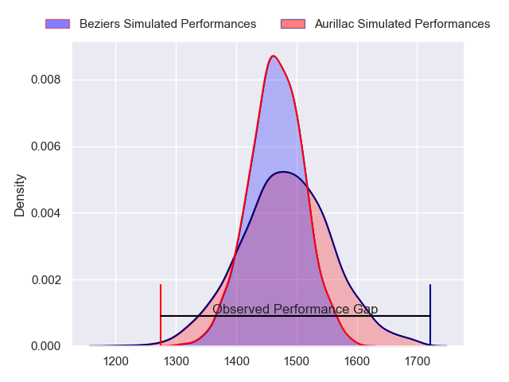
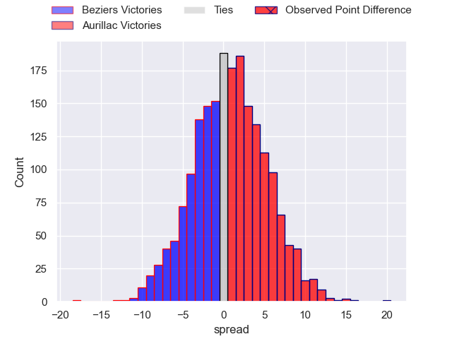
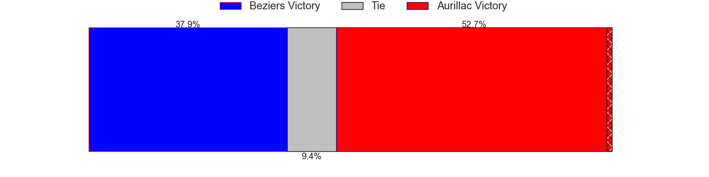
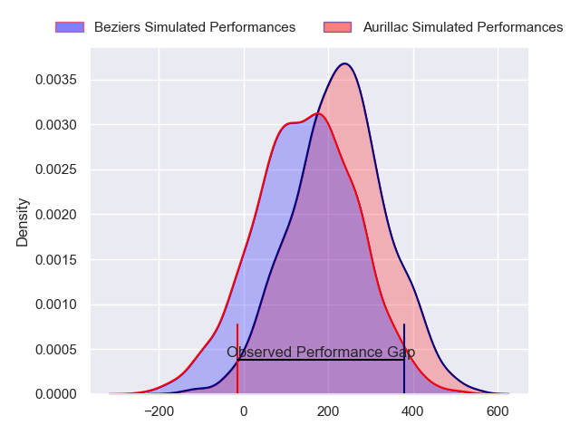
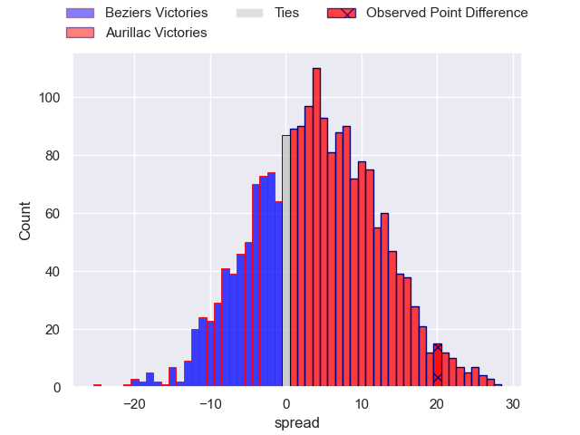
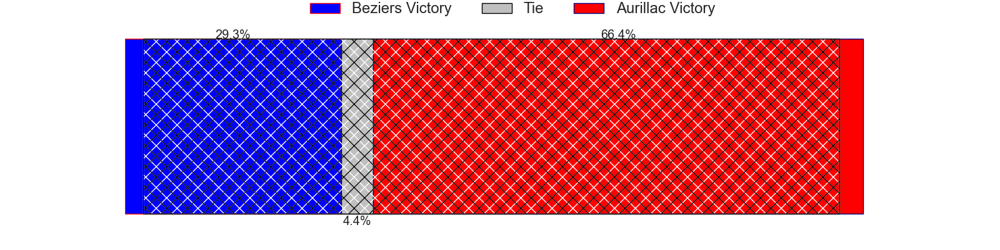

---  
layout: page  
title: Beziers at Aurillac; 7-27  
date: 2024-04-19 18:00:00 -0500  
categories: "Pro D2 2023" match review  
---
# Beziers at Aurillac; 7-27

# Club Level Predictions

The first set of predictions treats a club as the smallest object, as the club develops its members, organizes a gameplan, and deploys its players as needed for each match. This club model has a prediction of 0.523, which translates to predicting Aurillac to win by 0.8.

Our Over/Under is 38.5 - and combined with the spread above, we have a predicted scoreline of 19 to 20

Each club has a rating and a rating deviation (similar to a Glicko rating), and expected performances can be generated. This allows for simulated matches and spreads like the ones below.
## Projected Performances - Club Model

## Projected Spreads - Club Model

## Projected Results - Club Model

# Player Level Predictions - Version 2

Treating teams instead as an entity made up of the currently active players, I have ratings for each player in an altogether different system. These can be combined to form team ratings once teamsheets are announced, weighting starters a bit higher than the reserves. After the match is played, players can be weighted by their minutes on the field, allowing for an accurate measure of the team's composition. With these compiled team ratings, we can make predictions, measure inaccuracy, and update the individual player ratings.
## Prediction without Player Minutes: Aurillac by 4.4

Beziers by 3.4 on a neutral pitch

## Projected Performances - Player Model

## Projected Spreads - Player Model

## Projected Results - Player Model

|   Away Minutes | Away Player        |   Away Percentile |   Number |   Home Percentile | Home Player        |   Home Minutes |
|---------------:|:-------------------|------------------:|---------:|------------------:|:-------------------|---------------:|
|             56 | Giorgi Akhaladze   |             20.64 |        1 |             10.7  | Robert Rodgers     |             49 |
|             46 | Yanis Boulassel    |             19.88 |        2 |             37.95 | Ronan Loughnane    |             49 |
|             46 | Jon Zabala Arrieta |             73    |        3 |             39.05 | Lasha Mchelidze    |              8 |
|             80 | Pierrick Gunther   |              0.36 |        4 |             79.2  | Eoghan Masterson   |             80 |
|             49 | John Madigan       |             25.76 |        5 |             78.36 | Cam Dodson         |             80 |
|             71 | William van Bost   |             26.22 |        6 |             67.1  | Hugo Huurman       |             56 |
|             80 | Clement Ancely     |             73.06 |        7 |             39.45 | Didier Tison       |             71 |
|             80 | Sias Koen          |             58.1  |        8 |             54.61 | Beka Shvangiradze  |             43 |
|             56 | Samuel Marques     |             89.43 |        9 |             26.64 | David Delarue      |             56 |
|             80 | Charly Malie       |             60    |       10 |             34.81 | Antoine Aucagne    |             80 |
|             80 | Nicolas Plazy      |             72.91 |       11 |             71.43 | AJ Coertzen        |             80 |
|             27 | Taleta Tupuola     |             58.47 |       12 |             71.2  | Ofa Manuofetoa     |             71 |
|             80 | Paul Recor         |             53.65 |       13 |             40.67 | Hugo Bastard       |             80 |
|             80 | Raffaele Storti    |             87.77 |       14 |             66.86 | Juun Pieters       |             80 |
|             66 | Victor Dreuille    |             13.51 |       15 |             17.56 | Marc Palmier       |             80 |
|             53 | Watisoni Votu      |             88.13 |       16 |             31.34 | Tim Daniel-Meissen |             72 |
|             34 | Jose Luis Gonzalez |             79.72 |       17 |              8.23 | Latuka Maituku     |             37 |
|             34 | Filippo Alongi     |             13.89 |       18 |             53.23 | Irakli Mtchedlidze |             31 |
|             31 | Pierre Gayraud     |             13.42 |       19 |             14.06 | Luka Nioradze      |             31 |
|             24 | Mitch Short        |             33.62 |       20 |             25.79 | Mikheil Alania     |             24 |
|             24 | Youssef Amrouni    |             36.16 |       21 |            nan    | Aleksandre Burduli |             24 |
|             14 | Harry Glynn        |             25.19 |       22 |             33.25 | Anderson Neisen    |              9 |
|              9 | Thomas Hoarau      |             17.71 |       23 |             10.85 | Théo Cambon        |              9 |

