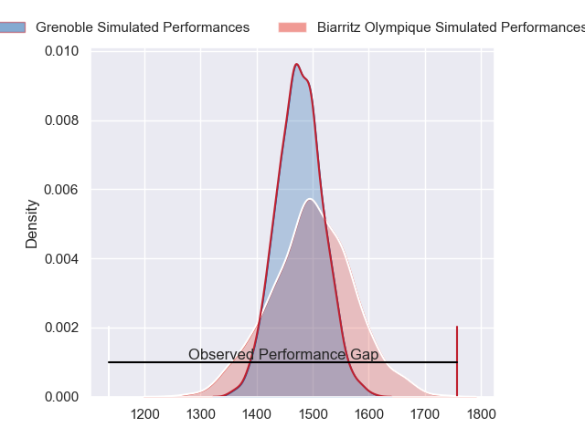
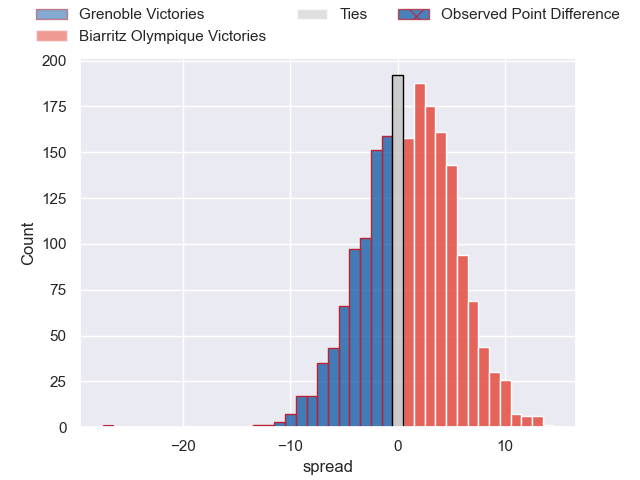
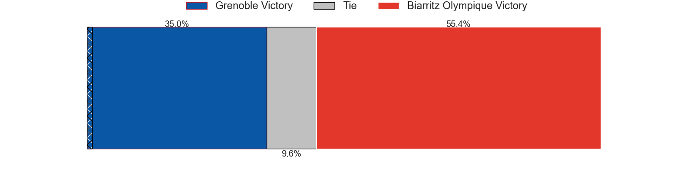
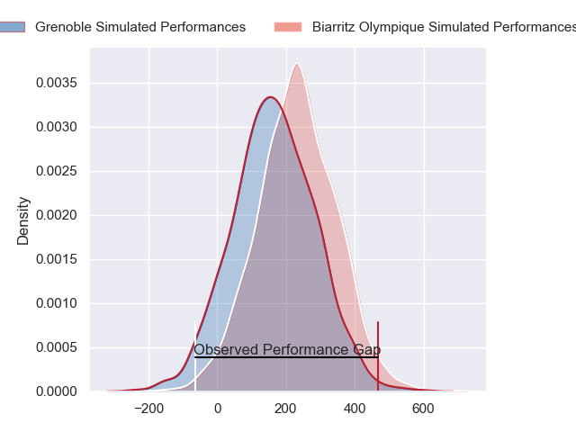
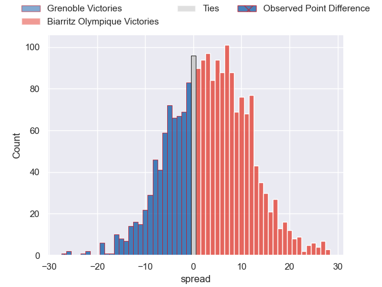
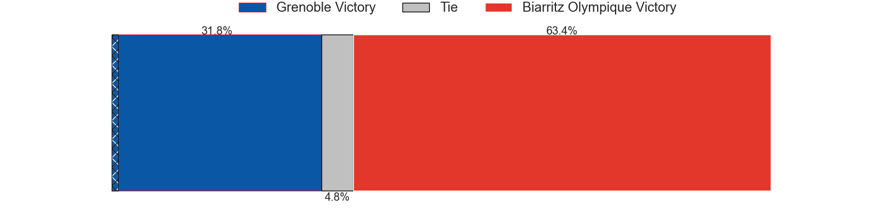

---  
layout: page  
title: Grenoble at Biarritz Olympique; 46-19  
date: 2024-04-19 18:00:00 -0500  
categories: "Pro D2 2023" match review  
---
# Grenoble at Biarritz Olympique; 46-19

# Club Level Predictions

The first set of predictions treats a club as the smallest object, as the club develops its members, organizes a gameplan, and deploys its players as needed for each match. This club model has a prediction of 0.531, which translates to predicting Biarritz Olympique to win by 1.1.

Our Over/Under is 43.5 - and combined with the spread above, we have a predicted scoreline of 21 to 22

Each club has a rating and a rating deviation (similar to a Glicko rating), and expected performances can be generated. This allows for simulated matches and spreads like the ones below.
## Projected Performances - Club Model

## Projected Spreads - Club Model

## Projected Results - Club Model

# Player Level Predictions - Version 2

Treating teams instead as an entity made up of the currently active players, I have ratings for each player in an altogether different system. These can be combined to form team ratings once teamsheets are announced, weighting starters a bit higher than the reserves. After the match is played, players can be weighted by their minutes on the field, allowing for an accurate measure of the team's composition. With these compiled team ratings, we can make predictions, measure inaccuracy, and update the individual player ratings.
## Prediction without Player Minutes: Biarritz Olympique by 4.1

Grenoble by 4.8 on a neutral pitch

## Projected Performances - Player Model

## Projected Spreads - Player Model

## Projected Results - Player Model

|   Away Minutes | Away Player         |   Away Percentile |   Number |   Home Percentile | Home Player        |   Home Minutes |
|---------------:|:--------------------|------------------:|---------:|------------------:|:-------------------|---------------:|
|             53 | Zack Gauthier       |             80.33 |        1 |             14.95 | Zakaria El Fakir   |             64 |
|             53 | Mathis Sarragallet  |             48.8  |        2 |             61.65 | Luteru Tolai       |             22 |
|             53 | Regis Montagne      |             83.9  |        3 |             77.82 | Mohamed Haouas     |             70 |
|             80 | Pierce Phillips     |             76.18 |        4 |              3.87 | Adrian Motoc       |             41 |
|             80 | Georgi Javakhia     |             83.68 |        5 |             69.41 | Charlie Matthews   |             41 |
|             42 | Antonin Berruyer    |             63.05 |        6 |             32.67 | Temo Matiu         |             80 |
|             80 | Thibaut Martel      |             63.89 |        7 |             54.23 | Simon Augry        |             80 |
|             41 | Pio Muarua          |             70.07 |        8 |             19.45 | Tornike Jalagonia  |             62 |
|             59 | Barnabe Couilloud   |             12.05 |        9 |             35.94 | Pierre Pages       |             68 |
|             80 | Max Clement         |             71.43 |       10 |             11.43 | Billy Searle       |             80 |
|             80 | Geoffrey Cros       |             69.26 |       11 |             21.14 | Steeve Barry       |             80 |
|             80 | Romain Trouilloud   |             74.29 |       12 |             67.99 | Yann David         |             70 |
|             59 | Romain Fusier       |             44.99 |       13 |             21.26 | Vincent Martin     |             80 |
|             80 | Nathan Farissier    |             17.37 |       14 |             17.14 | Zach Kibirige      |             80 |
|             68 | Julien Farnoux      |             96.69 |       15 |             49.62 | Gervais Cordin     |             80 |
|             39 | Steeve Blanc-Mappaz |             79.02 |       16 |             67.07 | Bastien Soury      |             58 |
|             38 | Jose Madeira        |             91.42 |       17 |             64.69 | Nafi Ma'afu        |             39 |
|             27 | Barnabé Massa       |             74.5  |       18 |              3.51 | Johnny Dyer        |             39 |
|             27 | Luka Goginava       |             55.74 |       19 |              8.22 | Charlie Francoz    |             18 |
|             27 | Irakli Aptsiauri    |             81.1  |       20 |             50.92 | Killian Taofifenua |             16 |
|             21 | Eric Escande        |             90.49 |       21 |             34.88 | Antoine Domercq    |             12 |
|             21 | Bautista Ezcurra    |             96.17 |       22 |              4.34 | Giorgi Nutsubidze  |             10 |
|             12 | Hugo Trouilloud     |             20.36 |       23 |             71.94 | Ilian Perraux      |             10 |

