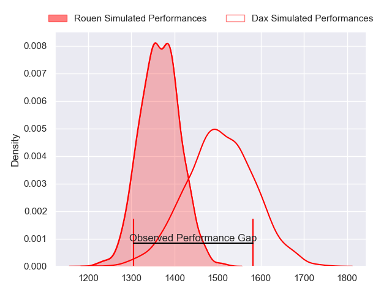
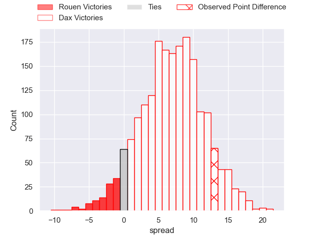
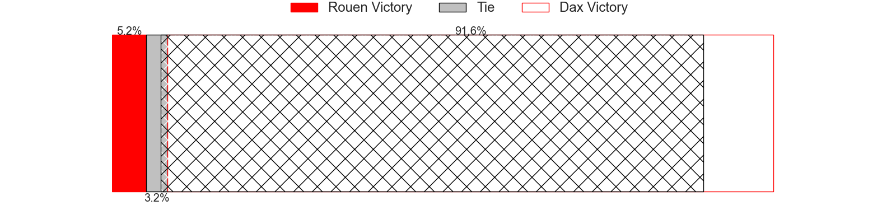
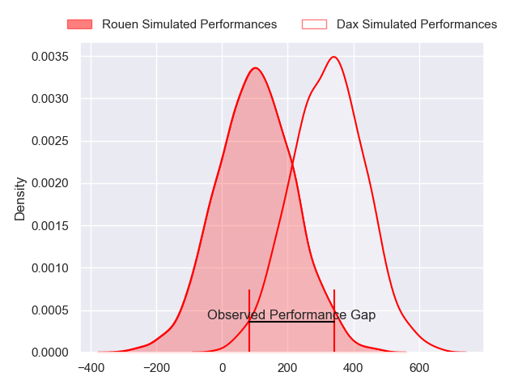
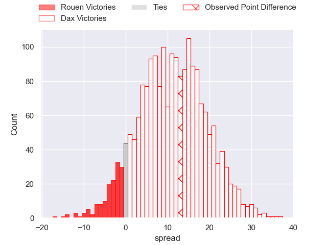
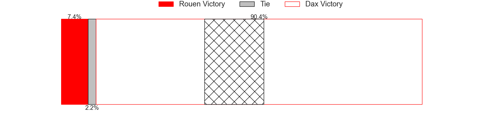

---  
layout: page  
title: Rouen at Dax; 16-29  
date: 2024-04-19 18:00:00 -0500  
categories: "Pro D2 2023" match review  
---
# Rouen at Dax; 16-29

# Club Level Predictions

The first set of predictions treats a club as the smallest object, as the club develops its members, organizes a gameplan, and deploys its players as needed for each match. This club model has a prediction of 0.687, which translates to predicting Dax to win by 6.9.

Our Over/Under is 49.5 - and combined with the spread above, we have a predicted scoreline of 21 to 28

Each club has a rating and a rating deviation (similar to a Glicko rating), and expected performances can be generated. This allows for simulated matches and spreads like the ones below.
## Projected Performances - Club Model

## Projected Spreads - Club Model

## Projected Results - Club Model

# Player Level Predictions - Version 2

Treating teams instead as an entity made up of the currently active players, I have ratings for each player in an altogether different system. These can be combined to form team ratings once teamsheets are announced, weighting starters a bit higher than the reserves. After the match is played, players can be weighted by their minutes on the field, allowing for an accurate measure of the team's composition. With these compiled team ratings, we can make predictions, measure inaccuracy, and update the individual player ratings.
## Prediction without Player Minutes: Dax by 11.6

Dax by 4.1 on a neutral pitch

## Projected Performances - Player Model

## Projected Spreads - Player Model

## Projected Results - Player Model

|   Away Minutes | Away Player        |   Away Percentile |   Number |   Home Percentile | Home Player           |   Home Minutes |
|---------------:|:-------------------|------------------:|---------:|------------------:|:----------------------|---------------:|
|             50 | Elias El Ansari    |             21.5  |        1 |             80.04 | Louis Mary            |             47 |
|             50 | Efi Ma'afu         |             36.35 |        2 |             77.91 | Iban Hiriart-Urruty   |             47 |
|             41 | Soso Bekoshvili    |             72.9  |        3 |             39.83 | Nephi Leatigaga       |             47 |
|             80 | John-Charles Astle |             33.62 |        4 |             56.83 | Brice Ferrer          |             50 |
|             50 | Will Witty         |             40.02 |        5 |             20.8  | Jean-Baptiste Singer  |             80 |
|             80 | Willy N'Diaye      |              3.81 |        6 |             51.13 | Jean-Baptiste Barrère |             56 |
|             80 | Samuel Maximin     |             44.58 |        7 |             59.36 | Paul Arnaud Ausset    |             80 |
|             50 | Abdelkarim Fofana  |             53.62 |        8 |             90.02 | Genesis Mamea Lemalu  |             80 |
|             50 | Maxime Sidobre     |             72.94 |        9 |             80.13 | Sylvère Reteau        |             50 |
|             50 | Franck Pourteau    |             84.16 |       10 |             56.88 | Romuald Séguy         |             50 |
|             80 | Paul Vallee        |             61.37 |       11 |             84.8  | Jope Naceava          |             80 |
|             80 | JT Jackson         |             27.32 |       12 |             77.38 | Alex McHenry          |             80 |
|             50 | Opetera Peleseuma  |              7.17 |       13 |             83.44 | Hugo Fourquet         |             56 |
|             80 | Benito Masilevu    |             85.14 |       14 |             85.49 | Théo Gatelier         |             80 |
|             80 | Baptiste Mouchous  |             79.13 |       15 |             17.49 | Maxime Oltmann        |             80 |
|             39 | Cody Thomas        |             37.61 |       16 |             12.05 | Matthieu Loudet       |             33 |
|             30 | Jeremie Maurouard  |              3.21 |       17 |             63.74 | Asa Faitotoa          |             33 |
|             30 | Antoine Fournier   |             68.85 |       18 |             21.08 | Louis Barrere         |             33 |
|             30 | Edgar Retiere      |             48.57 |       19 |             59.85 | Josh Furno            |             30 |
|             30 | Jean Leleu         |             13.95 |       20 |             75.58 | Hugo Cerisier         |             30 |
|             30 | Tienie Burger      |             86.77 |       21 |             76.32 | Paul Ravier           |             30 |
|             30 | Florent Campeggia  |             51.37 |       22 |             38.97 | Ratu Nacika           |             24 |
|             30 | Pablo Patilla      |             42.03 |       23 |             25.96 | Benjamin Puntous      |             24 |

