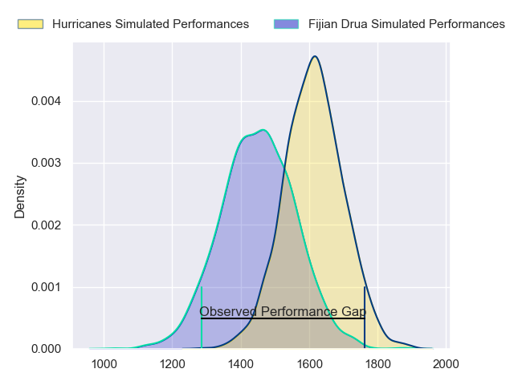
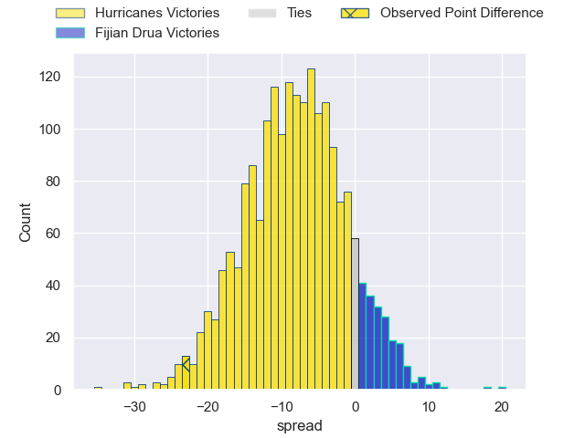
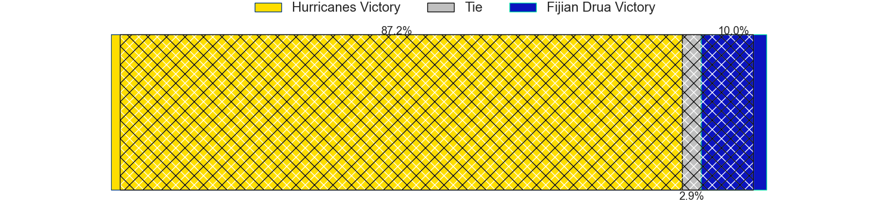
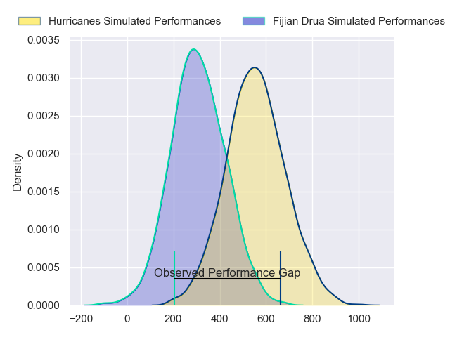
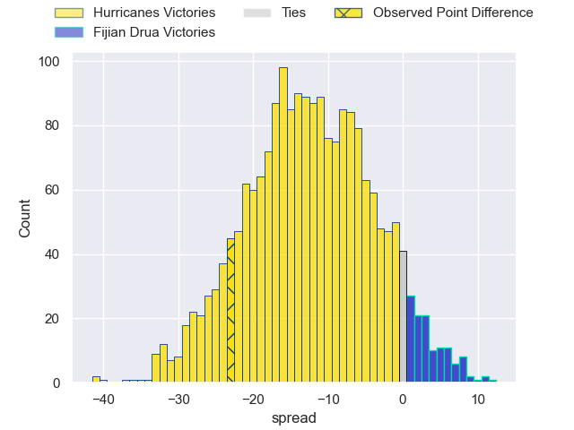
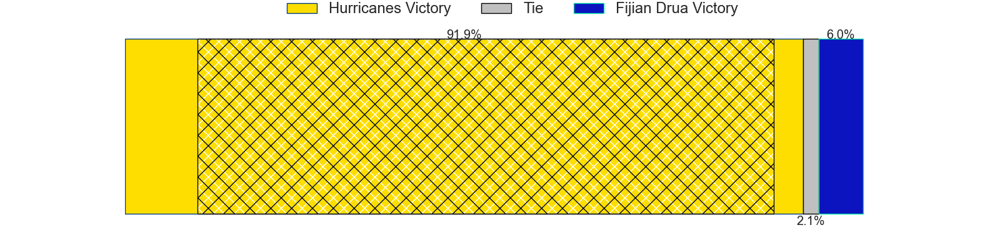

---  
layout: page  
title: Hurricanes at Fijian Drua; 38-15  
date: 2024-04-19 18:00:00 -0500  
categories: "Super Rugby Pacific 2024" match review  
---
# Hurricanes at Fijian Drua; 38-15

# Club Level Predictions

The first set of predictions treats a club as the smallest object, as the club develops its members, organizes a gameplan, and deploys its players as needed for each match. This club model has a prediction of 0.289, which translates to predicting Hurricanes to win by 8.1.

Our Over/Under is 52.5 - and combined with the spread above, we have a predicted scoreline of 30 to 22

Each club has a rating and a rating deviation (similar to a Glicko rating), and expected performances can be generated. This allows for simulated matches and spreads like the ones below.
## Projected Performances - Club Model

## Projected Spreads - Club Model

## Projected Results - Club Model

# Player Level Predictions - Version 2

Treating teams instead as an entity made up of the currently active players, I have ratings for each player in an altogether different system. These can be combined to form team ratings once teamsheets are announced, weighting starters a bit higher than the reserves. After the match is played, players can be weighted by their minutes on the field, allowing for an accurate measure of the team's composition. With these compiled team ratings, we can make predictions, measure inaccuracy, and update the individual player ratings.
## Prediction without Player Minutes: Hurricanes by 10.8

Hurricanes by 13.3 on a neutral pitch

## Projected Performances - Player Model

## Projected Spreads - Player Model

## Projected Results - Player Model

|   Away Minutes | Away Player          |   Away Percentile |   Number |   Home Percentile | Home Player           |   Home Minutes |
|---------------:|:---------------------|------------------:|---------:|------------------:|:----------------------|---------------:|
|             50 | Tevita Mafileo       |             88.56 |        1 |             92.47 | Haereiti Hetet        |             66 |
|             71 | James O'Reilly       |             44.01 |        2 |             89.19 | Tevita Ikanivere      |             66 |
|             50 | Pasilio Tosi         |             50.91 |        3 |             34.03 | Mesake Doge           |             47 |
|             59 | Ben Grant            |             50.96 |        4 |             72.73 | Isoa Nasilasila       |             55 |
|             83 | Isaia Walker-Leawere |             97.49 |        5 |             43.18 | Ratu Rotuisolia       |             83 |
|             83 | Brad Shields         |             93.39 |        6 |             62.3  | Vilive Miramira       |             66 |
|             83 | Du'Plessis Kirifi    |             92.46 |        7 |             11.25 | Kitione Salawa        |             83 |
|             64 | Devan Flanders       |             83.05 |        8 |             65.6  | Elia Canakaivata      |             83 |
|             71 | TJ Perenara          |             97.68 |        9 |             40    | Simione Kuruvoli      |             48 |
|             73 | Aidan Morgan         |             67.44 |       10 |             36.41 | Isikeli Rabitu        |             60 |
|             83 | Salesi Rayasi        |             88.74 |       11 |             21.85 | Epeli Momo            |             83 |
|             83 | Jordie Barrett       |             96.72 |       12 |             45.27 | Kemu Valetini         |             83 |
|             83 | Billy Proctor        |             93.69 |       13 |             76.82 | Iosefo Masi           |             83 |
|             66 | Kini Naholo          |             97.18 |       14 |             87.73 | Selestino Ravutaumada |             83 |
|             72 | Joshua Moorby        |             87.47 |       15 |             73.18 | Ilaisa Droasese       |             74 |
|             12 | Asafo Aumua          |             97.25 |       16 |            nan    | Zuriel Togiatama      |             17 |
|             33 | Xavier Numia         |             96.09 |       17 |             40.42 | Livai Natave          |             17 |
|             33 | Siale Lauaki         |            nan    |       18 |              2.96 | Samu Tawake           |             36 |
|             24 | Caleb Delany         |             87.08 |       19 |             68.9  | Mesake Vocevoce       |             28 |
|             19 | Peter Lakai          |             94.08 |       20 |             34.4  | Meli Derenalagi       |             17 |
|             12 | Richard Judd         |             95.58 |       21 |             53.05 | Peni Matawalu         |             35 |
|             21 | Ruben Love           |             94.24 |       22 |             37.62 | Michael Naitokani     |             23 |
|             17 | Bailyn Sullivan      |             25.56 |       23 |             46.62 | Iliesa Junior Ratuva  |              9 |

