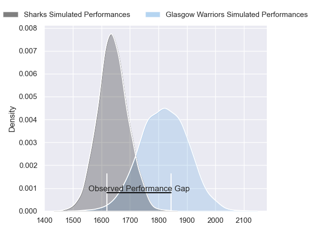
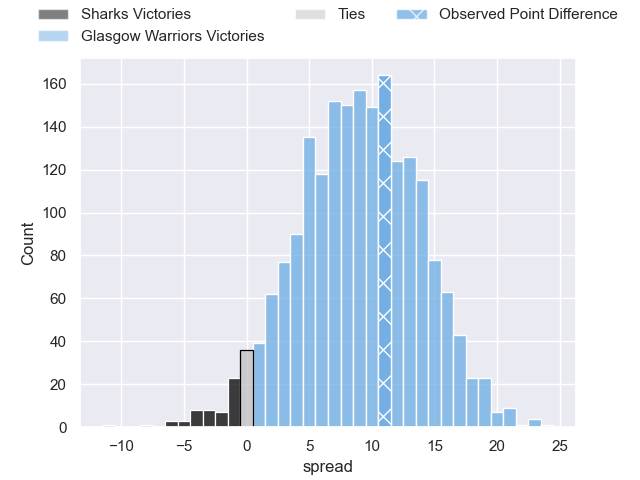
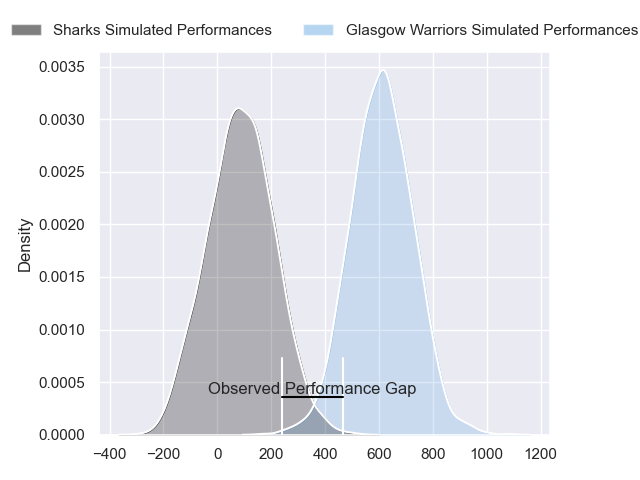
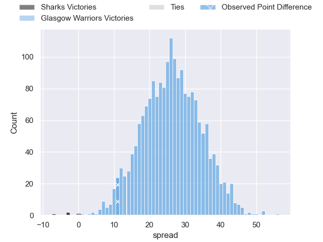
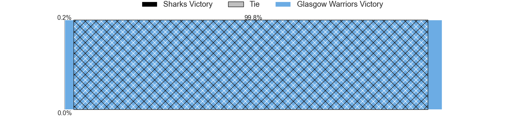

---  
layout: page  
title: Sharks at Glasgow Warriors; 10-21  
date: 2024-04-19 18:00:00 -0500  
categories: "United Rugby Championship 2023" match review  
---
# Sharks at Glasgow Warriors; 10-21

# Club Level Predictions

The first set of predictions treats a club as the smallest object, as the club develops its members, organizes a gameplan, and deploys its players as needed for each match. This club model has a prediction of 0.732, which translates to predicting Glasgow Warriors to win by 8.8.

Our Over/Under is 36.5 - and combined with the spread above, we have a predicted scoreline of 14 to 23

Each club has a rating and a rating deviation (similar to a Glicko rating), and expected performances can be generated. This allows for simulated matches and spreads like the ones below.
## Projected Performances - Club Model

## Projected Spreads - Club Model

## Projected Results - Club Model

# Player Level Predictions - Version 2

Treating teams instead as an entity made up of the currently active players, I have ratings for each player in an altogether different system. These can be combined to form team ratings once teamsheets are announced, weighting starters a bit higher than the reserves. After the match is played, players can be weighted by their minutes on the field, allowing for an accurate measure of the team's composition. With these compiled team ratings, we can make predictions, measure inaccuracy, and update the individual player ratings.
## Prediction without Player Minutes: Glasgow Warriors by 27.8

Glasgow Warriors by 21.4 on a neutral pitch

## Projected Performances - Player Model

## Projected Spreads - Player Model

## Projected Results - Player Model

|   Away Minutes | Away Player        |   Away Percentile |   Number |   Home Percentile | Home Player       |   Home Minutes |
|---------------:|:-------------------|------------------:|---------:|------------------:|:------------------|---------------:|
|             55 | Ntuthuko Mchunu    |             45.03 |        1 |             48.79 | Nathan McBeth     |             62 |
|             41 | Dan Jooste         |             47.39 |        2 |             26.91 | Johnny Matthews   |             52 |
|             55 | Hanru Jacobs       |             58.24 |        3 |             99.13 | Zander Fagerson   |             57 |
|             64 | Corne Rahl         |             59.49 |        4 |             50.18 | Max Williamson    |             66 |
|             80 | Gerbrandt Grobler  |             19.83 |        5 |             97.46 | Scott Cummings    |             80 |
|             80 | Tinotenda Mavesere |             47.32 |        6 |             95.35 | Matt Fagerson     |             73 |
|             52 | Pieter Labuschagne |             11.92 |        7 |             97.01 | Henco Venter      |             80 |
|             80 | Nick Hatton        |             47.38 |        8 |             30.67 | Jack Dempsey      |             57 |
|             69 | Grant Williams     |             62.37 |        9 |             99.15 | George Horne      |             74 |
|             48 | Curwin Bosch       |             85.45 |       10 |             38.96 | Tom Jordan        |             61 |
|             80 | Aphiwe Dyantyi     |              3.54 |       11 |             88.91 | Facundo Cordero   |             80 |
|             80 | Francois Venter    |             55.01 |       12 |             60.69 | Sione Tuipulotu   |             80 |
|             56 | Murray Koster      |             42.15 |       13 |             92.21 | Stafford McDowall |             80 |
|             80 | Eduan Keyter       |             47.89 |       14 |             95.54 | Kyle Steyn        |             80 |
|             80 | Boeta Chamberlain  |             42.75 |       15 |             84.57 | Kyle Rowe         |             80 |
|             39 | Fez Mbatha         |             87.95 |       16 |             63.86 | Gregor Hiddleston |             28 |
|             25 | Khwezi Mona        |             74.54 |       17 |             95.47 | Oli Kebble        |             18 |
|             25 | Vincent Koch       |             57.18 |       18 |             93.44 | Lucio Sordoni     |             23 |
|             16 | Emile van Heerden  |             59.37 |       19 |             71.46 | Sintu Manjezi     |             14 |
|             28 | Vincent Tshituka   |             82.54 |       20 |             35.76 | Ally Miller       |              7 |
|             11 | Cameron Wright     |              4.44 |       21 |             96.31 | Tom Gordon        |             23 |
|             32 | Siya Masuku        |             56.62 |       22 |             72.73 | Jamie Dobie       |              6 |
|             24 | Ethan Hooker       |             46.48 |       23 |             62.08 | Ross Thompson     |             19 |

