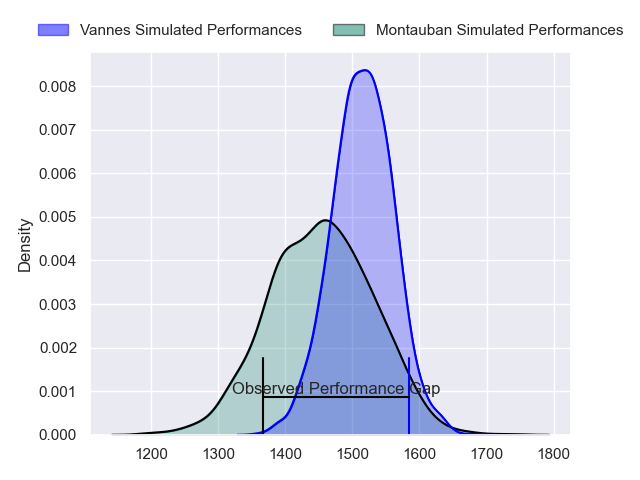
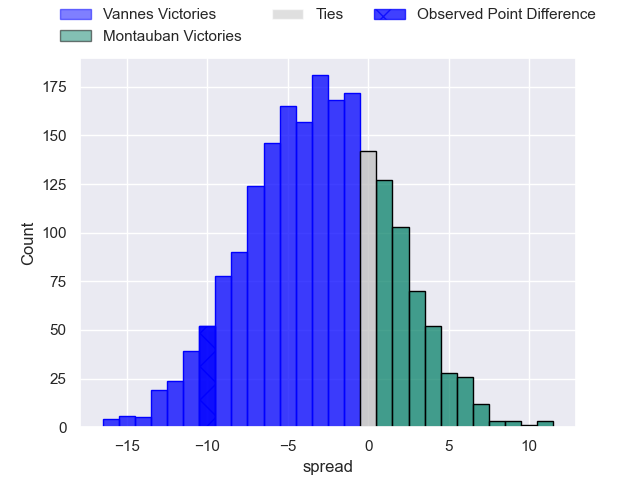
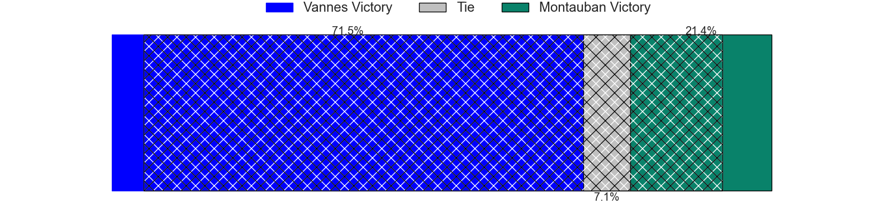
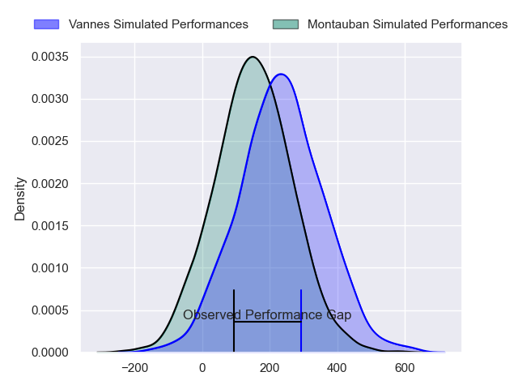
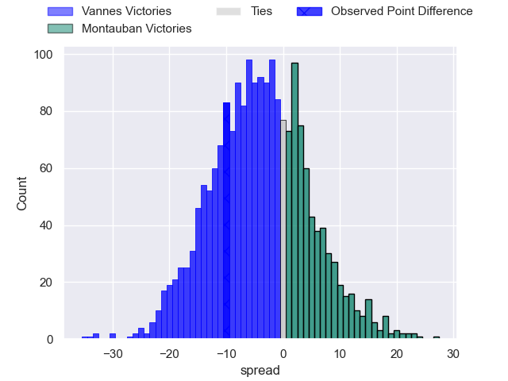
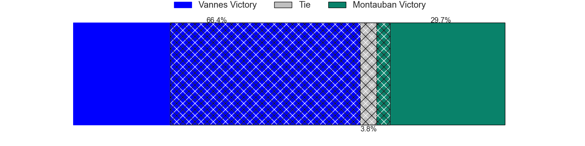

---  
layout: page  
title: Vannes at Montauban; 36-26  
date: 2024-04-19 18:00:00 -0500  
categories: "Pro D2 2023" match review  
---
# Vannes at Montauban; 36-26

# Club Level Predictions

The first set of predictions treats a club as the smallest object, as the club develops its members, organizes a gameplan, and deploys its players as needed for each match. This club model has a prediction of 0.414, which translates to predicting Vannes to win by 3.1.

Our Over/Under is 47.5 - and combined with the spread above, we have a predicted scoreline of 25 to 22

Each club has a rating and a rating deviation (similar to a Glicko rating), and expected performances can be generated. This allows for simulated matches and spreads like the ones below.
## Projected Performances - Club Model

## Projected Spreads - Club Model

## Projected Results - Club Model

# Player Level Predictions - Version 2

Treating teams instead as an entity made up of the currently active players, I have ratings for each player in an altogether different system. These can be combined to form team ratings once teamsheets are announced, weighting starters a bit higher than the reserves. After the match is played, players can be weighted by their minutes on the field, allowing for an accurate measure of the team's composition. With these compiled team ratings, we can make predictions, measure inaccuracy, and update the individual player ratings.
## Prediction without Player Minutes: Vannes by 4.4

Vannes by 11.0 on a neutral pitch

## Projected Performances - Player Model

## Projected Spreads - Player Model

## Projected Results - Player Model

|   Away Minutes | Away Player             |   Away Percentile |   Number |   Home Percentile | Home Player       |   Home Minutes |
|---------------:|:------------------------|------------------:|---------:|------------------:|:------------------|---------------:|
|             59 | Andy Bordelai           |             90.65 |        1 |             19    | Thomas Bue        |             32 |
|             51 | Cyril Blanchard         |             42.37 |        2 |             25.9  | German Kessler    |             51 |
|             51 | Paga Tafili             |             94.12 |        3 |              2.22 | Mirian Burduli    |             51 |
|             59 | Anton Bresler           |             70.01 |        4 |              5.44 | Tjuee Uanivi      |             80 |
|             72 | Mattéo Desjeux          |             21.4  |        5 |             23.58 | Dimitri Vaotoa    |             51 |
|             80 | Juan Bautista Pedemonte |             39.57 |        6 |             30.51 | Kyllian Ringuet   |             51 |
|             80 | Francisco Gorrissen     |             98.45 |        7 |             46.13 | Noa Kanika        |             80 |
|             51 | Sione Kalamafoni        |             59.35 |        8 |             11.97 | Tyrone Viiga      |             47 |
|             80 | Michael Ruru            |             94.08 |        9 |             47.99 | Alexis Bernadet   |             56 |
|             80 | Maxime Lafage           |             94.81 |       10 |             19.22 | Thomas Fortunel   |             51 |
|             80 | Martin Alonso Munoz     |             17.6  |       11 |             87.31 | Stephane Ahmed    |             80 |
|             80 | Andres Vilaseca         |             22.25 |       12 |             49.69 | Simon Renda       |             80 |
|             80 | Robin Taccola           |             63.91 |       13 |             33.87 | Yvan Reilhac      |             80 |
|             80 | Théo Bastardie          |             69.37 |       14 |             21.03 | Josua Vici        |             80 |
|             59 | Gwenaël Duplenne        |             98.73 |       15 |             78.63 | Semesa Rokoduguni |             80 |
|             29 | Phil Kite               |             80.14 |       16 |              0.39 | Malino Vanai      |             48 |
|             29 | Théo Beziat             |             62.85 |       17 |             22.69 | Corentin Coularis |             33 |
|             29 | Joe Edwards             |             91.27 |       18 |              5.82 | Kevin Firmin      |             29 |
|             21 | Eric Marks              |             15.11 |       19 |             57.92 | Tedo Abzhandadze  |             29 |
|             21 | Thibault Debaes         |             64.68 |       20 |             25.15 | Lewis Bean        |             29 |
|             21 | Ximun Bessonart         |              7.91 |       21 |             15.48 | Karl Wilkins      |             29 |
|              8 | Karl Chateau            |             17.4  |       22 |             58.05 | Tietie Tuimauga   |             29 |
|            nan | nan                     |            nan    |       23 |             63    | Yoan Cottin       |             24 |

