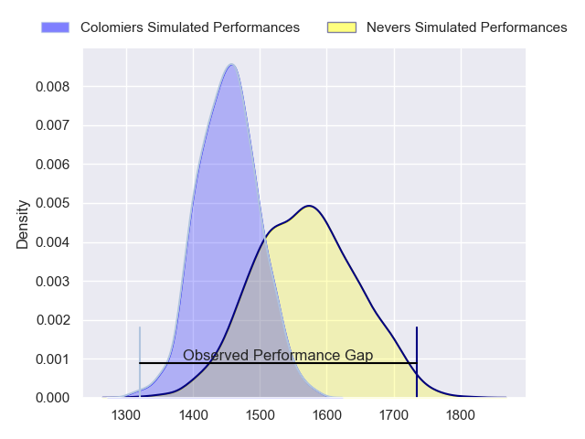
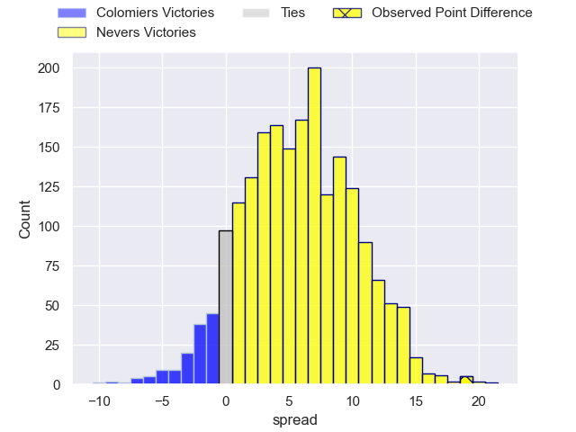
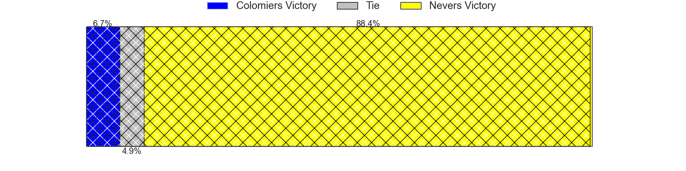
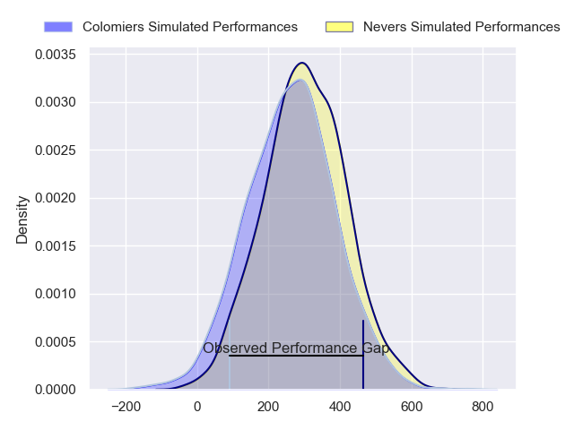
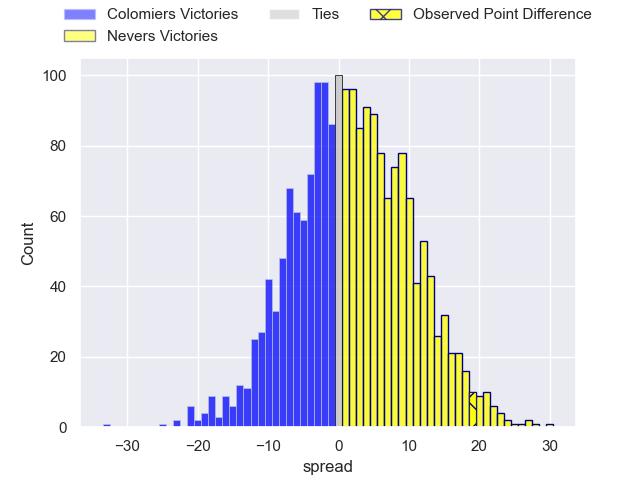
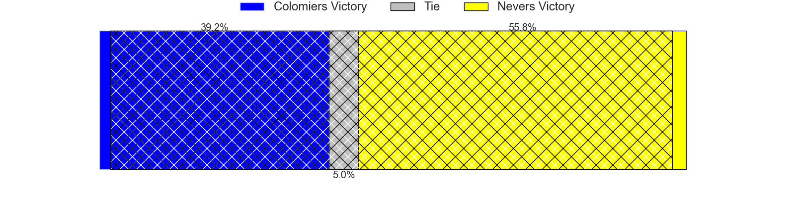

---  
layout: page  
title: Colomiers at Nevers; 15-34  
date: 2024-04-19 18:00:00 -0500  
categories: "Pro D2 2023" match review  
---
# Colomiers at Nevers; 15-34

# Club Level Predictions

The first set of predictions treats a club as the smallest object, as the club develops its members, organizes a gameplan, and deploys its players as needed for each match. This club model has a prediction of 0.662, which translates to predicting Nevers to win by 5.9.

Our Over/Under is 46.5 - and combined with the spread above, we have a predicted scoreline of 20 to 26

Each club has a rating and a rating deviation (similar to a Glicko rating), and expected performances can be generated. This allows for simulated matches and spreads like the ones below.
## Projected Performances - Club Model

## Projected Spreads - Club Model

## Projected Results - Club Model

# Player Level Predictions - Version 2

Treating teams instead as an entity made up of the currently active players, I have ratings for each player in an altogether different system. These can be combined to form team ratings once teamsheets are announced, weighting starters a bit higher than the reserves. After the match is played, players can be weighted by their minutes on the field, allowing for an accurate measure of the team's composition. With these compiled team ratings, we can make predictions, measure inaccuracy, and update the individual player ratings.
## Prediction without Player Minutes: Nevers by 3.7

Colomiers by 0.1 on a neutral pitch

## Projected Performances - Player Model

## Projected Spreads - Player Model

## Projected Results - Player Model

|   Away Minutes | Away Player           |   Away Percentile |   Number |   Home Percentile | Home Player         |   Home Minutes |
|---------------:|:----------------------|------------------:|---------:|------------------:|:--------------------|---------------:|
|             50 | Guillaume Tartas      |             73.19 |        1 |             53.13 | Tornike Mataradze   |             50 |
|             50 | Andrew Ready          |             22.09 |        2 |             53.21 | Elia Elia           |             55 |
|             42 | Marco Fepulea'i       |             12.34 |        3 |             35.87 | Cleopas Kundiona    |             48 |
|             55 | Maxime Granouillet    |             73.52 |        4 |             34.1  | Lado Chachanidze    |             60 |
|             41 | Alexandre Manukula    |             39.9  |        5 |             81.62 | Lasha Jaiani        |             80 |
|             55 | Waël Ponpon           |             26.82 |        6 |             77.59 | Luka Plataret       |             80 |
|             80 | Aldric Lescure        |             84.39 |        7 |             79.62 | Julien Kazubek      |             80 |
|             80 | Romain Bezian         |             68.33 |        8 |             86.03 | Jason-Colin Fraser  |             59 |
|             59 | Ugo Seguela           |             48.63 |        9 |              8.25 | Hugo Bouyssou       |             75 |
|             80 | Maxime Javaux         |             55.58 |       10 |             72.99 | Yohan Le Bourhis    |             67 |
|             80 | Rodrigo Marta         |             93.94 |       11 |             45.71 | Arthur Mathiron     |             80 |
|             80 | Dorian Laborde        |             64.28 |       12 |             85.41 | Rudy Derrieux       |             62 |
|             80 | Fabien Perrin         |             26.7  |       13 |             69.84 | Alifereti Loaloa    |             80 |
|             80 | Paul Pimienta         |             43.89 |       14 |             53.71 | Christian Ambadiang |             80 |
|             59 | Thomas Girard         |             41.48 |       15 |             73.03 | Kylian Jaminet      |             80 |
|             39 | Janse Roux            |             43.41 |       16 |             56.12 | Ilia Kaikatsishvili |             32 |
|             38 | Hugo Pirlet           |             58.34 |       17 |             63.65 | Aitor Kitutu        |             30 |
|             30 | Pierre-Samuel Pacheco |             50.54 |       18 |             11.04 | Jonathan Maiau      |             25 |
|             30 | Toma Kolokilagi       |             31.73 |       19 |             84.98 | Hugues Bastide      |             21 |
|             25 | Jorick Dastugue       |             60.1  |       20 |             98.07 | Will Skelton        |             20 |
|             25 | Jack Whetton          |              8.59 |       21 |             64.03 | Leonard Paris       |             18 |
|             21 | Mathis Galthié        |             57.08 |       22 |             28.83 | Shaun Reynolds      |             13 |
|             21 | Max Auriac            |             48.09 |       23 |             71.25 | Arthurs Barbier     |              5 |

