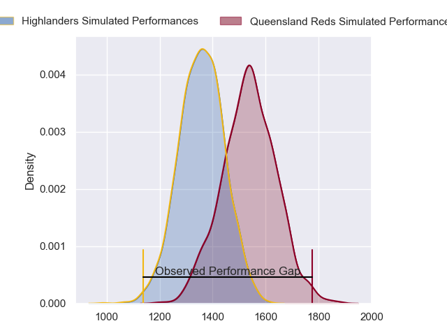
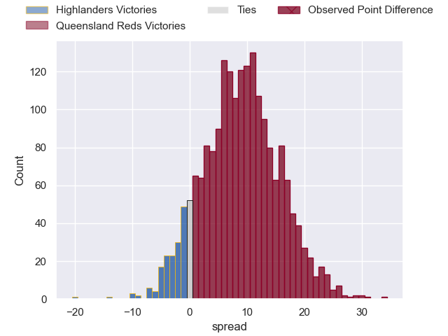
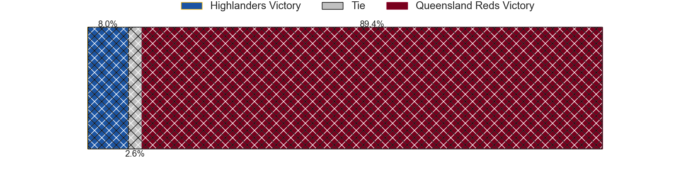
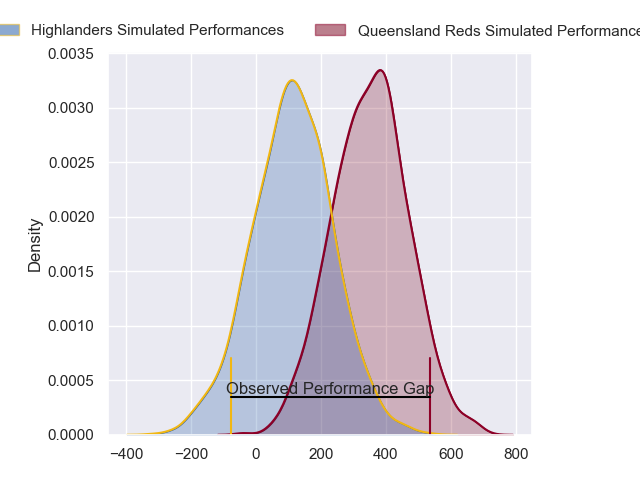
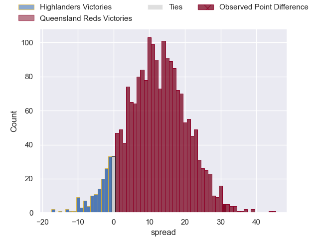
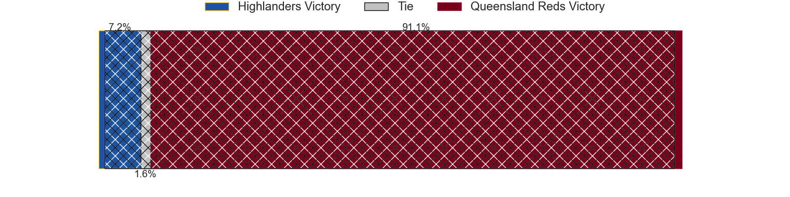

---  
layout: page  
title: Highlanders at Queensland Reds; 0-31  
date: 2024-04-19 18:00:00 -0500  
categories: "Super Rugby Pacific 2024" match review  
---
# Highlanders at Queensland Reds; 0-31

# Club Level Predictions

The first set of predictions treats a club as the smallest object, as the club develops its members, organizes a gameplan, and deploys its players as needed for each match. This club model has a prediction of 0.724, which translates to predicting Queensland Reds to win by 8.7.

Our Over/Under is 51.5 - and combined with the spread above, we have a predicted scoreline of 22 to 30

Each club has a rating and a rating deviation (similar to a Glicko rating), and expected performances can be generated. This allows for simulated matches and spreads like the ones below.
## Projected Performances - Club Model

## Projected Spreads - Club Model

## Projected Results - Club Model

# Player Level Predictions - Version 2

Treating teams instead as an entity made up of the currently active players, I have ratings for each player in an altogether different system. These can be combined to form team ratings once teamsheets are announced, weighting starters a bit higher than the reserves. After the match is played, players can be weighted by their minutes on the field, allowing for an accurate measure of the team's composition. With these compiled team ratings, we can make predictions, measure inaccuracy, and update the individual player ratings.
## Prediction without Player Minutes: Queensland Reds by 13.7

Queensland Reds by 8.9 on a neutral pitch

## Projected Performances - Player Model

## Projected Spreads - Player Model

## Projected Results - Player Model

|   Away Minutes | Away Player                   |   Away Percentile |   Number |   Home Percentile | Home Player          |   Home Minutes |
|---------------:|:------------------------------|------------------:|---------:|------------------:|:---------------------|---------------:|
|             41 | Ethan de Groot                |             53.1  |        1 |             59.1  | Alex Hodgman         |             44 |
|             41 | Ricky Jackson                 |             30.84 |        2 |             71.12 | Matt Faessler        |             50 |
|             67 | Saula Ma'u                    |             18.59 |        3 |             93.61 | Jeff Toomaga-Allen   |             50 |
|             82 | Hugo Plummer                  |             35.29 |        4 |             57.3  | Cormac Daly          |             53 |
|             41 | Pari Pari Parkinson           |             96.89 |        5 |             38.28 | Ryan Smith           |             82 |
|             82 | Oliver Haig                   |             40.49 |        6 |             96.06 | Liam Wright          |             82 |
|             82 | Sean Withy                    |              7.19 |        7 |             51.04 | John Bryant          |             82 |
|             82 | Billy Harmon                  |             43.98 |        8 |             64.37 | Harry Wilson         |             73 |
|             50 | James Arscott                 |              6.53 |        9 |             61.47 | Kalani Thomas        |             58 |
|             60 | Cameron Millar                |             45.64 |       10 |             77.69 | Tom Lynagh           |             63 |
|             66 | Jona Nareki                   |             75.9  |       11 |             82.77 | Mac Grealy           |             82 |
|             82 | Sam Gilbert                   |             14.32 |       12 |             69.9  | Hunter Paisami       |             82 |
|             82 | Tanielu Tele'a                |             29.13 |       13 |             86.65 | Jordan Petaia        |             33 |
|             82 | Timoci Tavatavanawai          |             12.05 |       14 |             50.45 | Suliasi Vunivalu     |             82 |
|             50 | Connor Garden-Bachop          |             31.58 |       15 |             66.67 | Jock Campbell        |             82 |
|             41 | Henry Bell                    |             15.13 |       16 |            nan    | Josh Nasser          |             32 |
|             41 | Dan Lienert-Brown             |             13.82 |       17 |             57.48 | Peni Ravai Kovekalou |             38 |
|             15 | Rohan Wingham                 |            nan    |       18 |             68.16 | Sef Fa'agase         |             32 |
|             41 | Will Stodart                  |            nan    |       19 |             92.11 | Angus Blyth          |             29 |
|             16 | Nikora Broughton              |             24.32 |       20 |            nan    | Joe Brial            |              9 |
|             32 | Folau Fakatava                |             41.05 |       21 |            nan    | Louis Werchon        |             24 |
|             22 | Ajay Faleafaga                |             23.33 |       22 |             17.95 | Lawson Creighton     |             49 |
|             32 | Jacob Ratumaitavuki-Kneepkens |             93.48 |       23 |            nan    | Tim Ryan             |             19 |

