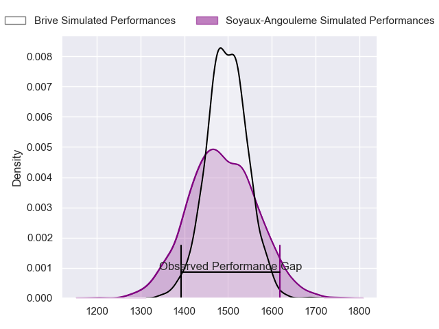
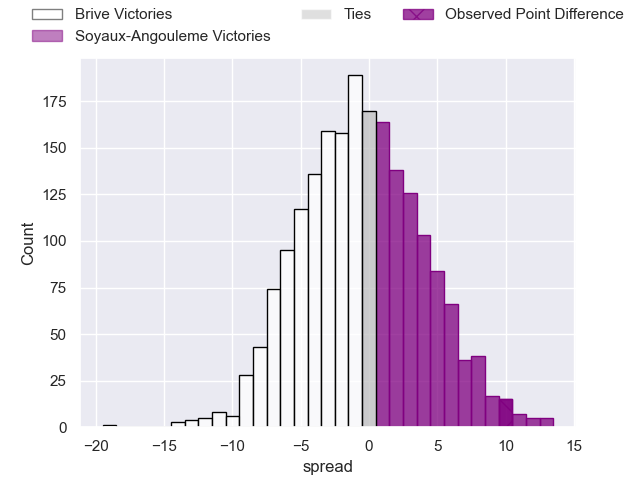
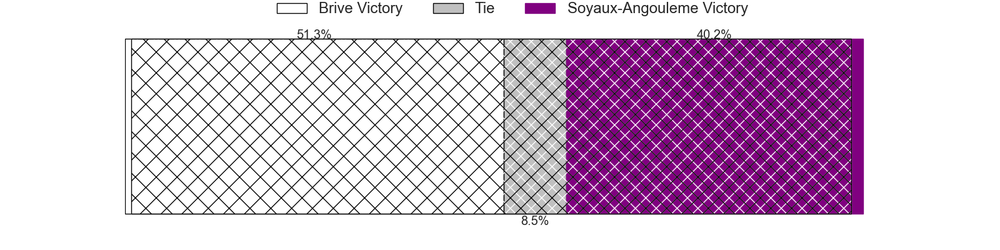
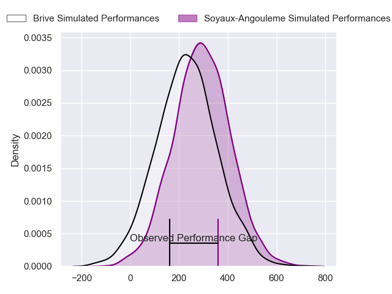
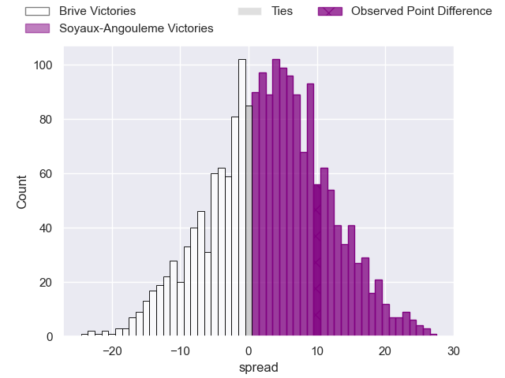
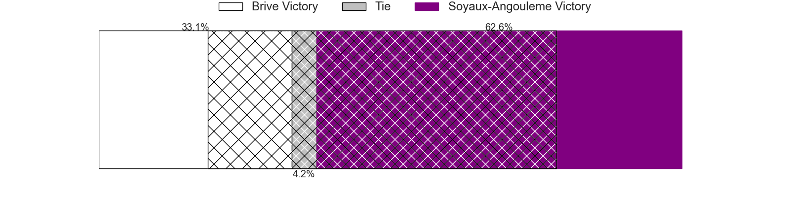

---  
layout: page  
title: Brive at Soyaux-Angouleme; 12-22  
date: 2024-04-19 18:00:00 -0500  
categories: "Pro D2 2023" match review  
---
# Brive at Soyaux-Angouleme; 12-22

# Club Level Predictions

The first set of predictions treats a club as the smallest object, as the club develops its members, organizes a gameplan, and deploys its players as needed for each match. This club model has a prediction of 0.493, which translates to predicting Brive to win by 0.3.

Our Over/Under is 43.5 - and combined with the spread above, we have a predicted scoreline of 22 to 21

Each club has a rating and a rating deviation (similar to a Glicko rating), and expected performances can be generated. This allows for simulated matches and spreads like the ones below.
## Projected Performances - Club Model

## Projected Spreads - Club Model

## Projected Results - Club Model

# Player Level Predictions - Version 2

Treating teams instead as an entity made up of the currently active players, I have ratings for each player in an altogether different system. These can be combined to form team ratings once teamsheets are announced, weighting starters a bit higher than the reserves. After the match is played, players can be weighted by their minutes on the field, allowing for an accurate measure of the team's composition. With these compiled team ratings, we can make predictions, measure inaccuracy, and update the individual player ratings.
## Prediction without Player Minutes: Soyaux-Angouleme by 3.4

Brive by 0.7 on a neutral pitch

## Projected Performances - Player Model

## Projected Spreads - Player Model

## Projected Results - Player Model

|   Away Minutes | Away Player               |   Away Percentile |   Number |   Home Percentile | Home Player            |   Home Minutes |
|---------------:|:--------------------------|------------------:|---------:|------------------:|:-----------------------|---------------:|
|             50 | Hugo Reilhes              |             68.47 |        1 |             97.01 | Sami Zouhair           |             61 |
|             50 | Benjamin Boudou           |             42.17 |        2 |             17.07 | Motu Matu'u            |             46 |
|             50 | Marcel van der Merwe      |             12.54 |        3 |             32.79 | Yassine Boutemane      |             61 |
|             80 | Renger Van Eerten         |             59.73 |        4 |             59.98 | Maxence Lemardelet     |             61 |
|             50 | Tevita Ratuva             |             66.99 |        5 |             86.58 | Sikeli Nabou           |             80 |
|             61 | Sasha Gue                 |             47.08 |        6 |             85.1  | Germain Burgaud        |             61 |
|             80 | Matthieu Voisin           |             32.9  |        7 |             89.15 | Nicolas Martins        |             80 |
|             61 | Ross Moriarty             |             88.78 |        8 |             68.08 | Alexander Masibaka     |             80 |
|             80 | Leo Carbonneau            |             50.74 |        9 |              7.4  | Adrien Bau             |             46 |
|             64 | Stuart Olding             |             89.87 |       10 |             84.42 | Ben Botica             |             80 |
|             71 | Asaeli Tuivuaka           |             66.06 |       11 |             71.5  | Jules Dubecq           |             80 |
|             80 | Sam Johnson               |             87.39 |       12 |             87.27 | Ledua Mau              |             69 |
|             80 | Sammy Arnold              |             41.41 |       13 |             89.49 | George Tilsley         |             80 |
|             80 | Mathis Ferté              |             68.69 |       14 |             66.29 | Eoghan Barrett         |             61 |
|             80 | Nic Krone                 |             41.22 |       15 |             66.41 | Pierre Lafitte         |             80 |
|             30 | Nathan Fraissenon         |            nan    |       16 |             50.11 | Manu Saubusse          |             34 |
|             30 | Lucas da Silva            |             38.15 |       17 |             82.73 | Rayne Barka            |             34 |
|             30 | Francisco Coria Marchetti |             16.59 |       18 |             66.51 | Enzo Morand-Bruyat     |             19 |
|             30 | Asier Usarraga            |             75.57 |       19 |             48.83 | Rémi Brosset           |             19 |
|             19 | Retief Marais             |             78.43 |       20 |             33.75 | Omar Dahir             |             19 |
|             19 | Taniela Sadrugu           |             49.38 |       21 |             71.46 | Omar Odishvili         |             19 |
|             16 | Julien Blanc              |             58.99 |       22 |              7.99 | Gautier Gibouin        |             19 |
|              9 | Wesley Douglas            |            nan    |       23 |             76.39 | Akuila Joeli Tabualevu |             11 |

