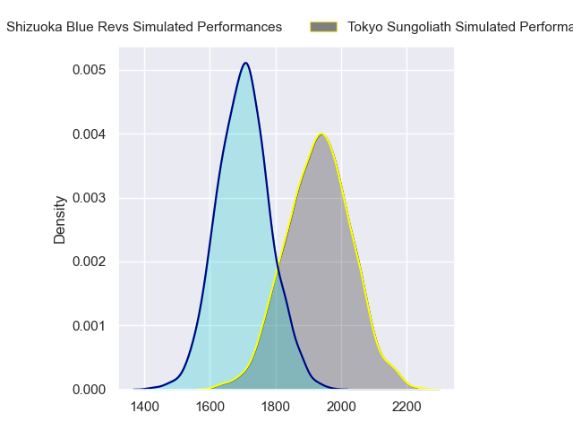
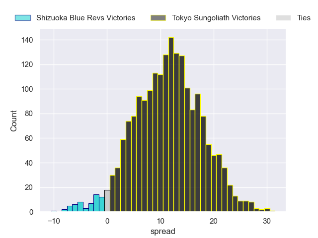
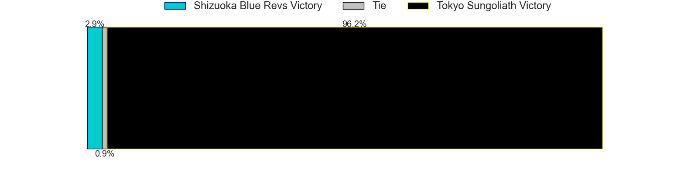
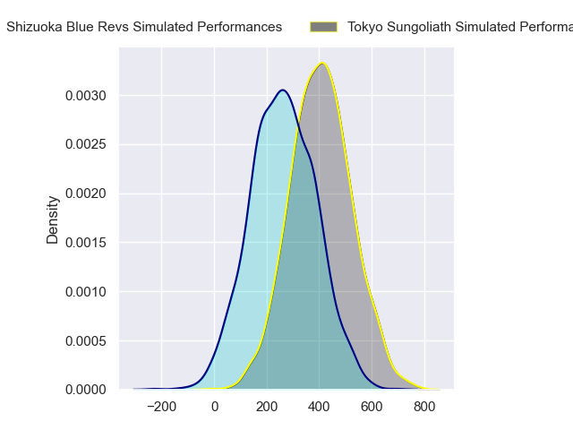
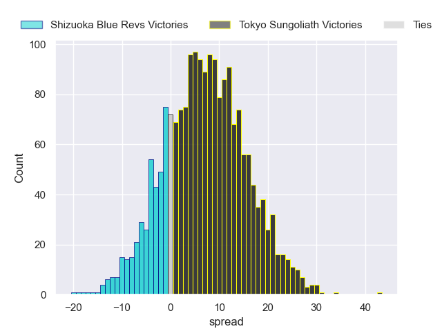
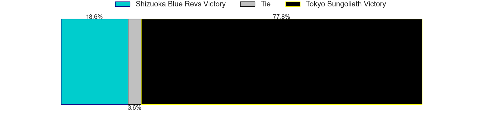

---  
layout: page  
title: Shizuoka Blue Revs at Tokyo Sungoliath; 31-31  
date: 2024-04-19 18:00:00 -0500  
categories: "Japan Rugby League One 2023" match review  
---
# Shizuoka Blue Revs at Tokyo Sungoliath; 31-31

# Club Level Predictions

The first set of predictions treats a club as the smallest object, as the club develops its members, organizes a gameplan, and deploys its players as needed for each match. This club model has a prediction of 0.778, which translates to predicting Tokyo Sungoliath to win by 11.2.

Our Over/Under is 58.5 - and combined with the spread above, we have a predicted scoreline of 24 to 35

Each club has a rating and a rating deviation (similar to a Glicko rating), and expected performances can be generated. This allows for simulated matches and spreads like the ones below.
## Projected Performances - Club Model

## Projected Spreads - Club Model

## Projected Results - Club Model

# Player Level Predictions - Version 2

Treating teams instead as an entity made up of the currently active players, I have ratings for each player in an altogether different system. These can be combined to form team ratings once teamsheets are announced, weighting starters a bit higher than the reserves. After the match is played, players can be weighted by their minutes on the field, allowing for an accurate measure of the team's composition. With these compiled team ratings, we can make predictions, measure inaccuracy, and update the individual player ratings.
## Prediction without Player Minutes: Tokyo Sungoliath by 9.6

Tokyo Sungoliath by 6.3 on a neutral pitch

## Projected Performances - Player Model

## Projected Spreads - Player Model

## Projected Results - Player Model

|   Away Minutes | Away Player        |   Away Percentile |   Number |   Home Percentile | Home Player         |   Home Minutes |
|---------------:|:-------------------|------------------:|---------:|------------------:|:--------------------|---------------:|
|             49 | Kenta Yamashita    |             40.99 |        1 |             92.37 | Yukio Morikawa      |             50 |
|             67 | Takeshi Hino       |             97.45 |        2 |             72.3  | Kosuke Horikoshi    |             80 |
|             56 | Heiichiro Ito      |             90.09 |        3 |             87.42 | Shinnosuke Kakinaga |             50 |
|             56 | Jack Wright        |             52.87 |        4 |             97.13 | Sam Jeffries        |             58 |
|             80 | Eishin Kuwano      |             88.76 |        5 |             98.68 | Harry Hockings      |             80 |
|             80 | Vueti Tupou        |             45.48 |        6 |             75.17 | Kanji Shimokawa     |             68 |
|             51 | Shoji Takuma       |             53.25 |        7 |             53.6  | Kai Yamamoto        |             58 |
|             49 | Malgene Ilaua      |             57.25 |        8 |             27.76 | Tamati Ioane        |             80 |
|             49 | Kodai Okazaki      |             60.63 |        9 |             86.53 | Yutaka Nagare       |             58 |
|             80 | Kakeru Okumura     |             34.1  |       10 |             71.54 | Mikiya Takamoto     |             80 |
|             80 | Malo Tuitama       |             85.02 |       11 |             74.44 | Shota Emi           |             53 |
|             49 | Sylvian Mahuza     |             54    |       12 |             47.57 | Isaiah Punivai      |             80 |
|             80 | Charles Piutau     |             89.68 |       13 |             75.12 | Taiga Ozaki         |             80 |
|             80 | Eito Maki          |             67.91 |       14 |             92.91 | Seiya Ozaki         |             80 |
|             80 | Futo Yamaguchi     |             74.44 |       15 |             95.49 | Kotaro Matsushima   |             80 |
|             31 | Takayoshi Mohara   |             44.14 |       16 |             60.06 | Kenta Kobayashi     |             30 |
|             31 | Sione Vuna         |             51.6  |       17 |             54.81 | Kan Nakano          |             30 |
|             31 | Bryn Hall          |             96.63 |       18 |             95.15 | Ryoto Nakamura      |             27 |
|             31 | Jonathan Faauli    |             76.58 |       19 |             18.78 | Trevor Hosea        |             22 |
|             29 | Richard Goh Jones  |             49.54 |       20 |             67.75 | Sota Oketani        |             22 |
|             24 | Sean Vete          |             55.48 |       21 |             27.58 | Naoto Saito         |             22 |
|             24 | Yuya Odo           |             94.78 |       22 |             58.82 | Ryuga Hashimoto     |             12 |
|             13 | Richmond Tongatama |            nan    |       23 |            nan    | nan                 |            nan |

