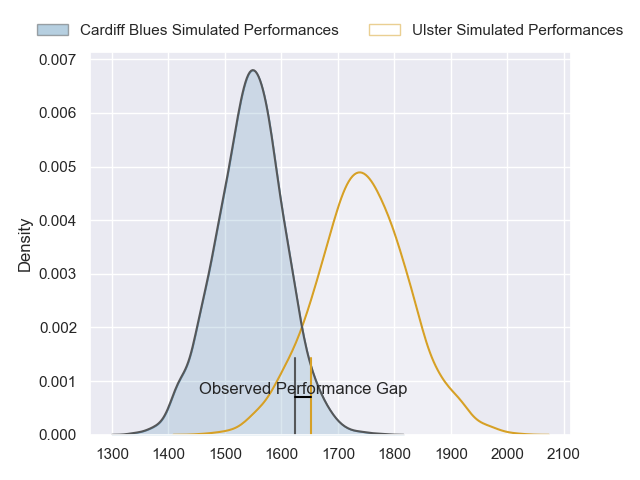
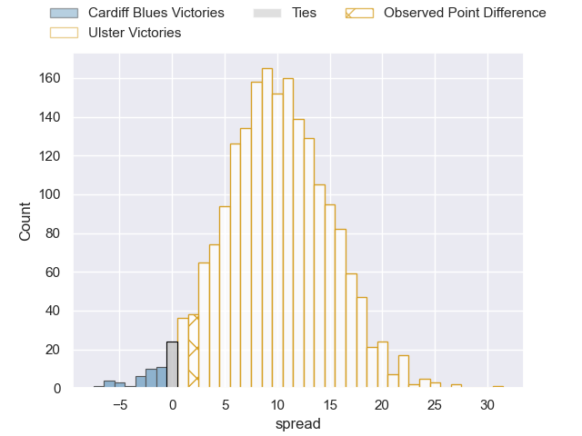
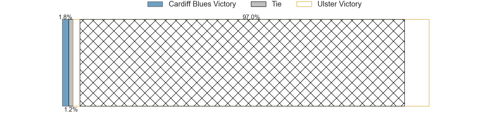
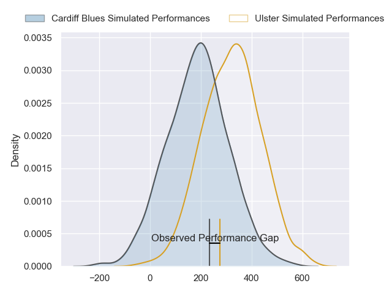
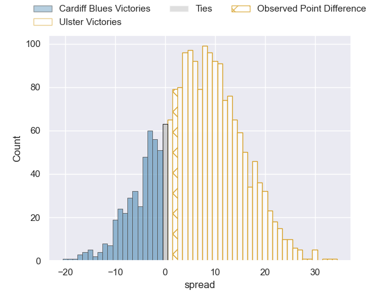
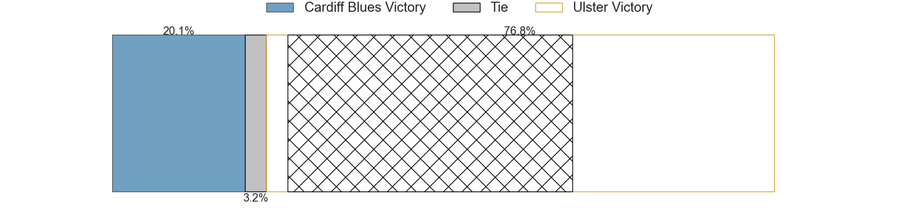

---  
layout: page  
title: Cardiff Blues at Ulster; 17-19  
date: 2024-04-19 18:00:00 -0500  
categories: "United Rugby Championship 2023" match review  
---
# Cardiff Blues at Ulster; 17-19

# Club Level Predictions

The first set of predictions treats a club as the smallest object, as the club develops its members, organizes a gameplan, and deploys its players as needed for each match. This club model has a prediction of 0.754, which translates to predicting Ulster to win by 9.9.

Our Over/Under is 44.5 - and combined with the spread above, we have a predicted scoreline of 17 to 27

Each club has a rating and a rating deviation (similar to a Glicko rating), and expected performances can be generated. This allows for simulated matches and spreads like the ones below.
## Projected Performances - Club Model

## Projected Spreads - Club Model

## Projected Results - Club Model

# Player Level Predictions - Version 2

Treating teams instead as an entity made up of the currently active players, I have ratings for each player in an altogether different system. These can be combined to form team ratings once teamsheets are announced, weighting starters a bit higher than the reserves. After the match is played, players can be weighted by their minutes on the field, allowing for an accurate measure of the team's composition. With these compiled team ratings, we can make predictions, measure inaccuracy, and update the individual player ratings.
## Prediction without Player Minutes: Ulster by 5.7

Cardiff Blues by 0.9 on a neutral pitch

## Projected Performances - Player Model

## Projected Spreads - Player Model

## Projected Results - Player Model

|   Away Minutes | Away Player       |   Away Percentile |   Number |   Home Percentile | Home Player        |   Home Minutes |
|---------------:|:------------------|------------------:|---------:|------------------:|:-------------------|---------------:|
|             52 | Corey Domachowski |             81.58 |        1 |             40.5  | Eric O'Sullivan    |             52 |
|             76 | Liam Belcher      |             67.27 |        2 |              4.62 | Tom Stewart        |             60 |
|             55 | Keiron Assiratti  |             34.33 |        3 |             65.19 | Scott Wilson       |             61 |
|             80 | Ben Donnell       |             85.97 |        4 |             84.64 | Harry Sheridan     |             80 |
|             66 | Teddy Williams    |             23.1  |        5 |             68.08 | Alan O'Connor      |             66 |
|             58 | Alex Mann         |             15.38 |        6 |             90.82 | Dave Ewers         |             80 |
|             80 | Thomas Young      |             89.51 |        7 |             90.94 | Marcus Rea         |             72 |
|             30 | Taulupe Faletau   |             82.29 |        8 |             65.84 | David McCann       |             80 |
|             55 | Ellis Bevan       |             55.6  |        9 |             23.89 | Nathan Doak        |             55 |
|             80 | Tinus de Beer     |             65.45 |       10 |             26.23 | Jake Flannery      |             41 |
|             80 | Theo Cabango      |             50.74 |       11 |             38.4  | Jacob Stockdale    |             80 |
|             80 | Ben Thomas        |             58.84 |       12 |             54.51 | Jude Postlethwaite |             80 |
|             80 | Mason Grady       |             79.73 |       13 |             22.5  | James Hume         |             20 |
|             80 | Josh Adams        |             72.11 |       14 |             33.26 | Mike Lowry         |             80 |
|              4 | Cameron Winnett   |             25.45 |       15 |             83.68 | Will Addison       |             80 |
|              4 | Evan Lloyd        |            nan    |       16 |             33.73 | John Andrew        |             20 |
|             28 | Rhys Carré        |             16.39 |       17 |             12.83 | Andrew Warwick     |             28 |
|             25 | Ciaran Parker     |            nan    |       18 |             61.52 | Tom O'Toole        |             19 |
|             14 | Rory Thornton     |              6.41 |       19 |             52    | Cormac Izuchukwu   |             14 |
|             22 | Ellis Jenkins     |             43.62 |       20 |            nan    | Greg Jones         |              8 |
|             50 | Mackenzie Martin  |             42.64 |       21 |             89.85 | John Cooney        |             25 |
|             25 | Gonzalo Bertranou |             68.5  |       22 |             47.01 | Billy Burns        |             39 |
|             76 | Jacob Beetham     |             17.05 |       23 |             79.43 | Ethan McIlroy      |             60 |

