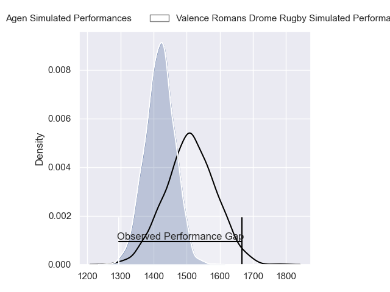
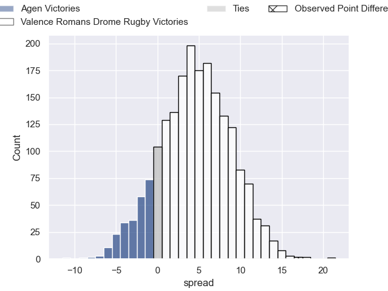
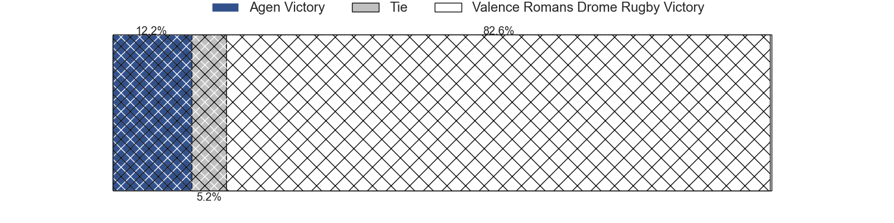
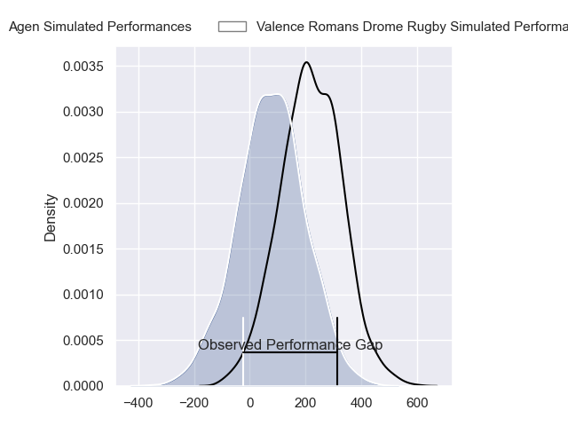
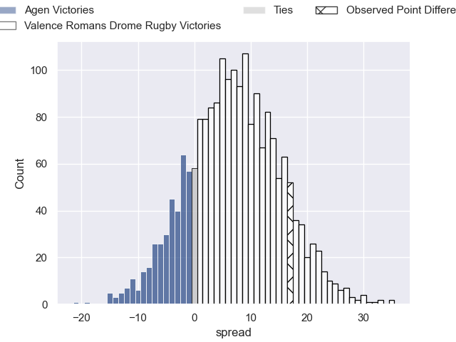
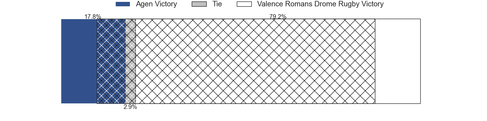

---  
layout: page  
title: Agen at Valence Romans Drome Rugby; 21-38  
date: 2024-04-19 18:00:00 -0500  
categories: "Pro D2 2023" match review  
---
# Agen at Valence Romans Drome Rugby; 21-38

# Club Level Predictions

The first set of predictions treats a club as the smallest object, as the club develops its members, organizes a gameplan, and deploys its players as needed for each match. This club model has a prediction of 0.628, which translates to predicting Valence Romans Drome Rugby to win by 4.6.

Our Over/Under is 40.5 - and combined with the spread above, we have a predicted scoreline of 18 to 22

Each club has a rating and a rating deviation (similar to a Glicko rating), and expected performances can be generated. This allows for simulated matches and spreads like the ones below.
## Projected Performances - Club Model

## Projected Spreads - Club Model

## Projected Results - Club Model

# Player Level Predictions - Version 2

Treating teams instead as an entity made up of the currently active players, I have ratings for each player in an altogether different system. These can be combined to form team ratings once teamsheets are announced, weighting starters a bit higher than the reserves. After the match is played, players can be weighted by their minutes on the field, allowing for an accurate measure of the team's composition. With these compiled team ratings, we can make predictions, measure inaccuracy, and update the individual player ratings.
## Prediction without Player Minutes: Valence Romans Drome Rugby by 7.3

Valence Romans Drome Rugby by 4.3 on a neutral pitch

## Projected Performances - Player Model

## Projected Spreads - Player Model

## Projected Results - Player Model

|   Away Minutes | Away Player                   |   Away Percentile |   Number |   Home Percentile | Home Player         |   Home Minutes |
|---------------:|:------------------------------|------------------:|---------:|------------------:|:--------------------|---------------:|
|             57 | Hans Lombard-Buret            |             63.36 |        1 |             61.23 | Anthony Aléo        |             60 |
|             70 | Pierre Jouvin                 |             12.45 |        2 |             80.12 | Dorian Marco Pena   |             56 |
|             57 | Beau Farrance                 |             39.34 |        3 |             43.3  | Gareth Milasinovich |             63 |
|             80 | Joe Maksymiw                  |              8.46 |        4 |             63.24 | Ryan McCauley       |             80 |
|             57 | Evan Olmstead                 |              2.54 |        5 |             75.09 | Florian Goumat      |             63 |
|             57 | Julien Lebian                 |             13.11 |        6 |             39.33 | Axel Bruchet        |             63 |
|             80 | Arnaud Duputs                 |             72.47 |        7 |              0.12 | Mathieu Vachon      |             60 |
|             80 | Matthieu Bonnet               |             27.68 |        8 |             89.53 | Ioane Iashagashvili |             80 |
|             62 | Dorian Bellot                 |             15.86 |        9 |             84.99 | Thomas Lhusero      |             80 |
|             80 | Ben Volavola                  |             21.82 |       10 |             38.18 | Lucas Meret         |             60 |
|             62 | Inoke Nalaga Kurukuruvakatini |              6.17 |       11 |             89.71 | Mosese Mawalu       |             80 |
|             80 | Peyo Muscarditz               |             68.85 |       12 |              8.53 | Mathieu Guillomot   |             80 |
|             80 | Theo Belan                    |             46.23 |       13 |             81.21 | Anatole Pauvert     |             48 |
|             80 | Tevita Railevu                |             63.09 |       14 |             94.97 | Adam Vargas         |             80 |
|             57 | Jean-Marcelin Buttin          |             26.21 |       15 |             92.37 | Charles Bouldoire   |             80 |
|             23 | Vincent Farre                 |             55.78 |       16 |             84.55 | Ben Neiceru         |             32 |
|             23 | Fotu Lokotui                  |             27.18 |       17 |              2.41 | Cyril Deligny       |             24 |
|             23 | Loris Tolot                   |              1.94 |       18 |              6.56 | Julien Royer        |             20 |
|             23 | Richard Barrington            |             63.93 |       19 |            nan    | Philippe Laville    |             20 |
|             23 | Alex Burin                    |             46.96 |       20 |             77.14 | Joris Moura         |             20 |
|             18 | Emile Dayral                  |             22.08 |       21 |             79.38 | Thembelani Bholi    |             17 |
|             18 | Timilai Rokoduru              |             60.46 |       22 |              4.17 | Éloi Massot         |             17 |
|             10 | Théo Sauzaret                 |            nan    |       23 |             34.04 | Mathis Roume        |             17 |

