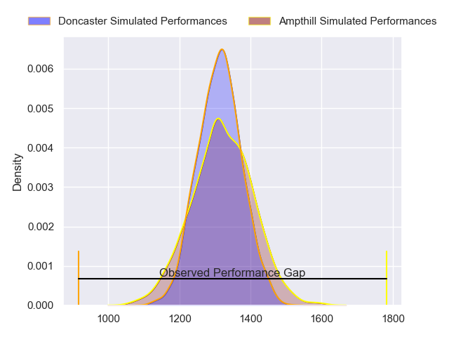
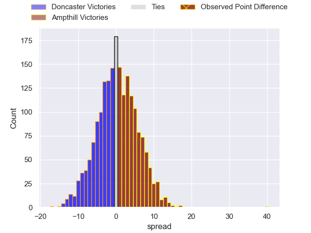
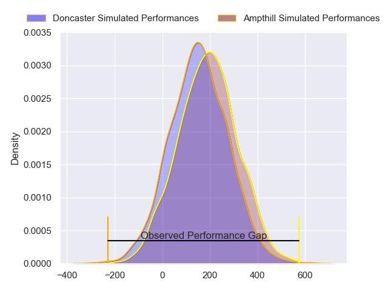
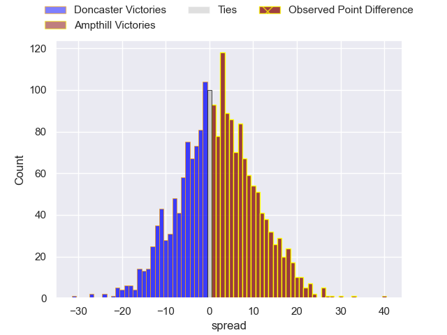

---  
layout: page  
title: Doncaster at Ampthill; 9-49  
date: 2024-04-20 18:00:00 -0500  
categories: "RFU Championship 2023" match review  
---
# Doncaster at Ampthill; 9-49

# Club Level Predictions

The first set of predictions treats a club as the smallest object, as the club develops its members, organizes a gameplan, and deploys its players as needed for each match. This club model has a prediction of 0.507, which translates to predicting Ampthill to win by 0.3.

Our Over/Under is 60.5 - and combined with the spread above, we have a predicted scoreline of 30 to 30

Each club has a rating and a rating deviation (similar to a Glicko rating), and expected performances can be generated. This allows for simulated matches and spreads like the ones below.
## Projected Performances - Club Model

## Projected Spreads - Club Model

## Projected Results - Club Model

# Player Level Predictions - Version 2

Treating teams instead as an entity made up of the currently active players, I have ratings for each player in an altogether different system. These can be combined to form team ratings once teamsheets are announced, weighting starters a bit higher than the reserves. After the match is played, players can be weighted by their minutes on the field, allowing for an accurate measure of the team's composition. With these compiled team ratings, we can make predictions, measure inaccuracy, and update the individual player ratings.
## Prediction without Player Minutes: Ampthill by 2.9

Ampthill by 0.1 on a neutral pitch

## Projected Performances - Player Model

## Projected Spreads - Player Model

## Projected Results - Player Model

|   Away Minutes | Away Player              |   Away Percentile |   Number |   Home Percentile | Home Player                 |   Home Minutes |
|---------------:|:-------------------------|------------------:|---------:|------------------:|:----------------------------|---------------:|
|             80 | Conor Davidson           |             55.35 |        1 |             88.81 | Sam Crean                   |             54 |
|             56 | George Roberts           |             28.92 |        2 |             40.76 | Samson Adejimi              |             62 |
|             56 | Lewis Thiede             |             96.62 |        3 |             26.62 | Alec Clarey                 |             62 |
|             66 | Evan Mintern             |             81.14 |        4 |             80.41 | Ollie Stonham               |             80 |
|             80 | Ben Murphy               |             45.59 |        5 |             74.61 | Iwan Shenton                |             48 |
|             50 | Fyn Brown                |             19.43 |        6 |             72.94 | Nathan Michelow             |             80 |
|             80 | Archie Smeaton           |             43.15 |        7 |             75.21 | Toby Knight                 |             80 |
|             60 | Harry Wilson             |             14.46 |        8 |             74.31 | Morgan Strong               |             80 |
|             61 | Ollie Fox                |              3.81 |        9 |             72.52 | Charlie Bracken             |             72 |
|             80 | Russell Bennett          |             83.38 |       10 |             70.91 | Josh Barton                 |             80 |
|             80 | Westleigh Alleyne Holden |             37.14 |       11 |             74.97 | Brandon Jackson-Richards    |             80 |
|             80 | Connor Edwards           |              7.66 |       12 |             90.36 | Fraser James Kevin Strachan |             80 |
|             80 | Joe Margetts             |             50.68 |       13 |             53.28 | Oli Morris                  |             47 |
|             61 | George Simpson           |             21.6  |       14 |             79.2  | Tobias Elliott              |             80 |
|             80 | Billy McBryde            |             79.39 |       15 |             79.9  | Tomas Bacon                 |             80 |
|             30 | Jack Digby               |             57.36 |       16 |             27.44 | Josh Hallett                |             33 |
|             24 | Corrie Barrett           |             25.27 |       17 |            nan    | Olamide Sodeke              |             32 |
|             24 | Ethan Caine              |            nan    |       18 |              9.84 | James Flynn                 |             26 |
|             20 | Rhys Tait                |             52.92 |       19 |            nan    | Sid Blackmore               |             18 |
|             19 | Alex Dolly               |             78.86 |       20 |             62.68 | James Johnston              |             18 |
|             19 | Sam Bedlow               |             77.87 |       21 |             88.58 | Peter White                 |              8 |
|             14 | Adam Hopkinson           |             44.26 |       22 |            nan    | nan                         |            nan |

