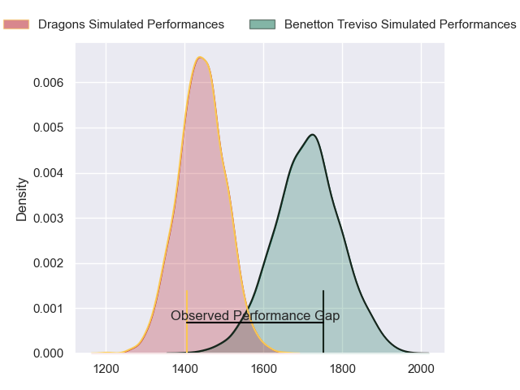
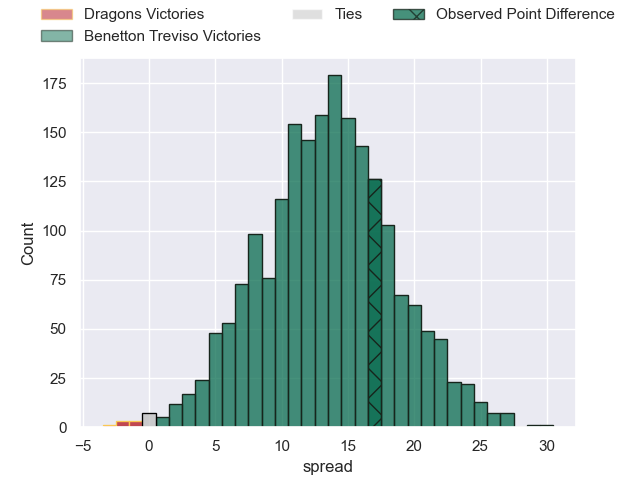
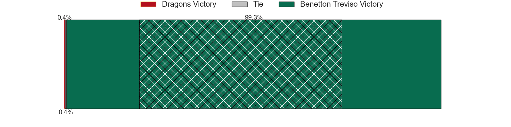
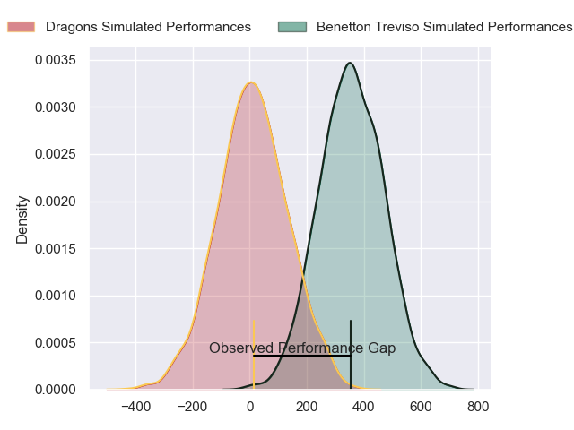
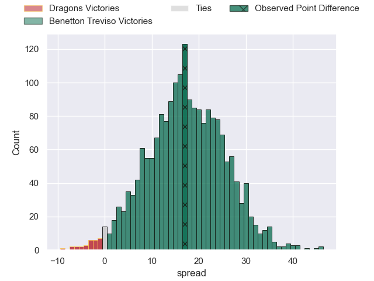
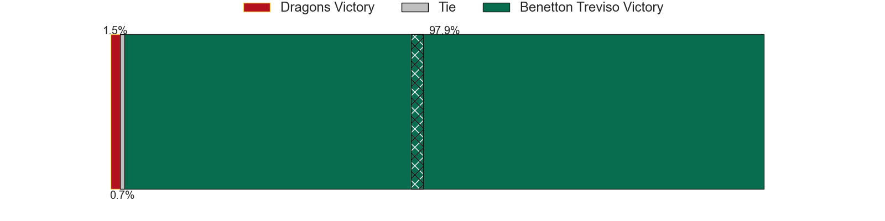

---  
layout: page  
title: Dragons at Benetton Treviso; 19-36  
date: 2024-04-20 18:00:00 -0500  
categories: "United Rugby Championship 2023" match review  
---
# Dragons at Benetton Treviso; 19-36

# Club Level Predictions

The first set of predictions treats a club as the smallest object, as the club develops its members, organizes a gameplan, and deploys its players as needed for each match. This club model has a prediction of 0.819, which translates to predicting Benetton Treviso to win by 13.4.

Our Over/Under is 43.5 - and combined with the spread above, we have a predicted scoreline of 15 to 28

Each club has a rating and a rating deviation (similar to a Glicko rating), and expected performances can be generated. This allows for simulated matches and spreads like the ones below.
## Projected Performances - Club Model

## Projected Spreads - Club Model

## Projected Results - Club Model

# Player Level Predictions - Version 2

Treating teams instead as an entity made up of the currently active players, I have ratings for each player in an altogether different system. These can be combined to form team ratings once teamsheets are announced, weighting starters a bit higher than the reserves. After the match is played, players can be weighted by their minutes on the field, allowing for an accurate measure of the team's composition. With these compiled team ratings, we can make predictions, measure inaccuracy, and update the individual player ratings.
## Prediction without Player Minutes: Benetton Treviso by 18.8

Benetton Treviso by 13.6 on a neutral pitch

## Projected Performances - Player Model

## Projected Spreads - Player Model

## Projected Results - Player Model

|   Away Minutes | Away Player      |   Away Percentile |   Number |   Home Percentile | Home Player         |   Home Minutes |
|---------------:|:-----------------|------------------:|---------:|------------------:|:--------------------|---------------:|
|             65 | Rodrigo Martinez |             61.11 |        1 |             55.2  | Mirco Spagnolo      |             52 |
|             69 | James Benjamin   |             13.95 |        2 |             85.27 | Gianmarco Lucchesi  |             52 |
|             47 | Luke Yendle      |             43.37 |        3 |             65.68 | Giosue Zilocchi     |             52 |
|             80 | Ben Carter       |             19.26 |        4 |             46.05 | Scott Scrafton      |             41 |
|             80 | George Nott      |             24.52 |        5 |             34.45 | Riccardo Favretto   |             61 |
|             47 | Dan Lydiate      |             29.7  |        6 |             87.24 | Sebastian Negri     |             48 |
|             80 | Sean Lonsdale    |             22.16 |        7 |             96.64 | Michele Lamaro      |             80 |
|             57 | Taine Basham     |             32.43 |        8 |             72.73 | Toa Halafihi        |             80 |
|             57 | Dane Blacker     |             10.53 |        9 |             16    | Andy Uren           |             56 |
|             80 | Will Reed        |             29.49 |       10 |             79.23 | Tomas Albornoz      |             52 |
|             80 | Jared Rosser     |              4.84 |       11 |             34.23 | Onisi Ratave        |             80 |
|             80 | Aneurin Owen     |             62.5  |       12 |             62.99 | Marco Zanon         |             80 |
|             47 | Sio Tomkinson    |             39.32 |       13 |             93.2  | Juan Ignacio Brex   |             80 |
|             80 | Rio Dyer         |             24.77 |       14 |             70.95 | Leonardo Marin      |             80 |
|             57 | Cai Evans        |             14.54 |       15 |             88.97 | Rhyno Smith         |             80 |
|             11 | Brodie Coghlan   |             38.51 |       16 |            nan    | Bautista Bernasconi |             28 |
|             15 | Aki Seiuli       |             11.06 |       17 |             82.46 | Ivan Nemer          |             28 |
|             33 | Dimitri Arhip    |            nan    |       18 |             83.79 | Tiziano Pasquali    |             28 |
|             23 | Harrison Keddie  |              1.97 |       19 |             15.55 | Gideon Koegelenberg |             39 |
|             33 | Aaron Wainwright |             84.28 |       20 |             71.77 | Edoardo Iachizzi    |             19 |
|             23 | Che Hope         |            nan    |       21 |             53.71 | Alessandro Izekor   |             32 |
|             33 | Joe Westwood     |             34.1  |       22 |            nan    | Dewaldt Duvenage    |             24 |
|             23 | Jordan Williams  |            nan    |       23 |             68.72 | Jacob Umaga         |             28 |

