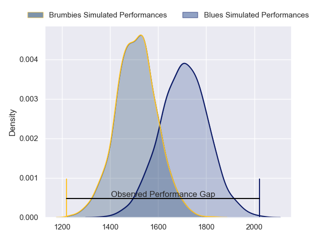
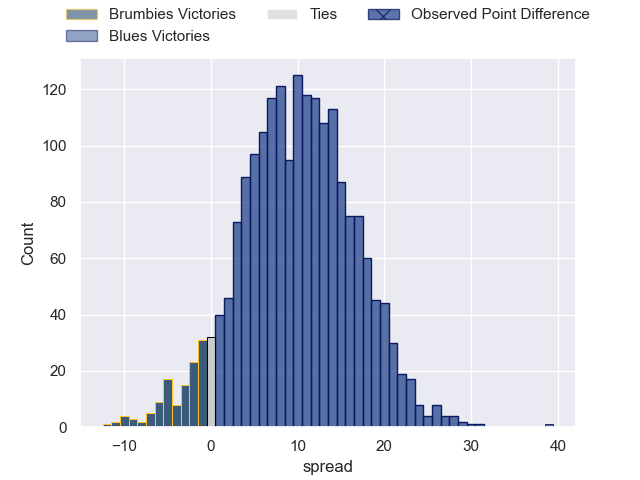
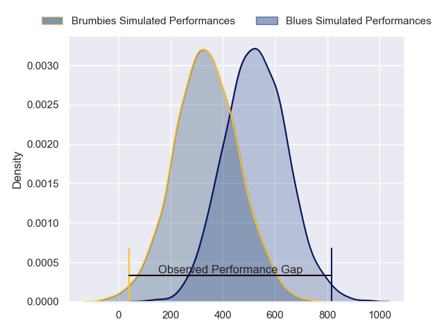
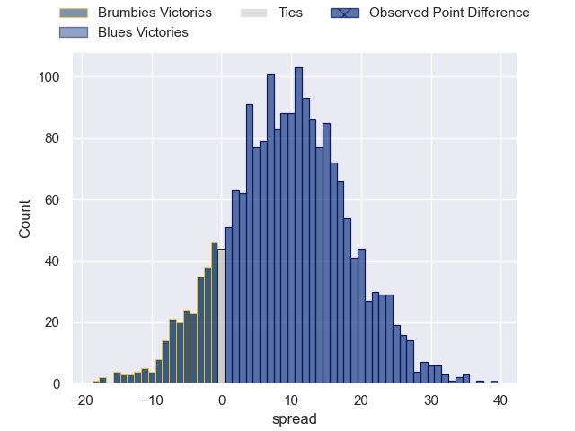
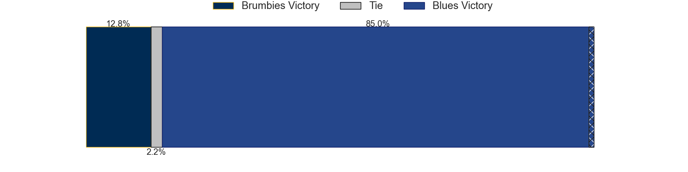

---  
layout: page  
title: Brumbies at Blues; 7-46  
date: 2024-04-20 18:00:00 -0500  
categories: "Super Rugby Pacific 2024" match review  
---
# Brumbies at Blues; 7-46

# Club Level Predictions

The first set of predictions treats a club as the smallest object, as the club develops its members, organizes a gameplan, and deploys its players as needed for each match. This club model has a prediction of 0.751, which translates to predicting Blues to win by 9.9.

Our Over/Under is 54.5 - and combined with the spread above, we have a predicted scoreline of 23 to 32

Each club has a rating and a rating deviation (similar to a Glicko rating), and expected performances can be generated. This allows for simulated matches and spreads like the ones below.
## Projected Performances - Club Model

## Projected Spreads - Club Model

## Projected Results - Club Model

# Player Level Predictions - Version 2

Treating teams instead as an entity made up of the currently active players, I have ratings for each player in an altogether different system. These can be combined to form team ratings once teamsheets are announced, weighting starters a bit higher than the reserves. After the match is played, players can be weighted by their minutes on the field, allowing for an accurate measure of the team's composition. With these compiled team ratings, we can make predictions, measure inaccuracy, and update the individual player ratings.
## Prediction without Player Minutes: Blues by 11.1

Blues by 6.6 on a neutral pitch

## Projected Performances - Player Model

## Projected Spreads - Player Model

## Projected Results - Player Model

|   Away Minutes | Away Player      |   Away Percentile |   Number |   Home Percentile | Home Player        |   Home Minutes |
|---------------:|:-----------------|------------------:|---------:|------------------:|:-------------------|---------------:|
|             60 | James Slipper    |             94.41 |        1 |             98.84 | Ofa Tu'ungafasi    |             54 |
|             61 | Billy Pollard    |             73.69 |        2 |             78.51 | Ricky Riccitelli   |             59 |
|             61 | Sefo Kautai      |             33.08 |        3 |             77.24 | Marcel Renata      |             54 |
|             51 | Darcy Swain      |             62.52 |        4 |             94.44 | Patrick Tuipulotu  |             80 |
|             51 | Cadeyrn Neville  |             98.79 |        5 |             95.41 | Laghlan McWhannell |             61 |
|             80 | Rob Valetini     |             97.62 |        6 |             95.83 | Akira Ioane        |             72 |
|             55 | Jahrome Brown    |             84.74 |        7 |             98.81 | Dalton Papalii     |             80 |
|             80 | Charlie Cale     |             53.12 |        8 |             94.26 | Hoskins Sotutu     |             80 |
|             70 | Ryan Lonergan    |             74.84 |        9 |             21.56 | Taufa Funaki       |             69 |
|             80 | Noah Lolesio     |             84.68 |       10 |             90.65 | Harry Plummer      |             76 |
|             80 | Corey Toole      |             57.83 |       11 |             53.6  | Caleb Clarke       |             80 |
|             67 | Tamati Tua       |             62.18 |       12 |             98.39 | Bryce Heem         |             59 |
|             76 | Hudson Creighton |             50.31 |       13 |             85.04 | Rieko Ioane        |             80 |
|             80 | Ollie Sapsford   |             90.51 |       14 |             71.54 | Mark Tele'a        |             80 |
|             80 | Tom Wright       |             72.77 |       15 |             64.89 | Cole Forbes        |             80 |
|             19 | Connal McInerney |             85.34 |       16 |             88.55 | Kurt Eklund        |             21 |
|             29 | Blake Schoupp    |             45.42 |       17 |             50.34 | Josh Fusitu'a      |             26 |
|             19 | Rhys Van Nek     |             63.55 |       18 |             95.76 | Angus Ta'avao      |             26 |
|             29 | Nick Frost       |             56.11 |       19 |             39.54 | Sam Darry          |             19 |
|             29 | Tom Hooper       |             72.59 |       20 |             62.46 | Adrian Choat       |              0 |
|             20 | Luke Reimer      |             52.09 |       21 |             72.09 | Sam Nock           |             11 |
|             10 | Harrison Goddard |             26.22 |       22 |             42.08 | Lucas Cashmore     |              4 |
|             13 | Jack Debreczeni  |             68.57 |       23 |             71.2  | AJ Lam             |             21 |

