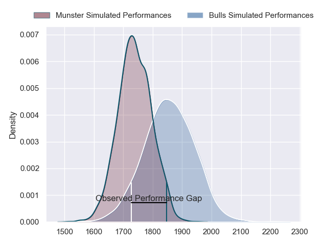
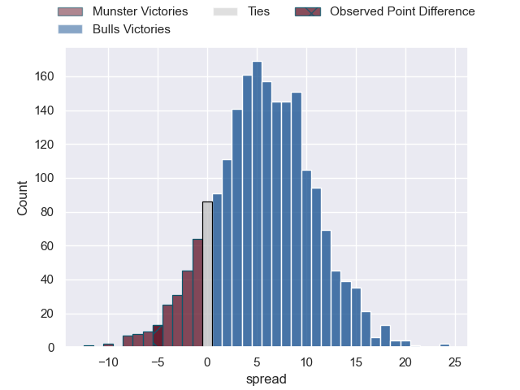
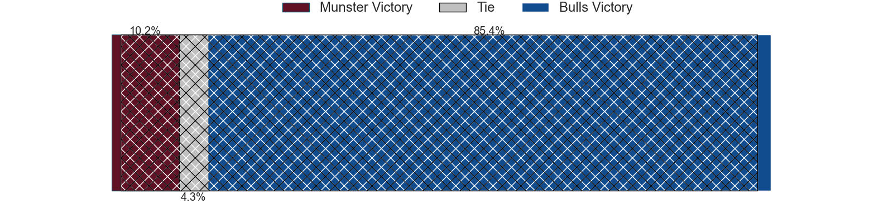
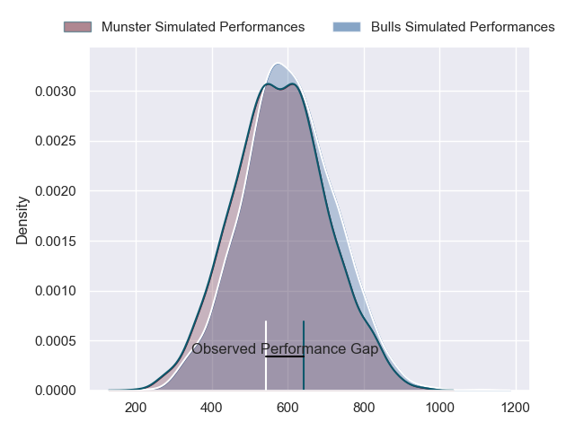
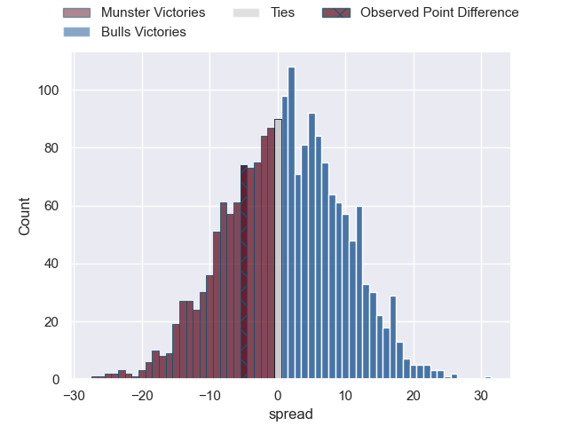

---  
layout: page  
title: Munster at Bulls; 27-22  
date: 2024-04-20 18:00:00 -0500  
categories: "United Rugby Championship 2023" match review  
---
# Munster at Bulls; 27-22

# Club Level Predictions

The first set of predictions treats a club as the smallest object, as the club develops its members, organizes a gameplan, and deploys its players as needed for each match. This club model has a prediction of 0.662, which translates to predicting Bulls to win by 5.9.

Our Over/Under is 62.5 - and combined with the spread above, we have a predicted scoreline of 28 to 34

Each club has a rating and a rating deviation (similar to a Glicko rating), and expected performances can be generated. This allows for simulated matches and spreads like the ones below.
## Projected Performances - Club Model

## Projected Spreads - Club Model

## Projected Results - Club Model

# Player Level Predictions - Version 2

Treating teams instead as an entity made up of the currently active players, I have ratings for each player in an altogether different system. These can be combined to form team ratings once teamsheets are announced, weighting starters a bit higher than the reserves. After the match is played, players can be weighted by their minutes on the field, allowing for an accurate measure of the team's composition. With these compiled team ratings, we can make predictions, measure inaccuracy, and update the individual player ratings.
## Prediction without Player Minutes: Bulls by 2.2

Munster by 2.3 on a neutral pitch

## Projected Performances - Player Model

## Projected Spreads - Player Model

## Projected Results - Player Model

|   Away Minutes | Away Player     |   Away Percentile |   Number |   Home Percentile | Home Player         |   Home Minutes |
|---------------:|:----------------|------------------:|---------:|------------------:|:--------------------|---------------:|
|             51 | Jeremy Loughman |             94.57 |        1 |             92.56 | Gerhard Steenekamp  |             69 |
|             63 | Niall Scannell  |             92.34 |        2 |             95.48 | Johan Grobbelaar    |             51 |
|             63 | Stephen Archer  |             97.9  |        3 |             99.24 | Wilco Louw          |             69 |
|             56 | RG Snyman       |             98.92 |        4 |             17.11 | Ruan Vermaak        |             80 |
|             80 | Tadhg Beirne    |             98.8  |        5 |             38.4  | JF van Heerden      |             60 |
|             52 | Peter O'Mahony  |             97.1  |        6 |             28.65 | Cameron Hanekom     |             52 |
|             52 | Alex Kendellen  |             76.57 |        7 |             73.9  | Reinhardt Ludwig    |             80 |
|             80 | Jack O'Donoghue |             77.89 |        8 |             89.19 | Elrigh Louw         |             80 |
|             77 | Conor Murray    |             98.11 |        9 |             94.53 | Embrose Papier      |             76 |
|             80 | Jack Crowley    |             42.82 |       10 |             81.54 | Johan Goosen        |             80 |
|             80 | Shane Daly      |             95.38 |       11 |             98.54 | Kurt-Lee Arendse    |             80 |
|             67 | Alex Nankivell  |             89.44 |       12 |             93.57 | David Kriel         |             80 |
|             80 | Antoine Frisch  |             89.32 |       13 |             98.79 | Canan Moodie        |             80 |
|             80 | Calvin Nash     |             92.12 |       14 |             34.91 | Sebastian de Klerk  |             76 |
|             80 | Simon Zebo      |             94.74 |       15 |             97.24 | Willie le Roux      |             63 |
|             17 | Eoghan Clarke   |            nan    |       16 |             99.41 | Akker van der Merwe |             29 |
|             29 | Josh Wycherley  |             41.37 |       17 |             77.22 | Simphiwe Matanzima  |             11 |
|             17 | Oli Jager       |             89.7  |       18 |             78.84 | Mornay Smith        |             11 |
|             24 | Thomas Ahern    |             53.35 |       19 |             83.13 | Janko Swanepoel     |             20 |
|             28 | Gavin Coombes   |             79.61 |       20 |             37.24 | Celimpilo Gumede    |             28 |
|              3 | Craig Casey     |             78.95 |       21 |             85.89 | Zak Burger          |              4 |
|             13 | Joey Carbery    |             74.36 |       22 |             34.87 | Chris William Smith |             17 |
|             28 | John Hodnett    |             61.25 |       23 |             84.46 | Devon Williams      |              4 |

