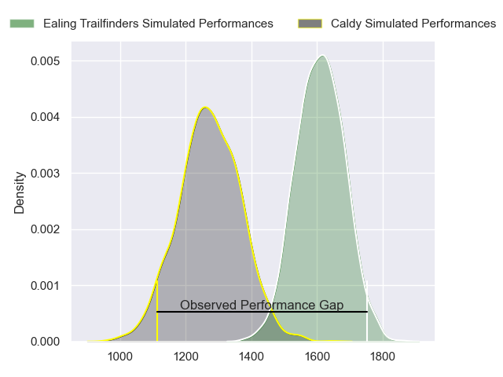
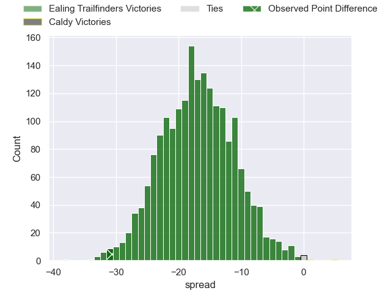
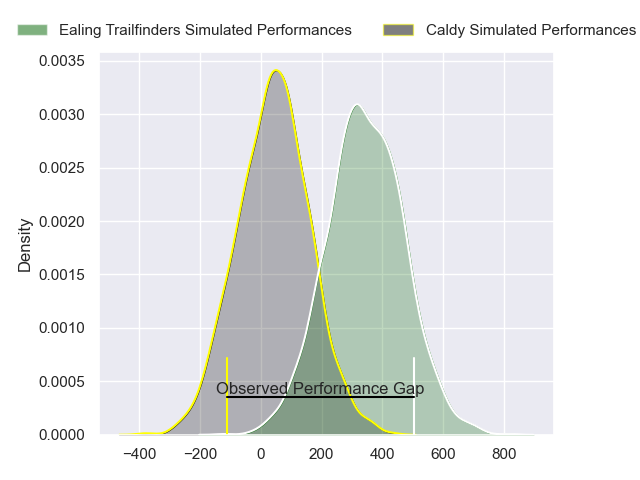
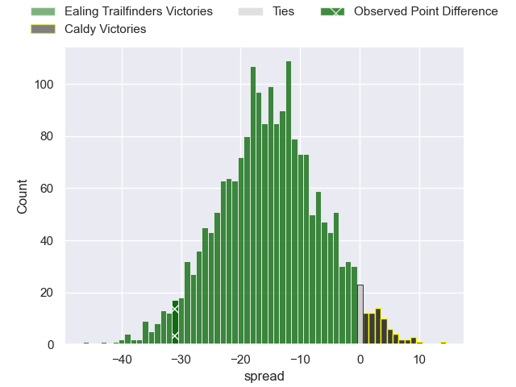

---  
layout: page  
title: Ealing Trailfinders at Caldy; 49-18  
date: 2024-04-20 18:00:00 -0500  
categories: "RFU Championship 2023" match review  
---
# Ealing Trailfinders at Caldy; 49-18

# Club Level Predictions

The first set of predictions treats a club as the smallest object, as the club develops its members, organizes a gameplan, and deploys its players as needed for each match. This club model has a prediction of 0.126, which translates to predicting Ealing Trailfinders to win by 17.2.

Our Over/Under is 70.5 - and combined with the spread above, we have a predicted scoreline of 44 to 27

Each club has a rating and a rating deviation (similar to a Glicko rating), and expected performances can be generated. This allows for simulated matches and spreads like the ones below.
## Projected Performances - Club Model

## Projected Spreads - Club Model

## Projected Results - Club Model

# Player Level Predictions - Version 2

Treating teams instead as an entity made up of the currently active players, I have ratings for each player in an altogether different system. These can be combined to form team ratings once teamsheets are announced, weighting starters a bit higher than the reserves. After the match is played, players can be weighted by their minutes on the field, allowing for an accurate measure of the team's composition. With these compiled team ratings, we can make predictions, measure inaccuracy, and update the individual player ratings.
## Prediction without Player Minutes: Ealing Trailfinders by 14.0

Ealing Trailfinders by 16.4 on a neutral pitch

## Projected Performances - Player Model

## Projected Spreads - Player Model

## Projected Results - Player Model

|   Away Minutes | Away Player          |   Away Percentile |   Number |   Home Percentile | Home Player      |   Home Minutes |
|---------------:|:---------------------|------------------:|---------:|------------------:|:-----------------|---------------:|
|             57 | Will Goodrick-Clarke |             47.73 |        1 |             18.71 | Ryan Higginson   |             46 |
|             57 | Matthew Cornish      |             70.08 |        2 |             53.82 | Matt Gallagher   |             52 |
|             60 | Biyi Alo             |             91.32 |        3 |             10.61 | Nathan Rushton   |             46 |
|             75 | Bobby de Wee         |             95.16 |        4 |             44.14 | Callum Atkinson  |             80 |
|             57 | Andrew Davidson      |             26.48 |        5 |             29.87 | Adam McNamee     |             80 |
|             80 | David O'Connor       |             23.48 |        6 |             10.01 | Sam Olyott       |             70 |
|             80 | Jordan Reid          |             61.14 |        7 |             29.56 | Tristan Woodman  |             80 |
|             80 | Richard Hardwick     |             56.86 |        8 |              4.99 | Callum Ridgway   |             80 |
|             61 | Craig Hampson        |             87.53 |        9 |             24.95 | Joseph Murray    |             48 |
|             77 | Craig Willis         |             97.66 |       10 |             12.99 | Rhys Hayes       |             80 |
|             80 | Dan O'Brien          |             40    |       11 |             10.74 | Benjamin Jones   |             60 |
|             80 | Pat Howard           |             91.97 |       12 |             29.91 | Connor Wilkinson |             55 |
|             80 | Reuben Bird-Tulloch  |             66.01 |       13 |              3.09 | Michael Cartmill |             80 |
|             80 | Angus Kernohan       |             87.54 |       14 |             17.83 | William Robinson |             80 |
|             51 | Michael Dykes        |             62.34 |       15 |             48.35 | Matt Kilcourse   |             80 |
|             29 | Tom Collins          |             97.83 |       16 |             16.88 | Adam Aigbokhae   |             34 |
|             23 | Kyle John Whyte      |             82.26 |       17 |             14.37 | Joe Sproston     |             34 |
|             23 | Barney Maddison      |             96.13 |       18 |            nan    | Ollie Wynn       |             32 |
|             23 | Mike Willemse        |             69.08 |       19 |             12.05 | Oliver Hearn     |             28 |
|             19 | Lloyd Williams       |             80.55 |       20 |             38.44 | Michael Barlow   |             25 |
|             20 | Jimmy Roots          |             47.25 |       21 |              9.71 | Nick Royle       |             20 |
|              5 | Callum Chick         |              2.24 |       22 |             18.98 | Josiah Dickinson |             10 |
|              3 | Dan Lancaster        |              2.34 |       23 |            nan    | nan              |            nan |

