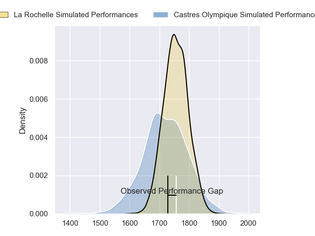
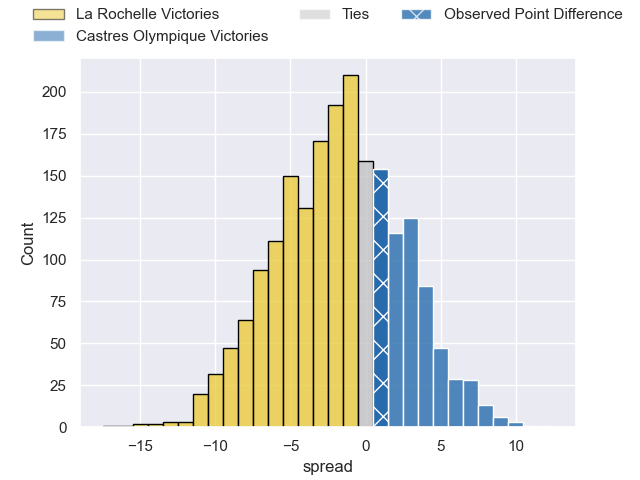
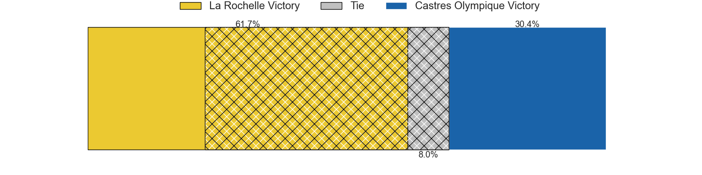
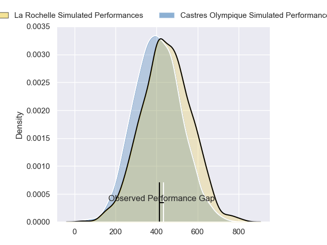
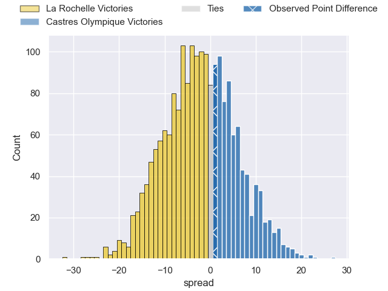
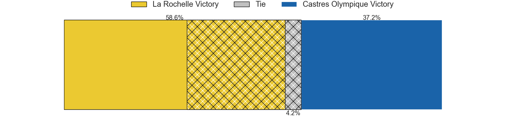

---  
layout: page  
title: La Rochelle at Castres Olympique; 24-25  
date: 2024-04-20 18:00:00 -0500  
categories: "Top 14 Orange 2023" match review  
---
# La Rochelle at Castres Olympique; 24-25

# Club Level Predictions

The first set of predictions treats a club as the smallest object, as the club develops its members, organizes a gameplan, and deploys its players as needed for each match. This club model has a prediction of 0.45, which translates to predicting La Rochelle to win by 1.8.

Our Over/Under is 35.5 - and combined with the spread above, we have a predicted scoreline of 18 to 17

Each club has a rating and a rating deviation (similar to a Glicko rating), and expected performances can be generated. This allows for simulated matches and spreads like the ones below.
## Projected Performances - Club Model

## Projected Spreads - Club Model

## Projected Results - Club Model

# Player Level Predictions - Version 2

Treating teams instead as an entity made up of the currently active players, I have ratings for each player in an altogether different system. These can be combined to form team ratings once teamsheets are announced, weighting starters a bit higher than the reserves. After the match is played, players can be weighted by their minutes on the field, allowing for an accurate measure of the team's composition. With these compiled team ratings, we can make predictions, measure inaccuracy, and update the individual player ratings.
## Prediction without Player Minutes: Castres Olympique by 1.0

La Rochelle by 7.1 on a neutral pitch

## Projected Performances - Player Model

## Projected Spreads - Player Model

## Projected Results - Player Model

|   Away Minutes | Away Player        |   Away Percentile |   Number |   Home Percentile | Home Player           |   Home Minutes |
|---------------:|:-------------------|------------------:|---------:|------------------:|:----------------------|---------------:|
|             49 | Alexandre Kaddouri |             50.82 |        1 |             86.11 | Antoine Tichit        |             55 |
|             39 | Quentin Lespiaucq  |             72.29 |        2 |             79.32 | Gaetan Barlot         |             60 |
|             41 | Joel Sclavi        |             87.46 |        3 |             79.65 | Levan Chilachava      |             55 |
|             80 | Thomas Lavault     |             90.69 |        4 |             93.71 | Leone Nakarawa        |             80 |
|             80 | Will Skelton       |             98.07 |        5 |             67.71 | Florent Vanverberghe  |             60 |
|             50 | Oscar Jegou        |             41.24 |        6 |             29.2  | Mathieu Babillot      |             78 |
|             80 | Paul Boudehent     |             13.47 |        7 |             78.31 | Baptiste Delaporte    |             64 |
|             50 | Yoan Tanga         |             67.33 |        8 |             73.57 | Yann Peysson          |             80 |
|             67 | Teddy Iribaren     |             83.72 |        9 |             64.69 | Santiago Arata        |             71 |
|             80 | Hugo Reus          |             50.65 |       10 |             71.95 | Louis Le Brun         |             55 |
|             80 | Jules Favre        |             84.34 |       11 |             82.29 | Filipo Nakosi         |             80 |
|             66 | Jonathan Danty     |             90.98 |       12 |             95.92 | Jack Goodhue          |             55 |
|             80 | Ulupano Seuteni    |             64.89 |       13 |             18.17 | Adrien Seguret        |             80 |
|             80 | Jack Nowell        |             96.46 |       14 |             79.89 | Nathanael Hulleu      |             80 |
|             78 | Antoine Hastoy     |             55.98 |       15 |             78.88 | Julien Dumora         |             80 |
|             41 | Tolu Latu          |             87.75 |       16 |             38.55 | Loris Zarantonello    |             20 |
|             31 | Louis Penverne     |             37.42 |       17 |             51.49 | Lois Guerois-Galisson |             25 |
|              0 | Thomas Ployet      |             36.64 |       18 |             63.48 | Ryno Pieterse         |             20 |
|             30 | Gregory Alldritt   |             98.5  |       19 |             38.65 | Abraham Papali'i      |             18 |
|             30 | Levani Botia       |             97.14 |       20 |             25.37 | Jeremy Fernandez      |              9 |
|             13 | Lucas Zamora       |            nan    |       21 |             44.68 | Vilimoni Botitu       |             25 |
|             16 | Raymond Rhule      |             96.91 |       22 |             85.91 | Adrea Cocagi          |             25 |
|             39 | Uini Atonio        |             99.52 |       23 |             46.19 | Henry Thomas          |             25 |

