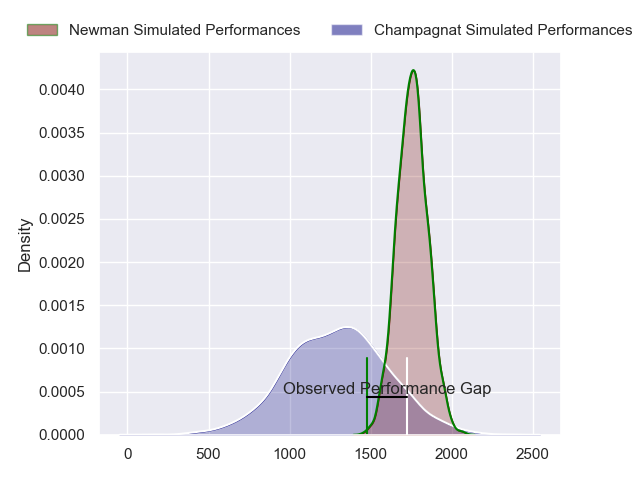
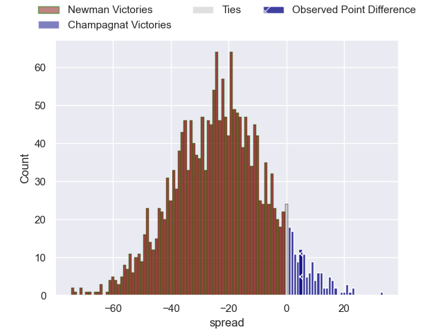
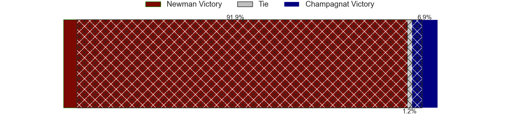
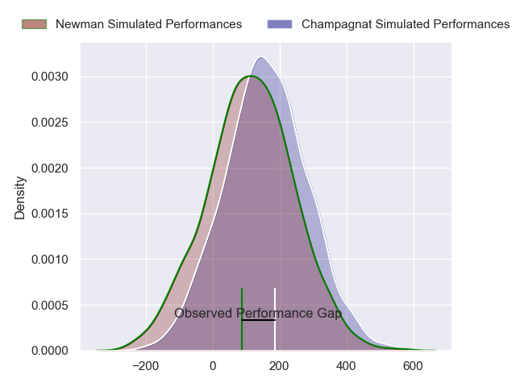
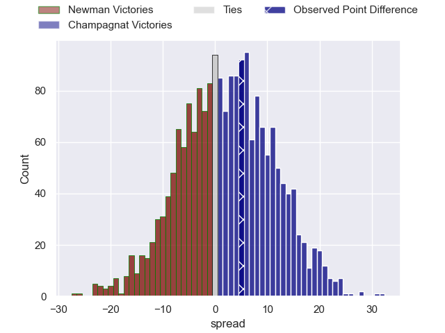

---  
layout: page  
title: Newman at Champagnat; 22-27  
date: 2024-04-20 18:00:00 -0500  
categories: "URBA Top 12 2024" match review  
---
# Newman at Champagnat; 22-27

# Club Level Predictions

The first set of predictions treats a club as the smallest object, as the club develops its members, organizes a gameplan, and deploys its players as needed for each match. This club model has a prediction of 0.074, which translates to predicting Newman to win by 22.9.

Our Over/Under is 39.5 - and combined with the spread above, we have a predicted scoreline of 31 to 8

Each club has a rating and a rating deviation (similar to a Glicko rating), and expected performances can be generated. This allows for simulated matches and spreads like the ones below.
## Projected Performances - Club Model

## Projected Spreads - Club Model

## Projected Results - Club Model

# Player Level Predictions - Version 2

Treating teams instead as an entity made up of the currently active players, I have ratings for each player in an altogether different system. These can be combined to form team ratings once teamsheets are announced, weighting starters a bit higher than the reserves. After the match is played, players can be weighted by their minutes on the field, allowing for an accurate measure of the team's composition. With these compiled team ratings, we can make predictions, measure inaccuracy, and update the individual player ratings.
## Prediction without Player Minutes: Champagnat by 2.5

Newman by 0.0 on a neutral pitch

## Projected Performances - Player Model

## Projected Spreads - Player Model

## Projected Results - Player Model

|   Away Minutes | Away Player               |   Away Percentile |   Number |   Home Percentile | Home Player                   |   Home Minutes |
|---------------:|:--------------------------|------------------:|---------:|------------------:|:------------------------------|---------------:|
|             49 | Miguel Prince             |             24.59 |        1 |             52.14 | Tomas Distel                  |             60 |
|             70 | Marcelo Brandi            |             25.54 |        2 |             52.26 | Fernando Rodriguez Pascarella |             80 |
|             60 | Luciano Borio             |             48.52 |        3 |             52.53 | Alberto Adissi                |             80 |
|             41 | Tomas Ureta               |             30.26 |        4 |             51.67 | Inaki Ustariz                 |             80 |
|             80 | Alejandro Urtubey         |             29.55 |        5 |             52.15 | Santiago Escuti               |             77 |
|             80 | Mateo Montoya             |             19.14 |        6 |             47.39 | Matias Alonso Boto            |             80 |
|             57 | Joaquin de la Vega        |             24.36 |        7 |             47.39 | Francisco Castelli            |             80 |
|             80 | Rodrigo Diaz de Vivar     |             46.44 |        8 |             48.4  | Matias Muniagurria            |             80 |
|             80 | Felix Branca              |             28.21 |        9 |             48.84 | Martin Graciarena             |             55 |
|             80 | Gonzalo Guiterrez Taboada |             24.62 |       10 |             42.05 | Benjamin Panelo               |             80 |
|             71 | Agustin Gosio             |             22.97 |       11 |             51.01 | Tomas Baca Castex             |             71 |
|             80 | Tomas Keena               |             26.09 |       12 |             44.17 | Tobias Imbrosciano            |             80 |
|              3 | Benjamin Lanfranco        |             28.64 |       13 |             44.05 | Tomas Cotter                  |             77 |
|             80 | Leandro Leivas            |             28.83 |       14 |             50.79 | Simon Zappella                |             80 |
|             80 | Francisco Pasman          |             23.81 |       15 |             44.11 | Geronimo Tomasella            |             70 |
|             10 | Away Team 16              |            nan    |       16 |            nan    | Home Team 16                  |              0 |
|             40 | Away Team 17              |            nan    |       17 |            nan    | Home Team 17                  |             20 |
|             20 | Away Team 18              |            nan    |       18 |            nan    | Home Team 18                  |              9 |
|             39 | Away Team 19              |            nan    |       19 |            nan    | Home Team 19                  |              3 |
|             23 | Away Team 20              |            nan    |       20 |            nan    | Home Team 20                  |              0 |
|              0 | Away Team 21              |            nan    |       21 |            nan    | Home Team 21                  |             25 |
|             15 | Away Team 22              |            nan    |       22 |            nan    | Home Team 22                  |              3 |
|             62 | Away Team 23              |            nan    |       23 |            nan    | Home Team 23                  |             10 |

