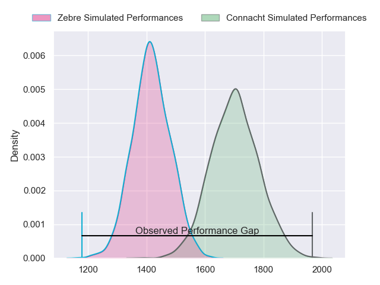
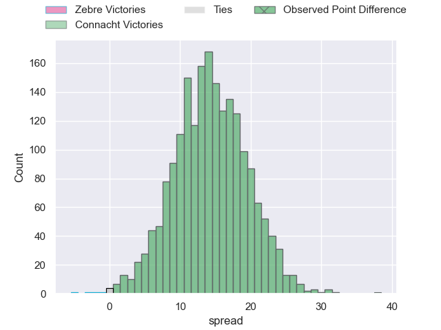
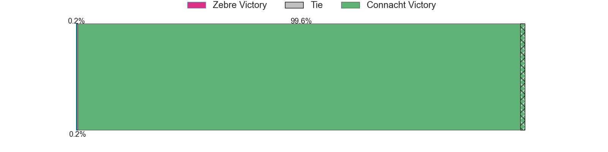
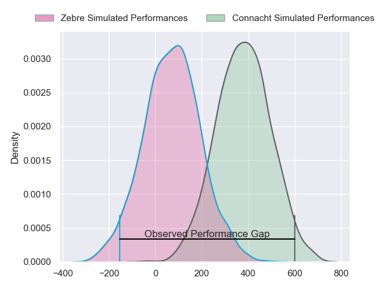
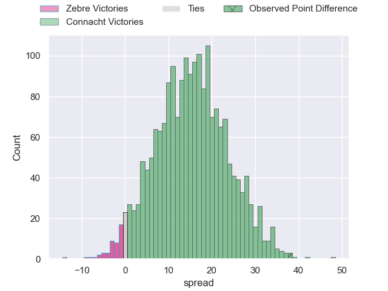
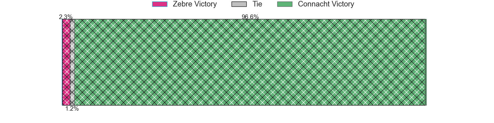

---  
layout: page  
title: Zebre at Connacht; 16-54  
date: 2024-04-20 18:00:00 -0500  
categories: "United Rugby Championship 2023" match review  
---
# Zebre at Connacht; 16-54

# Club Level Predictions

The first set of predictions treats a club as the smallest object, as the club develops its members, organizes a gameplan, and deploys its players as needed for each match. This club model has a prediction of 0.833, which translates to predicting Connacht to win by 14.2.

Our Over/Under is 42.5 - and combined with the spread above, we have a predicted scoreline of 14 to 28

Each club has a rating and a rating deviation (similar to a Glicko rating), and expected performances can be generated. This allows for simulated matches and spreads like the ones below.
## Projected Performances - Club Model

## Projected Spreads - Club Model

## Projected Results - Club Model

# Player Level Predictions - Version 2

Treating teams instead as an entity made up of the currently active players, I have ratings for each player in an altogether different system. These can be combined to form team ratings once teamsheets are announced, weighting starters a bit higher than the reserves. After the match is played, players can be weighted by their minutes on the field, allowing for an accurate measure of the team's composition. With these compiled team ratings, we can make predictions, measure inaccuracy, and update the individual player ratings.
## Prediction without Player Minutes: Connacht by 15.7

Connacht by 10.3 on a neutral pitch

## Projected Performances - Player Model

## Projected Spreads - Player Model

## Projected Results - Player Model

|   Away Minutes | Away Player            |   Away Percentile |   Number |   Home Percentile | Home Player           |   Home Minutes |
|---------------:|:-----------------------|------------------:|---------:|------------------:|:----------------------|---------------:|
|             62 | Muhamed Hasa           |             34.8  |        1 |             29.55 | Jordan Duggan         |             48 |
|             57 | Giampietro Ribaldi     |             33.6  |        2 |             65.23 | Dave Heffernan        |             70 |
|             66 | Juan Pitinari          |             19.26 |        3 |             96.47 | Finlay Bealham        |             58 |
|             54 | Leonard Krumov         |              5.14 |        4 |             95.22 | Joe Joyce             |             59 |
|             80 | Andrea Zambonin        |             35.89 |        5 |             89.83 | Niall Murray          |             80 |
|             80 | Guido Volpi            |             28.77 |        6 |             59.28 | Shamus Hurley-Langton |             66 |
|             50 | Davide Ruggeri         |             48.61 |        7 |             82.37 | Conor Oliver          |             80 |
|             72 | Giovanni Licata        |             26.54 |        8 |             30.71 | Sean O'Brien          |             54 |
|             54 | Gonzalo Garcia         |             35.79 |        9 |             46.95 | Matthew Devine        |             55 |
|             65 | Geronimo Prisciantelli |             88.46 |       10 |             87.44 | JJ Hanrahan           |             75 |
|             80 | Simone Gesi            |              6.42 |       11 |              8.9  | Andrew Smith          |             64 |
|             62 | Fetuli Paea            |             66.5  |       12 |             98.67 | Bundee Aki            |             80 |
|             80 | Scott Gregory          |             42.6  |       13 |             52.55 | Tom Farrell           |             80 |
|             80 | Jacopo Trulla          |              6.31 |       14 |             50.68 | John Porch            |             80 |
|             80 | Lorenzo Pani           |             31.83 |       15 |             54.64 | Shane Jennings        |             80 |
|             23 | Tommaso Di Bartolomeo  |            nan    |       16 |             24.17 | Tadgh McElroy         |             10 |
|             26 | Danilo Fischetti       |             71.88 |       17 |             97.43 | Peter Dooley          |             32 |
|             14 | Riccardo Genovese      |            nan    |       18 |            nan    | Sam Illo              |             22 |
|             26 | Matteo Canali          |             87.68 |       19 |             62.2  | Oisin Dowling         |             21 |
|             29 | Iacopo Bianchi         |              5.8  |       20 |             85.75 | Jarrad Butler         |             14 |
|             26 | Thomas Dominguez       |            nan    |       21 |             75.79 | Caolin Blade          |             25 |
|             15 | Franco Smith           |             28.52 |       22 |             21.72 | Cathal Forde          |             16 |
|             18 | Enrico Lucchin         |            nan    |       23 |             57    | Paul Boyle            |             26 |

