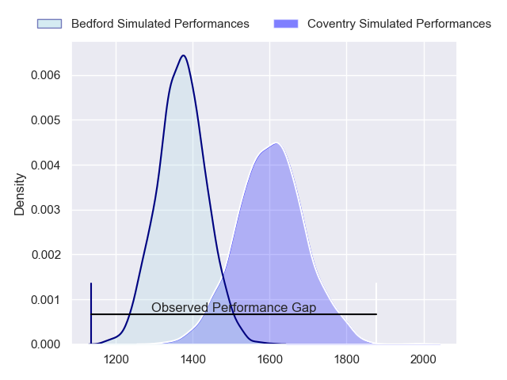
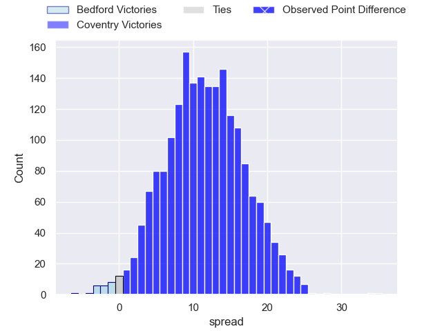
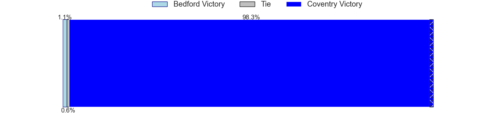
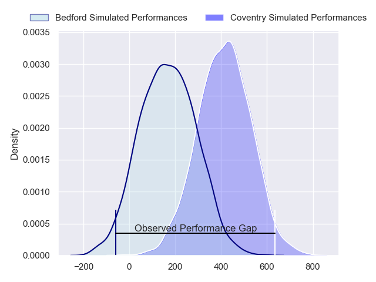
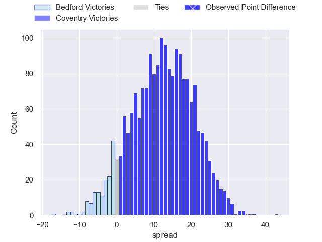
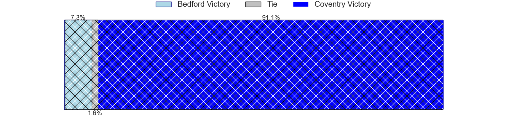

---  
layout: page  
title: Bedford at Coventry; 19-54  
date: 2024-04-20 18:00:00 -0500  
categories: "RFU Championship 2023" match review  
---
# Bedford at Coventry; 19-54

# Club Level Predictions

The first set of predictions treats a club as the smallest object, as the club develops its members, organizes a gameplan, and deploys its players as needed for each match. This club model has a prediction of 0.784, which translates to predicting Coventry to win by 11.4.

Our Over/Under is 61.5 - and combined with the spread above, we have a predicted scoreline of 25 to 36

Each club has a rating and a rating deviation (similar to a Glicko rating), and expected performances can be generated. This allows for simulated matches and spreads like the ones below.
## Projected Performances - Club Model

## Projected Spreads - Club Model

## Projected Results - Club Model

# Player Level Predictions - Version 2

Treating teams instead as an entity made up of the currently active players, I have ratings for each player in an altogether different system. These can be combined to form team ratings once teamsheets are announced, weighting starters a bit higher than the reserves. After the match is played, players can be weighted by their minutes on the field, allowing for an accurate measure of the team's composition. With these compiled team ratings, we can make predictions, measure inaccuracy, and update the individual player ratings.
## Prediction without Player Minutes: Coventry by 14.4

Coventry by 11.5 on a neutral pitch

## Projected Performances - Player Model

## Projected Spreads - Player Model

## Projected Results - Player Model

|   Away Minutes | Away Player          |   Away Percentile |   Number |   Home Percentile | Home Player        |   Home Minutes |
|---------------:|:---------------------|------------------:|---------:|------------------:|:-------------------|---------------:|
|             50 | Joey Conway          |             57.76 |        1 |             95.08 | Toby Trinder       |             57 |
|             50 | James Fish           |             58.63 |        2 |             94.98 | Jordon Poole       |             57 |
|             50 | Bryan O'Connor       |             60.75 |        3 |             77.92 | Adam Nicol         |             57 |
|             60 | Robin Williams       |             69.77 |        4 |             84.89 | James Tyas         |             80 |
|             80 | Alex Woolford        |             79.56 |        5 |             72.43 | Obinna Nkwocha     |             52 |
|             80 | Luke Frost           |             10.61 |        6 |             92.01 | Tom Ball           |             71 |
|             52 | Jac Arthur           |             56.62 |        7 |             71.39 | Matt Kvesic        |             80 |
|             80 | Joe Howard           |              9.48 |        8 |             61.35 | Chester Owen       |             51 |
|             58 | Alex Day             |             83.09 |        9 |            100    | Will Chudley       |             57 |
|             58 | Louis Grimoldby      |             27.79 |       10 |             91.17 | Patrick Pellegrini |             80 |
|             80 | Dean Adamson         |             83.54 |       11 |             96.57 | James Martin       |             80 |
|             80 | Josh Matavesi        |             24.85 |       12 |             72.68 | Thomas Hitchcock   |             80 |
|             60 | Jamie Elliott        |             30.78 |       13 |             80.84 | Will Wand          |             80 |
|             80 | Sean French          |             35.43 |       14 |             78.74 | Ryan Hutler        |             80 |
|             80 | Michael Le Bourgeois |             60.56 |       15 |             87.28 | Tobi Wilson        |             62 |
|             30 | Jamie Jack           |             22.95 |       16 |             50.06 | Paddy Ryan         |             29 |
|             30 | Jacob Fields         |             54.62 |       17 |             23.82 | Rhys Anstey        |             28 |
|             30 | Oisin Heffernan      |             85.15 |       18 |             33.37 | Eliot Salt         |             23 |
|             28 | Kieran Curran        |             53.4  |       19 |             37.03 | Vilikesa Nairau    |             23 |
|             22 | James Lennon         |            nan    |       20 |             69.88 | Suva Ma'asi        |             23 |
|             22 | William Maisey       |             81.56 |       21 |             62.58 | Toby Venner        |             23 |
|             20 | Jordan Onojaife      |             44.38 |       22 |             32.32 | Evan Mitchell      |             18 |
|             20 | Ewan Baker           |            nan    |       23 |            nan    | Harry Stone        |              9 |

