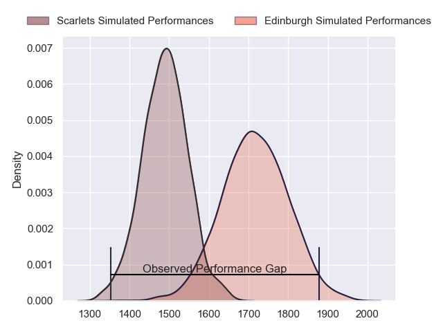
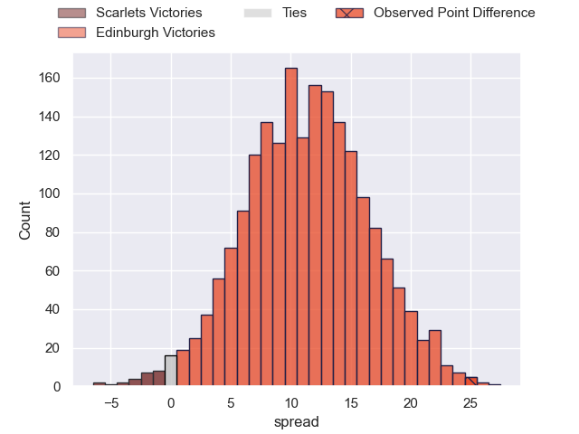
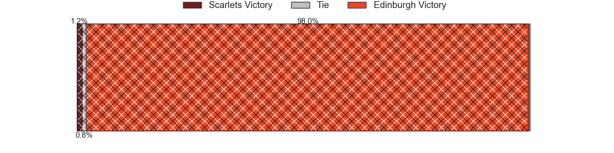
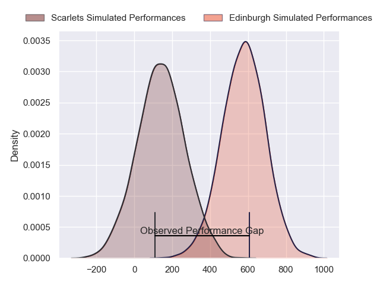
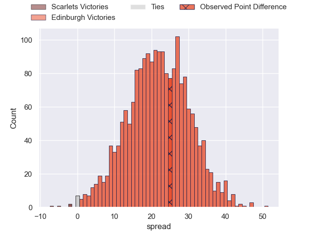

---  
layout: page  
title: Scarlets at Edinburgh; 18-43  
date: 2024-04-20 18:00:00 -0500  
categories: "United Rugby Championship 2023" match review  
---
# Scarlets at Edinburgh; 18-43

# Club Level Predictions

The first set of predictions treats a club as the smallest object, as the club develops its members, organizes a gameplan, and deploys its players as needed for each match. This club model has a prediction of 0.788, which translates to predicting Edinburgh to win by 11.6.

Our Over/Under is 49.5 - and combined with the spread above, we have a predicted scoreline of 19 to 31

Each club has a rating and a rating deviation (similar to a Glicko rating), and expected performances can be generated. This allows for simulated matches and spreads like the ones below.
## Projected Performances - Club Model

## Projected Spreads - Club Model

## Projected Results - Club Model

# Player Level Predictions - Version 2

Treating teams instead as an entity made up of the currently active players, I have ratings for each player in an altogether different system. These can be combined to form team ratings once teamsheets are announced, weighting starters a bit higher than the reserves. After the match is played, players can be weighted by their minutes on the field, allowing for an accurate measure of the team's composition. With these compiled team ratings, we can make predictions, measure inaccuracy, and update the individual player ratings.
## Prediction without Player Minutes: Edinburgh by 22.3

Edinburgh by 15.8 on a neutral pitch

## Projected Performances - Player Model

## Projected Spreads - Player Model

## Projected Results - Player Model

|   Away Minutes | Away Player      |   Away Percentile |   Number |   Home Percentile | Home Player         |   Home Minutes |
|---------------:|:-----------------|------------------:|---------:|------------------:|:--------------------|---------------:|
|             54 | Kemsley Mathias  |             58.53 |        1 |             15.14 | Boan Venter         |             41 |
|             69 | Ryan Elias       |             91.16 |        2 |             52.61 | Dave Cherry         |             41 |
|             54 | Sam Wainwright   |             16.78 |        3 |             60.08 | Javan Sebastian     |             41 |
|             70 | Alex Craig       |             15.6  |        4 |             88.75 | Jamie Hodgson       |             57 |
|             80 | Sam Lousi        |             65.3  |        5 |             94.8  | Grant Gilchrist     |             80 |
|             66 | Taine Plumtree   |             54.83 |        6 |            100    | Jamie Ritchie       |             80 |
|             80 | Dan Davis        |             62.1  |        7 |             91.52 | Luke Crosbie        |             69 |
|             80 | Vaea Fifita      |             93.52 |        8 |             75.06 | Viliame Mata        |             80 |
|             74 | Gareth Davies    |             35.52 |        9 |             85.62 | Ali Price           |             60 |
|             74 | Sam Costelow     |             40.26 |       10 |             78.7  | Ben Healy           |             80 |
|             80 | Tomi Lewis       |             78.86 |       11 |             83.31 | Duhan van der Merwe |             73 |
|             80 | Eddie James      |             22.62 |       12 |             91.72 | James Lang          |             69 |
|             80 | Johnny Williams  |             70.95 |       13 |             65.14 | Mark Bennett        |             80 |
|             69 | Tom Rogers       |             16.69 |       14 |             81.46 | Matt Currie         |             80 |
|             80 | Ioan Nicholas    |              9.92 |       15 |             93.13 | Wes Goosen          |             80 |
|             11 | Shaun Evans      |              5.22 |       16 |             83.73 | Ewan Ashman         |             39 |
|             26 | Wyn Jones        |             56.03 |       17 |             91.71 | Pierre Schoeman     |             39 |
|             26 | Harri O'Connor   |              8.97 |       18 |             99.04 | WP Nel              |             39 |
|             10 | Morgan Jones     |              3.63 |       19 |             86.34 | Marshall Sykes      |             23 |
|             14 | Carwyn Tuipulotu |             45.89 |       20 |             12.16 | Connor Boyle        |             11 |
|              6 | Archie Hughes    |             17.34 |       21 |             77.38 | Ben Vellacott       |             20 |
|              6 | Dan Jones        |             66.75 |       22 |            nan    | Scott Steele        |              7 |
|             11 | Ryan Conbeer     |             19.31 |       23 |              9.64 | Chris Dean          |             11 |

