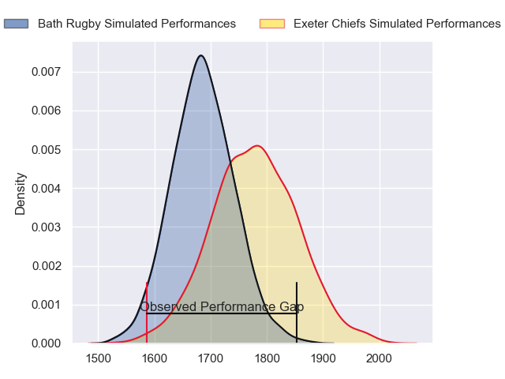
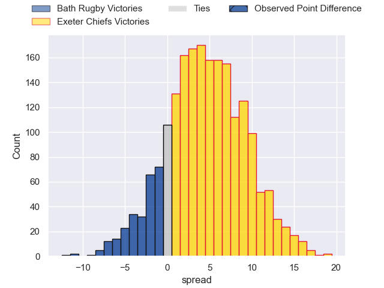
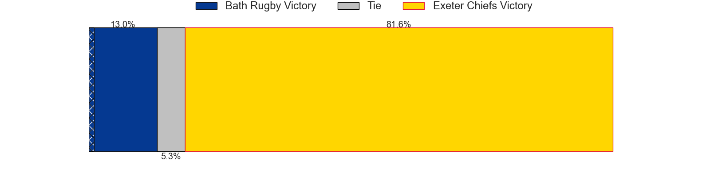
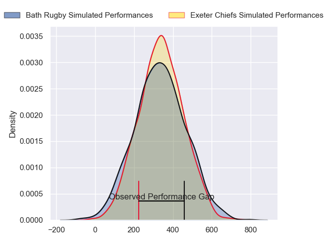
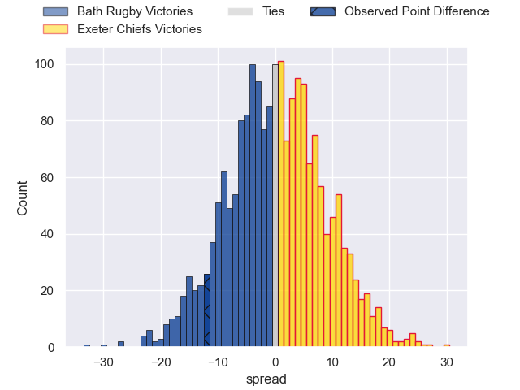

---  
layout: page  
title: Bath Rugby at Exeter Chiefs; 26-14  
date: 2024-04-20 18:00:00 -0500  
categories: "Gallagher Premiership 2023" match review  
---
# Bath Rugby at Exeter Chiefs; 26-14

# Club Level Predictions

The first set of predictions treats a club as the smallest object, as the club develops its members, organizes a gameplan, and deploys its players as needed for each match. This club model has a prediction of 0.629, which translates to predicting Exeter Chiefs to win by 4.7.

Our Over/Under is 56.5 - and combined with the spread above, we have a predicted scoreline of 26 to 30

Each club has a rating and a rating deviation (similar to a Glicko rating), and expected performances can be generated. This allows for simulated matches and spreads like the ones below.
## Projected Performances - Club Model

## Projected Spreads - Club Model

## Projected Results - Club Model

# Player Level Predictions - Version 2

Treating teams instead as an entity made up of the currently active players, I have ratings for each player in an altogether different system. These can be combined to form team ratings once teamsheets are announced, weighting starters a bit higher than the reserves. After the match is played, players can be weighted by their minutes on the field, allowing for an accurate measure of the team's composition. With these compiled team ratings, we can make predictions, measure inaccuracy, and update the individual player ratings.
## Prediction without Player Minutes: Exeter Chiefs by 0.9

Bath Rugby by 4.2 on a neutral pitch

## Projected Performances - Player Model

## Projected Spreads - Player Model

## Projected Results - Player Model

|   Away Minutes | Away Player        |   Away Percentile |   Number |   Home Percentile | Home Player          |   Home Minutes |
|---------------:|:-------------------|------------------:|---------:|------------------:|:---------------------|---------------:|
|             52 | Beno Obano         |             87.61 |        1 |             94.76 | Scott Sio            |             59 |
|             68 | Tom Dunn           |             96.07 |        2 |             90.37 | Jack Yeandle         |             59 |
|             63 | Will Stuart        |             40.51 |        3 |             44.52 | Ehren Painter        |             41 |
|             52 | Quinn Roux         |             93.66 |        4 |             31.46 | Lewis Pearson        |             54 |
|             80 | Charlie Ewels      |             57.78 |        5 |             89.35 | Dafydd Jenkins       |             80 |
|             78 | Ted Hill           |             80.16 |        6 |             72.27 | Ethan Roots          |             50 |
|             54 | Sam Underhill      |             88.63 |        7 |             54.29 | Jacques Vermeulen    |             80 |
|             80 | Alfie Barbeary     |             71.74 |        8 |             60.44 | Greg Fisilau         |             80 |
|             79 | Ben Spencer        |             77.68 |        9 |             65.89 | Tom Cairns           |             54 |
|             80 | Orlando Bailey     |             30.26 |       10 |             18.46 | Harvey Skinner       |             80 |
|             80 | Will Muir          |             11.94 |       11 |             88.85 | Olly Woodburn        |             80 |
|             80 | Max Ojomoh         |             82.4  |       12 |             25.61 | Ollie Devoto         |             54 |
|             80 | Ollie Lawrence     |             83.86 |       13 |             96.12 | Henry Slade          |             80 |
|             80 | Joe Cokanasiga     |             91.55 |       14 |             74.89 | Immanuel Feyi-Waboso |             80 |
|             80 | Matt Gallagher     |             95.99 |       15 |              1.5  | Josh Hodge           |             80 |
|             12 | Hame Faiva         |              3.34 |       16 |            nan    | Max Norey            |             21 |
|             28 | Thomas du Toit     |             93.42 |       17 |            nan    | Danny Southworth     |             21 |
|             17 | Archie Griffin     |            nan    |       18 |             22.12 | Marcus Street        |             39 |
|             28 | Jacques du Plessis |             12.8  |       19 |             20.81 | Jack Dunne           |             26 |
|             17 | Josh Bayliss       |             15.89 |       20 |             52.32 | Christ Tshiunza      |             30 |
|              1 | Louis Schreuder    |             66.95 |       21 |             81.26 | Stu Townsend         |             26 |
|              0 | Will Butt          |             66.26 |       22 |            nan    | Will Haydon-Wood     |              0 |
|             11 | Miles Reid         |             94.55 |       23 |             29    | Zack Wimbush         |             26 |

