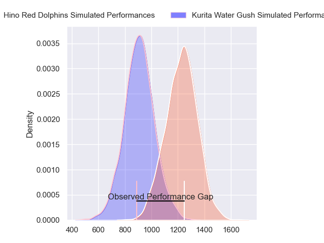
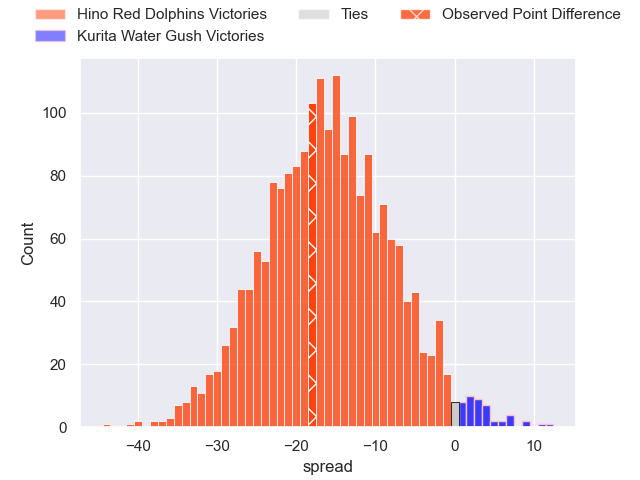
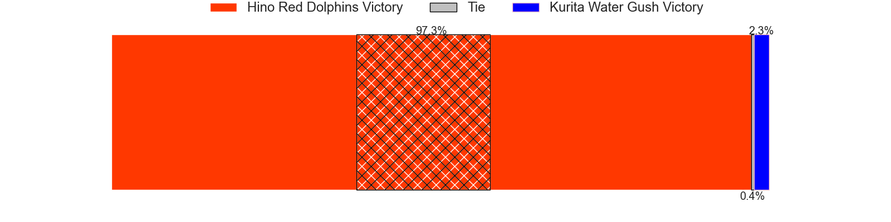
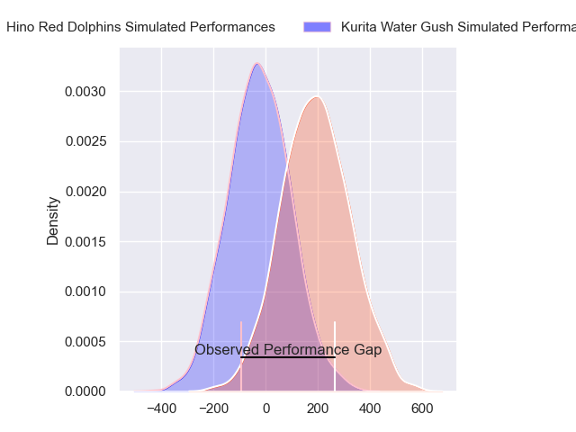
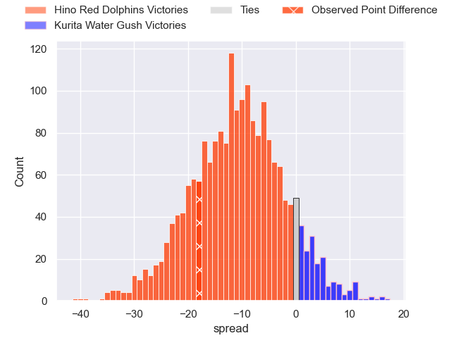
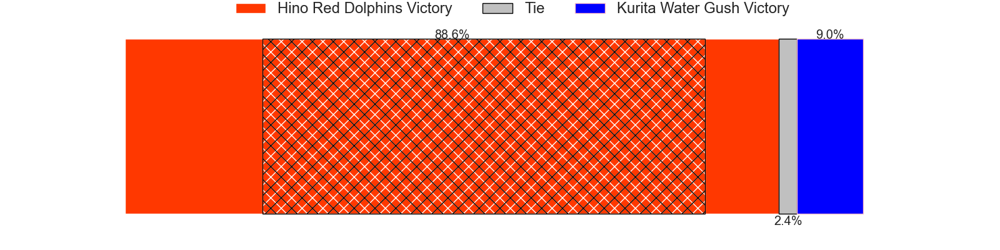

---  
layout: page  
title: Hino Red Dolphins at Kurita Water Gush; 59-41  
date: 2024-04-20 18:00:00 -0500  
categories: "Japan Rugby League One D3 2023" match review  
---
# Hino Red Dolphins at Kurita Water Gush; 59-41

# Club Level Predictions

The first set of predictions treats a club as the smallest object, as the club develops its members, organizes a gameplan, and deploys its players as needed for each match. This club model has a prediction of 0.151, which translates to predicting Hino Red Dolphins to win by 16.0.

Our Over/Under is 63.5 - and combined with the spread above, we have a predicted scoreline of 40 to 24

Each club has a rating and a rating deviation (similar to a Glicko rating), and expected performances can be generated. This allows for simulated matches and spreads like the ones below.
## Projected Performances - Club Model

## Projected Spreads - Club Model

## Projected Results - Club Model

# Player Level Predictions - Version 2

Treating teams instead as an entity made up of the currently active players, I have ratings for each player in an altogether different system. These can be combined to form team ratings once teamsheets are announced, weighting starters a bit higher than the reserves. After the match is played, players can be weighted by their minutes on the field, allowing for an accurate measure of the team's composition. With these compiled team ratings, we can make predictions, measure inaccuracy, and update the individual player ratings.
## Prediction without Player Minutes: Hino Red Dolphins by 11.9

Hino Red Dolphins by 14.4 on a neutral pitch

## Projected Performances - Player Model

## Projected Spreads - Player Model

## Projected Results - Player Model

|   Away Minutes | Away Player        |   Away Percentile |   Number |   Home Percentile | Home Player          |   Home Minutes |
|---------------:|:-------------------|------------------:|---------:|------------------:|:---------------------|---------------:|
|             74 | Yuto Tokuda        |             79.94 |        1 |              3.47 | Shoya Koyama         |             52 |
|             74 | Towa Taniguchi     |             73.09 |        2 |             23.49 | Kota Hojo            |             52 |
|             65 | Shosuke Funaki     |             48.02 |        3 |              4.05 | Kuriyama Rui         |             62 |
|             47 | Zephania Tuinona   |             62.39 |        4 |              2.06 | Kota Nakamura        |             80 |
|             80 | Rory Arnold        |             97.58 |        5 |              2.78 | Mike Williams        |             80 |
|             72 | Noah Tovio         |             60.43 |        6 |              5.13 | Kengo Nakamura       |             45 |
|             80 | Shun Tomonaga      |             77.47 |        7 |             32.66 | Taisei Nakao         |             80 |
|             65 | Kyosuke Horie      |             73.07 |        8 |             20.7  | Tebita Oto           |             78 |
|             80 | Norifumi Hashimoto |             10.36 |        9 |              8.03 | Sho Nakamura         |             42 |
|             52 | Shigenori Someyama |             20.52 |       10 |             35.58 | Hiroki Handa         |             80 |
|             80 | Sora Ohchi         |             34.86 |       11 |              4.46 | Hosea Saumaki        |             80 |
|             75 | Shogo Tokota       |             23.61 |       12 |             13.47 | Antonio Mikaele-Tu'u |             55 |
|             80 | Taiki Kawai        |             44.13 |       13 |             21.76 | So Matsushima        |             62 |
|             80 | Ko Kojima          |             75.09 |       14 |             14.86 | Tumanawa Tawhai      |             80 |
|             80 | Keita Doi          |             41.98 |       15 |              2.54 | Kentaro Sugimori     |             80 |
|             33 | Shun Nakashika     |             59.24 |       16 |            nan    | Ren Shinwada         |             38 |
|             28 | Taroma Togo        |             46.97 |       17 |             43.89 | Teariki Ben-Nicholas |             35 |
|             15 | Taiga Yamaguchi    |             43.88 |       18 |             15.53 | Kei Shibuya          |             28 |
|             15 | Shohei Ijima       |             68.58 |       19 |              1.81 | Ryota Kuribara       |             28 |
|              8 | AJ Wolf            |             40.65 |       20 |            nan    | Shogo Yanagita       |             25 |
|              6 | Yutaro Danno       |            nan    |       21 |              3.86 | Masachi Debuchi      |             18 |
|              6 | Kousei Tamaki      |            nan    |       22 |              2.97 | Ayato Sakamoto       |             18 |
|              5 | Yuki Kagoshima     |             66.6  |       23 |            nan    | Yoji Shiina          |              2 |

