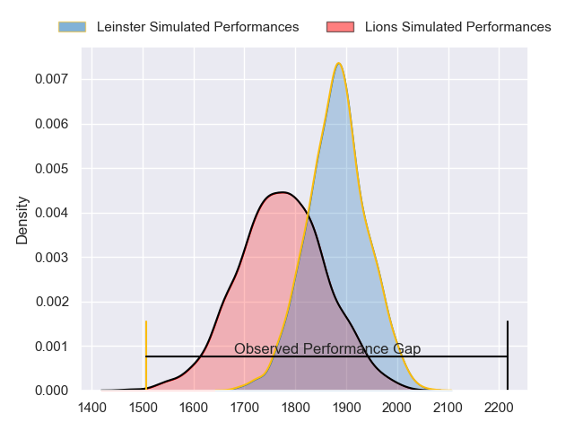
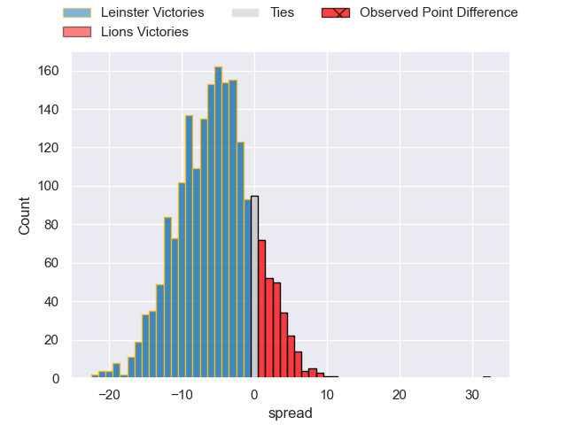
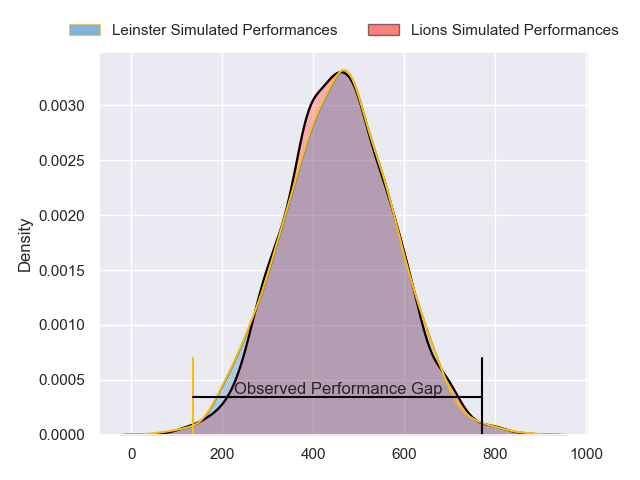
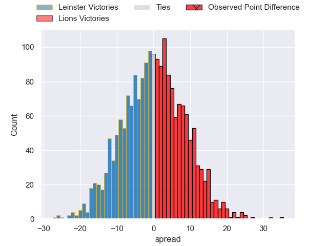

---  
layout: page  
title: Leinster at Lions; 12-44  
date: 2024-04-20 18:00:00 -0500  
categories: "United Rugby Championship 2023" match review  
---
# Leinster at Lions; 12-44

# Club Level Predictions

The first set of predictions treats a club as the smallest object, as the club develops its members, organizes a gameplan, and deploys its players as needed for each match. This club model has a prediction of 0.355, which translates to predicting Leinster to win by 5.3.

Our Over/Under is 51.5 - and combined with the spread above, we have a predicted scoreline of 28 to 23

Each club has a rating and a rating deviation (similar to a Glicko rating), and expected performances can be generated. This allows for simulated matches and spreads like the ones below.
## Projected Performances - Club Model

## Projected Spreads - Club Model

## Projected Results - Club Model

# Player Level Predictions - Version 2

Treating teams instead as an entity made up of the currently active players, I have ratings for each player in an altogether different system. These can be combined to form team ratings once teamsheets are announced, weighting starters a bit higher than the reserves. After the match is played, players can be weighted by their minutes on the field, allowing for an accurate measure of the team's composition. With these compiled team ratings, we can make predictions, measure inaccuracy, and update the individual player ratings.
## Prediction without Player Minutes: Lions by 2.4

Leinster by 1.3 on a neutral pitch

## Projected Performances - Player Model

## Projected Spreads - Player Model

## Projected Results - Player Model

|   Away Minutes | Away Player          |   Away Percentile |   Number |   Home Percentile | Home Player          |   Home Minutes |
|---------------:|:---------------------|------------------:|---------:|------------------:|:---------------------|---------------:|
|             44 | Cian Healy           |             92.66 |        1 |             55.86 | Morgan Naude         |             62 |
|             44 | Lee Barron           |             51.67 |        2 |             82.91 | PJ Botha             |             55 |
|             44 | Thomas Clarkson      |             78.93 |        3 |             98.95 | Ruan Dreyer          |             55 |
|             82 | Ross Molony          |             94.38 |        4 |             91.39 | Willem Alberts       |             82 |
|             78 | Jason Jenkins        |             72.01 |        5 |             58.73 | Ruan Delport         |             62 |
|             58 | Diarmuid Mangan      |             32.37 |        6 |             84.8  | JC Pretorius         |             82 |
|             82 | Scott Penny          |             82.6  |        7 |             74.36 | Emmanuel Tshituka    |             78 |
|             82 | Max Deegan           |             90.91 |        8 |            100    | Francke Horn         |             82 |
|             82 | Luke McGrath         |             98.53 |        9 |             89.68 | Morne van den Berg   |             78 |
|             61 | Harry Byrne          |             85.64 |       10 |             95.38 | Sanele Nohamba       |             65 |
|             24 | Andrew Osborne       |             48.54 |       11 |             93.02 | Edwill van der Merwe |             82 |
|             44 | Charlie Ngatai       |             31.92 |       12 |             95.02 | Marius Louw          |             82 |
|             82 | Liam Turner          |             47.09 |       13 |             19.42 | Erich Cronje         |             65 |
|             82 | Rob Russell          |             73.65 |       14 |             69.59 | Richard Kriel        |             82 |
|             82 | Ciaran Frawley       |             59.65 |       15 |             91.73 | Quan Horn            |             82 |
|             38 | John McKee           |             70.33 |       16 |             72.1  | Jaco Visagie         |             27 |
|             38 | Michael Milne        |             71.5  |       17 |             80.84 | Jean-Pierre Smith    |             20 |
|             38 | Michael Ala'alatoa   |             95.42 |       18 |             70.92 | Asenathi Ntlabakanye |             27 |
|              4 | Conor O'Tighearnaigh |            nan    |       19 |             91.15 | Reinhard Nothnagel   |             20 |
|             24 | Rhys Ruddock         |             99.65 |       20 |            nan    | Sibusiso Sangweni    |              4 |
|             58 | Cormac Foley         |            nan    |       21 |            nan    | Nico Steyn           |              4 |
|             21 | Sam Prendergast      |            nan    |       22 |             64.87 | Jordan Hendrikse     |             17 |
|             38 | Ben Brownlee         |            nan    |       23 |             73.42 | Henco van Wyk        |             17 |

