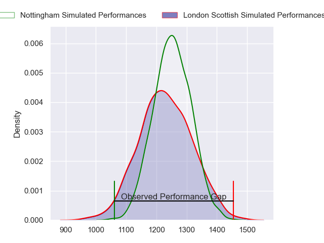
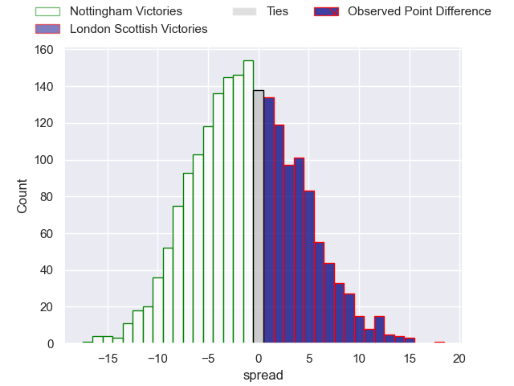
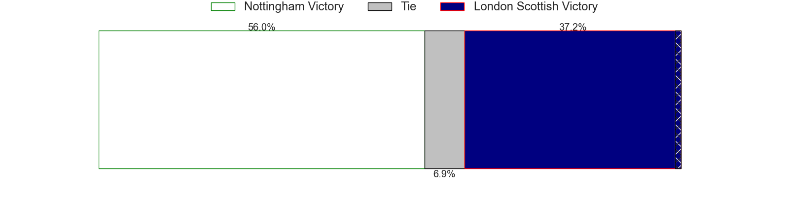
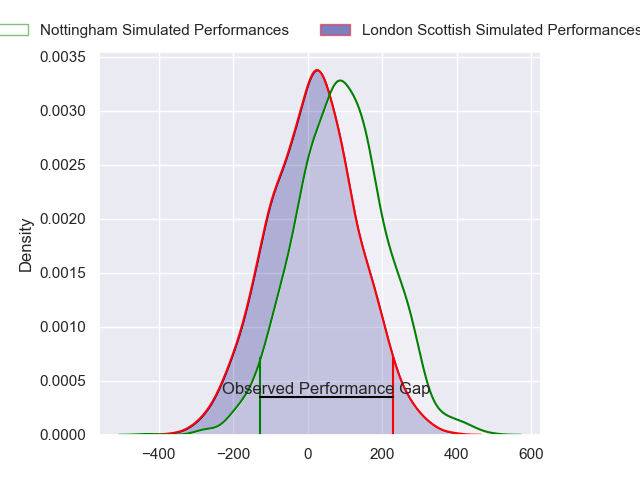
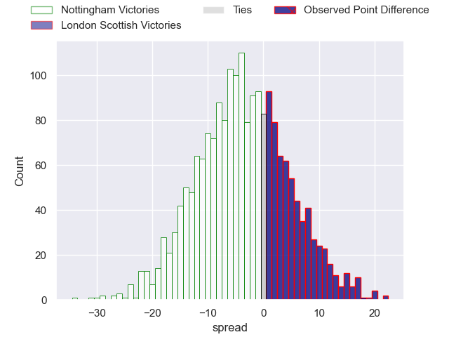
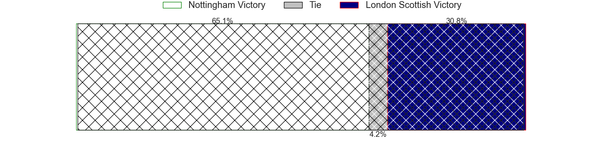

---  
layout: page  
title: Nottingham at London Scottish; 27-45  
date: 2024-04-20 18:00:00 -0500  
categories: "RFU Championship 2023" match review  
---
# Nottingham at London Scottish; 27-45

# Club Level Predictions

The first set of predictions treats a club as the smallest object, as the club develops its members, organizes a gameplan, and deploys its players as needed for each match. This club model has a prediction of 0.467, which translates to predicting Nottingham to win by 1.2.

Our Over/Under is 54.5 - and combined with the spread above, we have a predicted scoreline of 28 to 27

Each club has a rating and a rating deviation (similar to a Glicko rating), and expected performances can be generated. This allows for simulated matches and spreads like the ones below.
## Projected Performances - Club Model

## Projected Spreads - Club Model

## Projected Results - Club Model

# Player Level Predictions - Version 2

Treating teams instead as an entity made up of the currently active players, I have ratings for each player in an altogether different system. These can be combined to form team ratings once teamsheets are announced, weighting starters a bit higher than the reserves. After the match is played, players can be weighted by their minutes on the field, allowing for an accurate measure of the team's composition. With these compiled team ratings, we can make predictions, measure inaccuracy, and update the individual player ratings.
## Prediction without Player Minutes: Nottingham by 4.5

Nottingham by 7.8 on a neutral pitch

## Projected Performances - Player Model

## Projected Spreads - Player Model

## Projected Results - Player Model

|   Away Minutes | Away Player               |   Away Percentile |   Number |   Home Percentile | Home Player           |   Home Minutes |
|---------------:|:--------------------------|------------------:|---------:|------------------:|:----------------------|---------------:|
|             49 | Kai Owen                  |             34.14 |        1 |             56.61 | Tom Osborne           |             65 |
|             49 | Harry Clayton             |             74.7  |        2 |             76.71 | Jack Musk             |             80 |
|             49 | Beltus Nonleh             |             31.63 |        3 |             82.45 | William Hobson        |             70 |
|             80 | Sebastien Ferreira        |              0.85 |        4 |             57.56 | Matt Wilkinson        |             80 |
|             65 | Come Clayver Joussain     |             23.22 |        5 |             63.36 | Marijn Huis           |             70 |
|             80 | Jay Ecclesfield           |             15.73 |        6 |             69.49 | Bailey Ransom         |             79 |
|             80 | Nathan Tweedy             |             49.34 |        7 |             29.08 | Jack Ingall           |             66 |
|             13 | Richard Clift             |             49.63 |        8 |             57.86 | Tom Marshall          |             80 |
|             65 | Micheal Stronge           |             13.32 |        9 |             32.14 | Daniel Nutton         |             65 |
|             60 | Morgan Bunting            |              6.49 |       10 |              9.61 | Harry Sheppard        |             80 |
|             65 | Ryan Olowofela            |             57.6  |       11 |             73.26 | Cassius Cleaves       |             80 |
|             80 | Dafydd-Rhys Tiueti        |             27.81 |       12 |              9.15 | Robert David McCallum |             65 |
|             80 | Marcus Alexander Ramage   |              8.16 |       13 |             77.26 | Bryn Bradley          |             52 |
|             80 | David Williams            |             15.89 |       14 |              4.69 | Noah Ferdinand        |             80 |
|             80 | Ellis Mee                 |             47.33 |       15 |             88.3  | Will Brown            |             80 |
|             67 | James Cherry              |             46.88 |       16 |             27.31 | Luke Mehson           |             28 |
|             31 | Jack Dickinson            |             36.95 |       17 |             19.45 | Jonny Law             |             15 |
|             31 | Xavier Valentine          |             67.98 |       18 |             51.17 | Alexander Lloyd-Seed  |             15 |
|             31 | Archie Van der Flier      |             60.37 |       19 |              2.8  | George Cave           |             15 |
|             15 | Jack Stapley              |              2.84 |       20 |             24.1  | Austin Wallis         |             14 |
|             15 | Josh Goodwin              |             28.75 |       21 |             66.54 | Rhys Charalambous     |             10 |
|             20 | Jamie Annand              |            nan    |       22 |             27.45 | Zach Carr             |             10 |
|             15 | Iosefa Danny Wayne Fiaola |             65.9  |       23 |             78.4  | Will Prior            |              1 |

