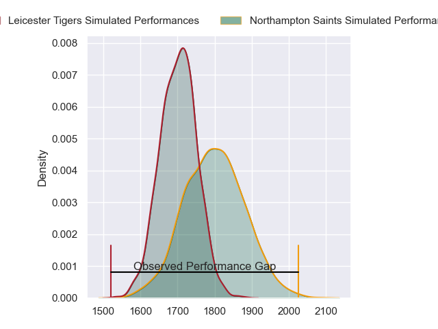
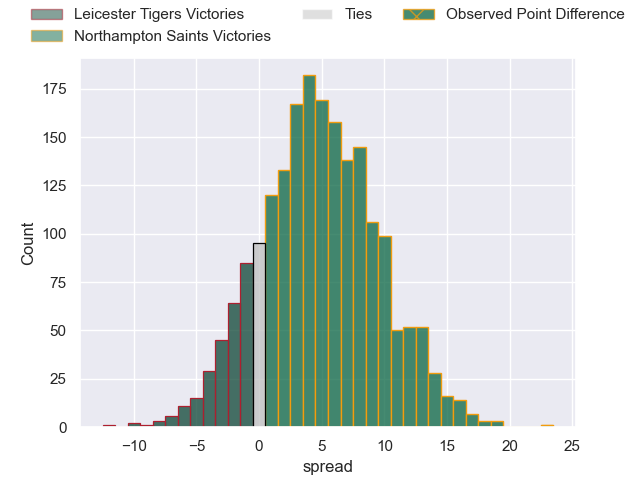
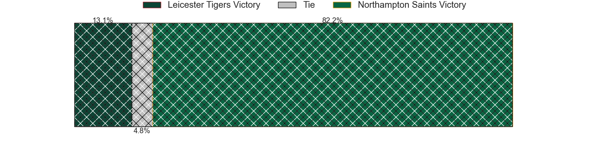
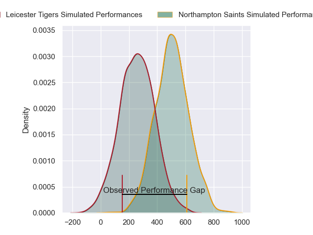
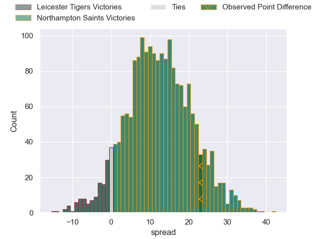
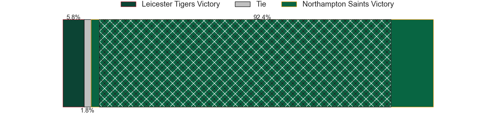

---  
layout: page  
title: Leicester Tigers at Northampton Saints; 17-40  
date: 2024-04-20 18:00:00 -0500  
categories: "Gallagher Premiership 2023" match review  
---
# Leicester Tigers at Northampton Saints; 17-40

# Club Level Predictions

The first set of predictions treats a club as the smallest object, as the club develops its members, organizes a gameplan, and deploys its players as needed for each match. This club model has a prediction of 0.633, which translates to predicting Northampton Saints to win by 4.8.

Our Over/Under is 55.5 - and combined with the spread above, we have a predicted scoreline of 25 to 30

Each club has a rating and a rating deviation (similar to a Glicko rating), and expected performances can be generated. This allows for simulated matches and spreads like the ones below.
## Projected Performances - Club Model

## Projected Spreads - Club Model

## Projected Results - Club Model

# Player Level Predictions - Version 2

Treating teams instead as an entity made up of the currently active players, I have ratings for each player in an altogether different system. These can be combined to form team ratings once teamsheets are announced, weighting starters a bit higher than the reserves. After the match is played, players can be weighted by their minutes on the field, allowing for an accurate measure of the team's composition. With these compiled team ratings, we can make predictions, measure inaccuracy, and update the individual player ratings.
## Prediction without Player Minutes: Northampton Saints by 13.6

Northampton Saints by 5.4 on a neutral pitch

## Projected Performances - Player Model

## Projected Spreads - Player Model

## Projected Results - Player Model

|   Away Minutes | Away Player           |   Away Percentile |   Number |   Home Percentile | Home Player         |   Home Minutes |
|---------------:|:----------------------|------------------:|---------:|------------------:|:--------------------|---------------:|
|             55 | James Cronin          |             90.28 |        1 |             97.81 | Alex Waller         |             60 |
|             55 | Julian Montoya        |             94.89 |        2 |             91.75 | Curtis Langdon      |             60 |
|             47 | Dan Cole              |             41.09 |        3 |             63.68 | Elliot Millar-Mills |             60 |
|             65 | Harry Wells           |             76.56 |        4 |             96.17 | Alex Moon           |             80 |
|             80 | Ollie Chessum         |             76.08 |        5 |             91.03 | Temo Mayanavanua    |             65 |
|             80 | Finn Carnduff         |             32.95 |        6 |             20.88 | Alex Coles          |             80 |
|             40 | Tommy Reffell         |             84.45 |        7 |             68.68 | Lewis Ludlam        |             71 |
|             80 | Jasper Wiese          |             83.54 |        8 |             67.08 | Juarno Augustus     |             80 |
|             65 | Jack van Poortvliet   |             71.79 |        9 |             95.16 | Alex Mitchell       |             71 |
|             80 | Handre Pollard        |             87.69 |       10 |             94.36 | George Furbank      |             80 |
|             80 | Ollie Hassell-Collins |             66.44 |       11 |              7.09 | Tom Seabrook        |             62 |
|             80 | Solomone Kata         |             35.92 |       12 |             90.9  | Fraser Dingwall     |             80 |
|             69 | Dan Kelly             |             81.19 |       13 |             59.95 | Tom Litchfield      |             57 |
|             80 | Freddie Steward       |             40.09 |       14 |             87.16 | George Hendy        |             80 |
|             57 | Jamie Shillcock       |             25.56 |       15 |             69.92 | James Ramm          |             80 |
|             25 | Charlie Clare         |              6.88 |       16 |            nan    | Robbie Smith        |             20 |
|             25 | Francois van Wyk      |             74.74 |       17 |            nan    | Tarek Haffar        |             20 |
|             33 | Will Hurd             |             38.13 |       18 |              2.76 | Trevor Davison      |             20 |
|             15 | Kyle Hatherell        |              1.79 |       19 |            nan    | Tom Lockett         |             15 |
|             40 | Olly Cracknell        |             30.86 |       20 |             98.72 | Sam Graham          |              9 |
|             15 | Ben Youngs            |             77.89 |       21 |             20.63 | Tom James           |              9 |
|             11 | Phil Cokanasiga       |            nan    |       22 |             82.05 | Fin Smith           |             18 |
|             23 | Mike Brown            |             94.59 |       23 |             96.48 | Tommy Freeman       |             23 |

