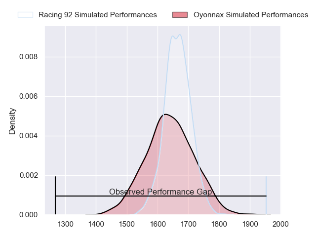
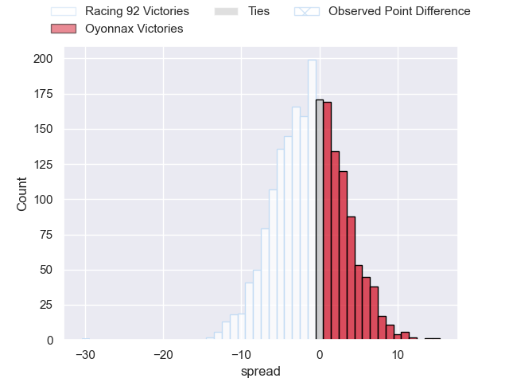
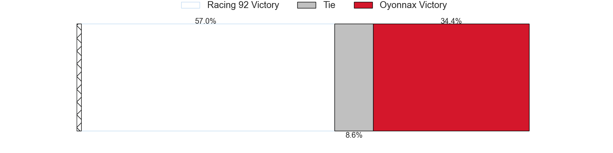
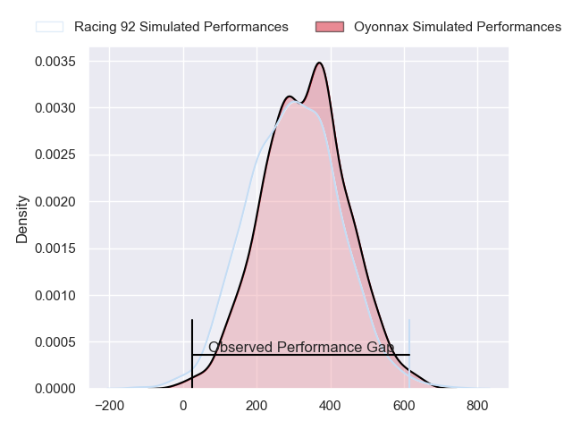
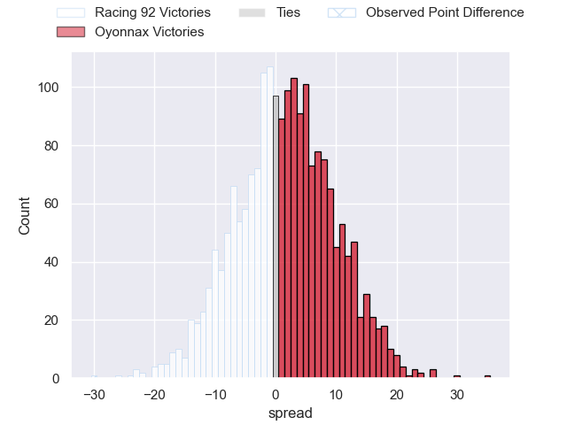

---  
layout: page  
title: Racing 92 at Oyonnax; 43-13  
date: 2024-04-20 18:00:00 -0500  
categories: "Top 14 Orange 2023" match review  
---
# Racing 92 at Oyonnax; 43-13

# Club Level Predictions

The first set of predictions treats a club as the smallest object, as the club develops its members, organizes a gameplan, and deploys its players as needed for each match. This club model has a prediction of 0.468, which translates to predicting Racing 92 to win by 1.1.

Our Over/Under is 41.5 - and combined with the spread above, we have a predicted scoreline of 21 to 20

Each club has a rating and a rating deviation (similar to a Glicko rating), and expected performances can be generated. This allows for simulated matches and spreads like the ones below.
## Projected Performances - Club Model

## Projected Spreads - Club Model

## Projected Results - Club Model

# Player Level Predictions - Version 2

Treating teams instead as an entity made up of the currently active players, I have ratings for each player in an altogether different system. These can be combined to form team ratings once teamsheets are announced, weighting starters a bit higher than the reserves. After the match is played, players can be weighted by their minutes on the field, allowing for an accurate measure of the team's composition. With these compiled team ratings, we can make predictions, measure inaccuracy, and update the individual player ratings.
## Prediction without Player Minutes: Oyonnax by 2.4

Racing 92 by 5.3 on a neutral pitch

## Projected Performances - Player Model

## Projected Spreads - Player Model

## Projected Results - Player Model

|   Away Minutes | Away Player         |   Away Percentile |   Number |   Home Percentile | Home Player        |   Home Minutes |
|---------------:|:--------------------|------------------:|---------:|------------------:|:-------------------|---------------:|
|             55 | Trevor Nyakane      |             76.64 |        1 |             47.76 | Antoine Abraham    |             58 |
|             55 | Peniami Narisia     |             81.93 |        2 |              7.27 | Teddy Durand       |             63 |
|             51 | Thomas Laclayat     |             78.46 |        3 |             14.3  | Christopher Vaotoa |             58 |
|             81 | Fabien Sanconnie    |             51.2  |        4 |             96.65 | Phoenix Battye     |             81 |
|             60 | Will Rowlands       |             46.41 |        5 |             54.19 | Ewan Johnson       |             58 |
|             77 | Cameron Woki        |             89.79 |        6 |             43.74 | Kevin Lebreton     |             81 |
|             81 | Baptiste Chouzenoux |             89.56 |        7 |             24.25 | Hugo Hermet        |             55 |
|             54 | Jordan Joseph       |             71.5  |        8 |              4.91 | Loic Godener       |             70 |
|             72 | Nolann Le Garrec    |             81.47 |        9 |             93.26 | Jonathan Ruru      |             67 |
|             81 | Antoine Gibert      |             90    |       10 |             86.67 | Domingo Miotti     |             58 |
|             81 | Juan Imhoff         |             99.32 |       11 |             35.47 | Enzo Reybier       |             81 |
|             67 | Gael Fickou         |             96.84 |       12 |             60.56 | Lucas Mensa        |             58 |
|             81 | Inia Tabuavou       |             55.95 |       13 |             12.74 | Chris Farrell      |             81 |
|             43 | Donovan Taofifenua  |             67.57 |       14 |              9.23 | Gavin Stark        |             81 |
|             81 | Tristan Tedder      |             63.16 |       15 |             67.42 | Darren Sweetnam    |             81 |
|             26 | Janick Tarrit       |             25.93 |       16 |              1.57 | Manu Leiataua      |             18 |
|             26 | Hassane Kolingar    |             16.78 |       17 |              7.34 | Adrien Bordenave   |             30 |
|             21 | Boris Palu          |             74.16 |       18 |             20.33 | Steve Mafi         |             23 |
|             31 | Maxime Baudonne     |             52.2  |       19 |             67.87 | Rory Grice         |             30 |
|              9 | Clovis Le Bail      |             19.79 |       20 |             10.32 | Vasil Lobzhanidze  |             14 |
|             14 | Henry Chavancy      |             97.94 |       21 |              7.95 | Justin Bouraux     |             23 |
|             38 | Henry Arundell      |             11.49 |       22 |             74.76 | Theo Millet        |             23 |
|             30 | Cedate Gomes Sa     |             64.16 |       23 |             38.04 | Thibault Berthaud  |             23 |

