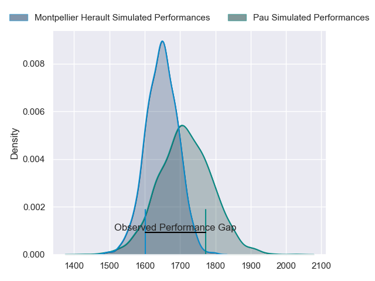
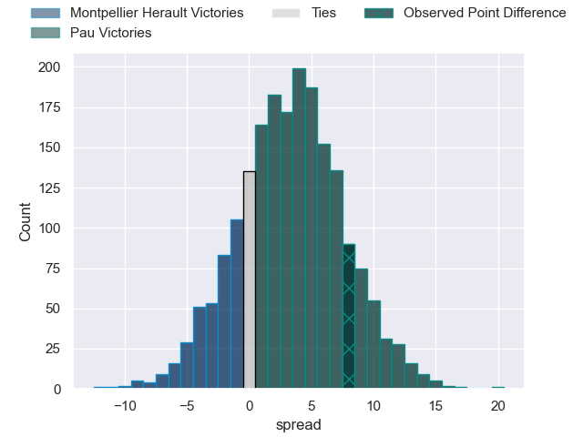
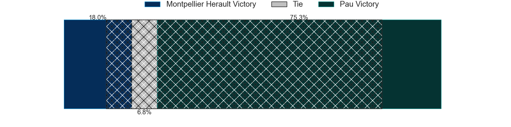
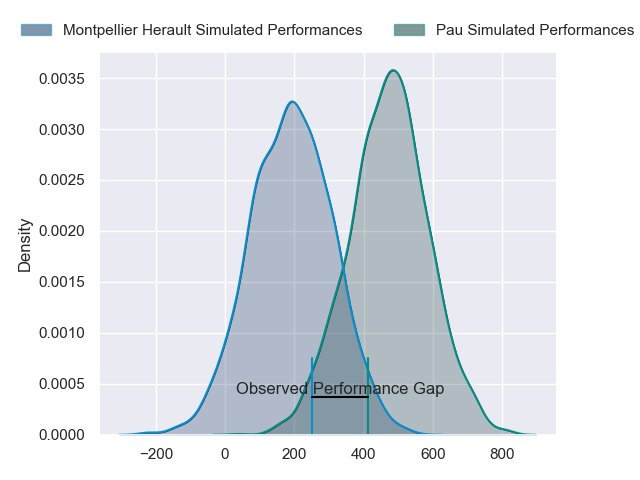
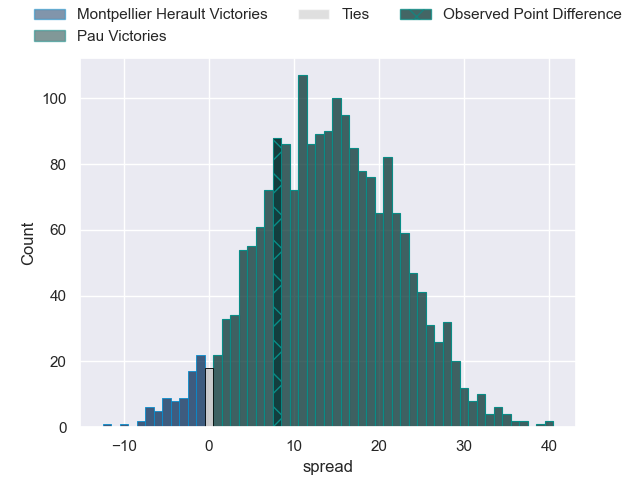

---  
layout: page  
title: Montpellier Herault at Pau; 23-31  
date: 2024-04-20 18:00:00 -0500  
categories: "Top 14 Orange 2023" match review  
---
# Montpellier Herault at Pau; 23-31

# Club Level Predictions

The first set of predictions treats a club as the smallest object, as the club develops its members, organizes a gameplan, and deploys its players as needed for each match. This club model has a prediction of 0.589, which translates to predicting Pau to win by 3.2.

Our Over/Under is 46.5 - and combined with the spread above, we have a predicted scoreline of 22 to 25

Each club has a rating and a rating deviation (similar to a Glicko rating), and expected performances can be generated. This allows for simulated matches and spreads like the ones below.
## Projected Performances - Club Model

## Projected Spreads - Club Model

## Projected Results - Club Model

# Player Level Predictions - Version 2

Treating teams instead as an entity made up of the currently active players, I have ratings for each player in an altogether different system. These can be combined to form team ratings once teamsheets are announced, weighting starters a bit higher than the reserves. After the match is played, players can be weighted by their minutes on the field, allowing for an accurate measure of the team's composition. With these compiled team ratings, we can make predictions, measure inaccuracy, and update the individual player ratings.
## Prediction without Player Minutes: Pau by 15.0

Pau by 6.9 on a neutral pitch

## Projected Performances - Player Model

## Projected Spreads - Player Model

## Projected Results - Player Model

|   Away Minutes | Away Player                 |   Away Percentile |   Number |   Home Percentile | Home Player         |   Home Minutes |
|---------------:|:----------------------------|------------------:|---------:|------------------:|:--------------------|---------------:|
|             53 | Baptiste Erdocio            |              2.7  |        1 |             32.69 | Siegfried Fisi'ihoi |             51 |
|             53 | Christopher Tolofua         |             88.96 |        2 |             13.65 | Lucas Rey           |             56 |
|             46 | Luka Japaridze              |             70.3  |        3 |             81.49 | Siate Tokolahi      |             56 |
|             60 | Florian Verhaeghe           |             46.55 |        4 |             98.91 | Samuel Whitelock    |             80 |
|             66 | Tyler Duguid                |             51.39 |        5 |             67.23 | Lekima Tagitagivalu |             58 |
|             66 | Nicolaas Janse van Rensburg |             81.53 |        6 |             98.93 | Luke Whitelock      |             80 |
|             60 | Alexandre Becognee          |             21.33 |        7 |             73.9  | Reece Hewat         |             55 |
|             56 | Sam Simmonds                |             50.12 |        8 |             47.88 | Beka Gorgadze       |             78 |
|             46 | Cobus Reinach               |             89.01 |        9 |             90.06 | Thibault Daubagna   |             58 |
|             80 | Louis Carbonel              |             44.94 |       10 |             78.44 | Joe Simmonds        |             80 |
|             80 | Masivesi Dakuwaqa           |             70.63 |       11 |              9.14 | Samuel Ezeala       |             63 |
|             56 | Auguste Cadot               |             13.6  |       12 |             59.09 | Nathan Decron       |             80 |
|             80 | Arthur Vincent              |             48.45 |       13 |             59.66 | Emilien Gailleton   |             80 |
|             80 | Gabriel Ngandebe            |              3.31 |       14 |             15.27 | Theo Attissogbe     |             80 |
|             80 | Anthony Bouthier            |             67.94 |       15 |             76.08 | Jack Maddocks       |             69 |
|             27 | Vano Karkadze               |             38.35 |       16 |             56.43 | Romain Ruffenach    |             24 |
|             27 | Luca Tabarot                |            nan    |       17 |            nan    | Hugo Parrou         |             29 |
|             34 | Bastien Chalureau           |             73.16 |       18 |             18.38 | Guillaume Ducat     |             24 |
|             34 | Yacouba Camara              |             87.13 |       19 |             18.71 | Sacha Zegueur       |             25 |
|             24 | Clement Doumenc             |             23.72 |       20 |             97.46 | Dan Robson          |             22 |
|             34 | Leo Coly                    |             42.71 |       21 |             73.25 | Axel Desperes       |             11 |
|             24 | Thomas Darmon               |             17.18 |       22 |             14.09 | Elliot Roudil       |             17 |
|             34 | Harry Williams              |             92.96 |       23 |             17.94 | Guram Papidze       |             24 |

