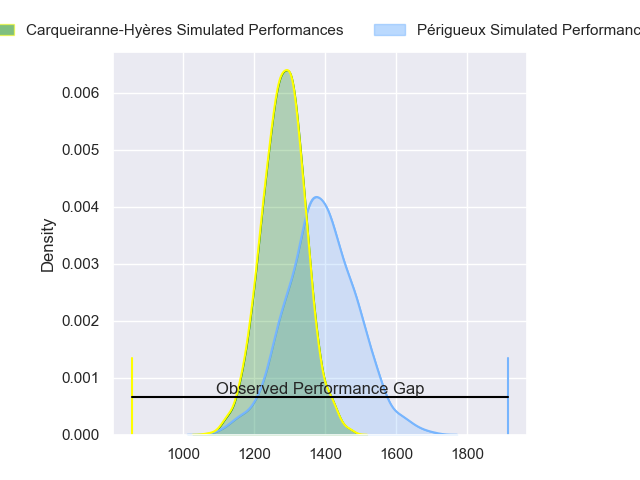
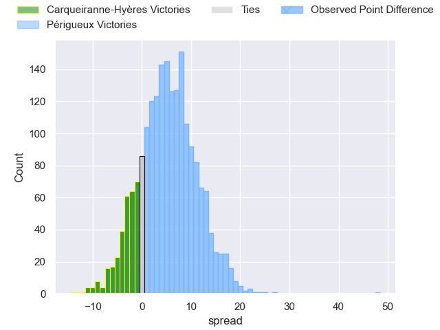
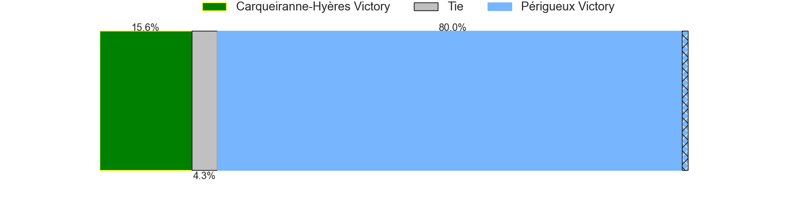
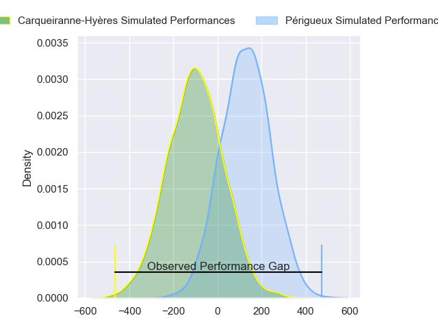
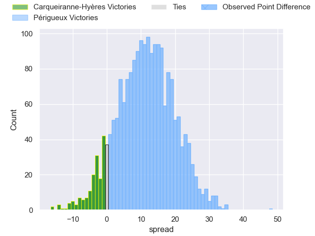
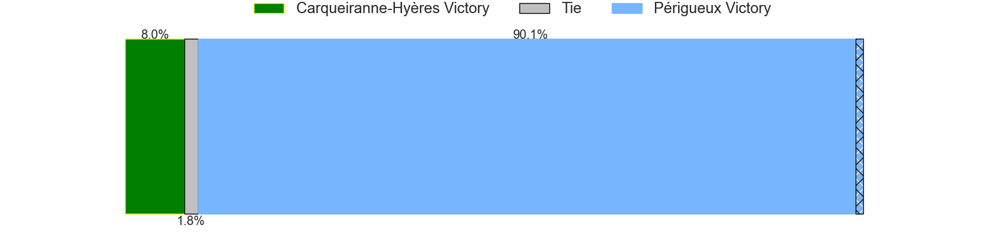

---  
layout: page  
title: Carqueiranne-Hyeres at Perigueux; 19-67  
date: 2024-04-20 18:00:00 -0500  
categories: "Nationale 2023" match review  
---
# Carqueiranne-Hyeres at Perigueux; 19-67

# Club Level Predictions

The first set of predictions treats a club as the smallest object, as the club develops its members, organizes a gameplan, and deploys its players as needed for each match. This club model has a prediction of 0.648, which translates to predicting Périgueux to win by 5.4.

Our Over/Under is 39.5 - and combined with the spread above, we have a predicted scoreline of 17 to 22

Each club has a rating and a rating deviation (similar to a Glicko rating), and expected performances can be generated. This allows for simulated matches and spreads like the ones below.
## Projected Performances - Club Model

## Projected Spreads - Club Model

## Projected Results - Club Model

# Player Level Predictions - Version 2

Treating teams instead as an entity made up of the currently active players, I have ratings for each player in an altogether different system. These can be combined to form team ratings once teamsheets are announced, weighting starters a bit higher than the reserves. After the match is played, players can be weighted by their minutes on the field, allowing for an accurate measure of the team's composition. With these compiled team ratings, we can make predictions, measure inaccuracy, and update the individual player ratings.
## Prediction without Player Minutes: Périgueux by 11.1

Périgueux by 8.6 on a neutral pitch

## Projected Performances - Player Model

## Projected Spreads - Player Model

## Projected Results - Player Model

|   Away Minutes | Away Player         |   Away Percentile |   Number |   Home Percentile | Home Player        |   Home Minutes |
|---------------:|:--------------------|------------------:|---------:|------------------:|:-------------------|---------------:|
|             40 | Eli Serra-Miglietti |              2.89 |        1 |             66.44 | Emilien Borges     |             49 |
|             71 | Theo Lachaud        |              0.2  |        2 |             54.22 | Baptiste Arvouet   |             49 |
|             46 | Thomas Lithaud      |             41.95 |        3 |             54.77 | Anthony Pelmard    |             49 |
|             62 | Josaia Cama         |             28.17 |        4 |             23.94 | Damien Lavergne    |             49 |
|             80 | Nathan Gendre       |             50.67 |        5 |             21.52 | Jaco Willemse      |             62 |
|             46 | Paul Negri          |             34.56 |        6 |             58.76 | Clement Lanen      |             80 |
|             80 | Spike Salman        |              0.95 |        7 |             87.72 | Afaesetiti Amosa   |             80 |
|             80 | Nicolas Baquer      |              1.07 |        8 |             33.67 | Karl Lambert       |             80 |
|             46 | Jérémy Fleury       |             79.49 |        9 |              9.94 | Matteo Bordenave   |             49 |
|             54 | Juan Kotze          |             30.91 |       10 |             14.81 | Yann Caillat       |             49 |
|             36 | Vincent Alessi      |              1.6  |       11 |             39.89 | Pierre Tournebize  |             80 |
|             80 | Romain Leveque      |              0.87 |       12 |             39.18 | Cyril Couturier    |             54 |
|             80 | Charles Brousse     |             53.77 |       13 |             92.95 | Vincent Fouillade  |             80 |
|             80 | Josselyn Bouchon    |              4.11 |       14 |             85.83 | Arthur Duhau       |             80 |
|             80 | Adrien Amans        |              3.82 |       15 |             54.71 | Djamel Ouchene     |             80 |
|             44 | Paul Gadea          |             92.23 |       16 |             69.61 | Greg Hutley        |             31 |
|             40 | Nassim Aanikid      |             32.02 |       17 |             36.58 | Enzo Hardy         |             31 |
|             34 | Marius Pellegrin    |             39.09 |       18 |             41.85 | Jason Tindiliere   |             31 |
|             34 | Rémi Dubié          |              4.23 |       19 |             65.54 | Mathieu Pace       |             31 |
|             34 | Miguel Mathieu      |             26.33 |       20 |             40.69 | Martin Augeix      |             31 |
|             26 | Enzo Miot           |             14.55 |       21 |            nan    | Enzo Jaubert       |             31 |
|             18 | Mattéo Beuve        |            nan    |       22 |             10.94 | Thibault Rabourdin |             26 |
|              9 | Evann Mégret        |            nan    |       23 |             16.44 | Richard Fourcade   |             18 |

