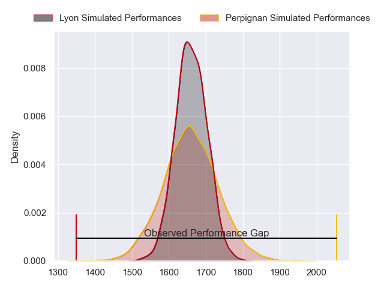
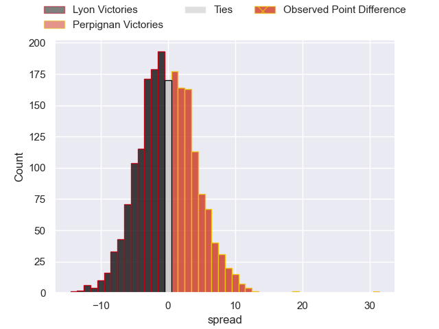
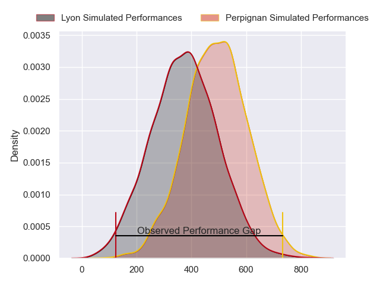
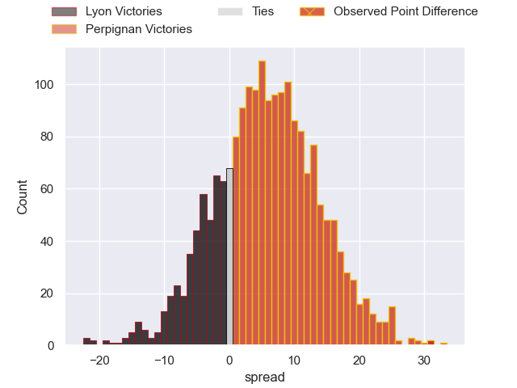
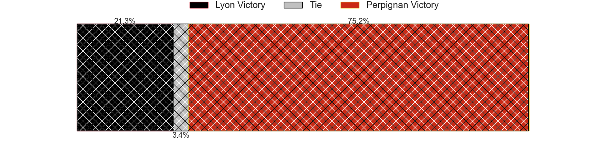

---  
layout: page  
title: Lyon at Perpignan; 20-51  
date: 2024-04-20 18:00:00 -0500  
categories: "Top 14 Orange 2023" match review  
---
# Lyon at Perpignan; 20-51

# Club Level Predictions

The first set of predictions treats a club as the smallest object, as the club develops its members, organizes a gameplan, and deploys its players as needed for each match. This club model has a prediction of 0.503, which translates to predicting Perpignan to win by 0.1.

Our Over/Under is 54.5 - and combined with the spread above, we have a predicted scoreline of 27 to 27

Each club has a rating and a rating deviation (similar to a Glicko rating), and expected performances can be generated. This allows for simulated matches and spreads like the ones below.
## Projected Performances - Club Model

## Projected Spreads - Club Model

## Projected Results - Club Model

# Player Level Predictions - Version 2

Treating teams instead as an entity made up of the currently active players, I have ratings for each player in an altogether different system. These can be combined to form team ratings once teamsheets are announced, weighting starters a bit higher than the reserves. After the match is played, players can be weighted by their minutes on the field, allowing for an accurate measure of the team's composition. With these compiled team ratings, we can make predictions, measure inaccuracy, and update the individual player ratings.
## Prediction without Player Minutes: Perpignan by 7.4

Lyon by 1.5 on a neutral pitch

## Projected Performances - Player Model

## Projected Spreads - Player Model

## Projected Results - Player Model

|   Away Minutes | Away Player        |   Away Percentile |   Number |   Home Percentile | Home Player           |   Home Minutes |
|---------------:|:-------------------|------------------:|---------:|------------------:|:----------------------|---------------:|
|             55 | Jerome Rey         |             27.29 |        1 |             67.02 | Sacha Lotrian         |             56 |
|             54 | Liam Coltman       |             83.94 |        2 |             87.15 | Ignacio Ruiz          |             70 |
|             47 | Feao Fotuaika      |             61.72 |        3 |             76.37 | Nemo Roelofse         |             51 |
|             80 | Felix Lambey       |             81.74 |        4 |             74    | Mathieu Tanguy        |             72 |
|             80 | Romain Taofifenua  |             45.47 |        5 |             48.73 | Posolo Tuilagi        |             65 |
|             73 | Mickael Guillard   |             62.34 |        6 |             81.88 | Alan Brazo            |             66 |
|             41 | Beka Saghinadze    |             83.19 |        7 |             82.72 | Jacobus van Tonder    |             79 |
|             80 | Arno Botha         |             89.27 |        8 |             92.77 | So'otala Fa'aso'o     |             59 |
|             65 | Baptiste Couilloud |             92.18 |        9 |             89.22 | Tom Ecochard          |             60 |
|             58 | Leo Berdeu         |             70.39 |       10 |             93.77 | Jake McIntyre         |             79 |
|             80 | Monty Ioane        |             97.71 |       11 |             84    | Lucas Dubois          |             80 |
|             80 | Josiah Maraku      |             16.32 |       12 |             99.38 | Jeronimo de la Fuente |             80 |
|             67 | Alfred Parisien    |             63.41 |       13 |             37.08 | Alivereti Duguivalu   |             80 |
|             80 | Vincent Rattez     |             95.31 |       14 |             86.29 | Tavite Veredamu       |             70 |
|             80 | Davit Niniashvili  |             80.92 |       15 |             73.28 | Louis Dupichot        |             80 |
|             26 | Yanis Charcosset   |             50    |       16 |            nan    | Victor Montgaillard   |             10 |
|             32 | Vivien Devisme     |             70.01 |       17 |             64.42 | Xavier Chiocci        |             24 |
|             29 | Joel Kpoku         |             61.03 |       18 |             91.17 | Marvin Orie           |             15 |
|             10 | Maxime Gouzou      |             35.66 |       19 |             85.29 | Joaquin Oviedo        |             29 |
|             15 | Martin Page-Relo   |             75.26 |       20 |             94.64 | Patrick Sobela        |             15 |
|             22 | Paddy Jackson      |             79.48 |       21 |             12.26 | Sadek Deghmache       |             21 |
|             13 | Kyle Godwin        |             62.3  |       22 |             46.11 | Apisai Naqalevu       |             10 |
|             33 | Demba Bamba        |             90.94 |       23 |             74.64 | Pietro Ceccarelli     |             29 |

