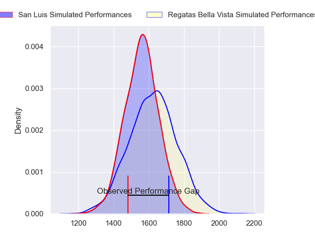
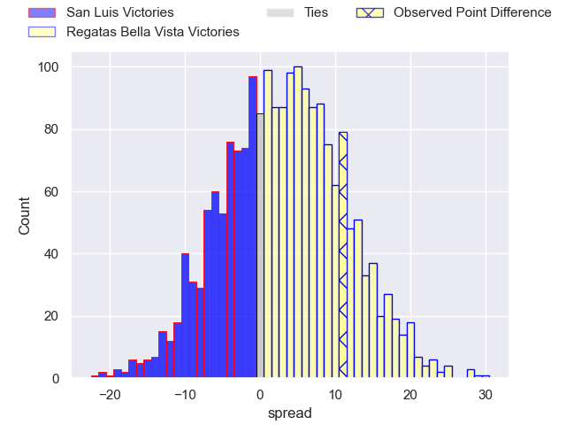
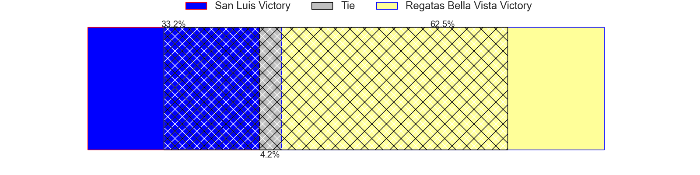
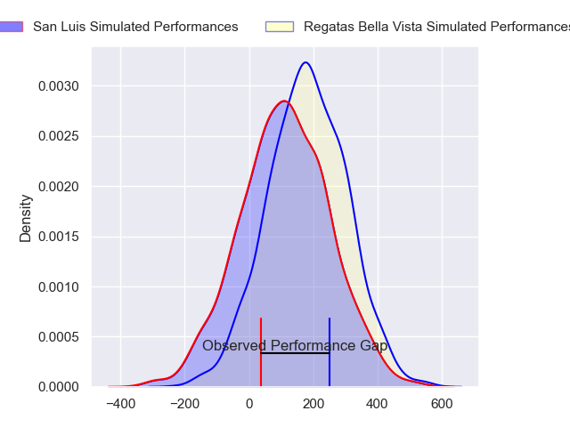
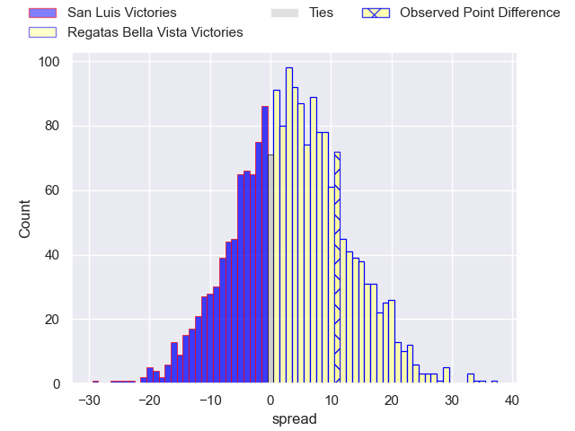
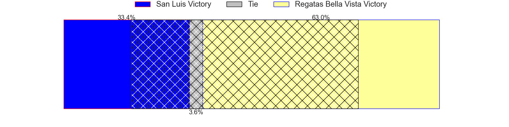

---  
layout: page  
title: San Luis at Regatas Bella Vista; 17-28  
date: 2024-04-20 18:00:00 -0500  
categories: "URBA Top 12 2024" match review  
---
# San Luis at Regatas Bella Vista; 17-28

# Club Level Predictions

The first set of predictions treats a club as the smallest object, as the club develops its members, organizes a gameplan, and deploys its players as needed for each match. This club model has a prediction of 0.586, which translates to predicting Regatas Bella Vista to win by 3.2.

Our Over/Under is 44.5 - and combined with the spread above, we have a predicted scoreline of 21 to 24

Each club has a rating and a rating deviation (similar to a Glicko rating), and expected performances can be generated. This allows for simulated matches and spreads like the ones below.
## Projected Performances - Club Model

## Projected Spreads - Club Model

## Projected Results - Club Model

# Player Level Predictions - Version 2

Treating teams instead as an entity made up of the currently active players, I have ratings for each player in an altogether different system. These can be combined to form team ratings once teamsheets are announced, weighting starters a bit higher than the reserves. After the match is played, players can be weighted by their minutes on the field, allowing for an accurate measure of the team's composition. With these compiled team ratings, we can make predictions, measure inaccuracy, and update the individual player ratings.
## Prediction without Player Minutes: Regatas Bella Vista by 3.6

San Luis by 0.0 on a neutral pitch

## Projected Performances - Player Model

## Projected Spreads - Player Model

## Projected Results - Player Model

|   Away Minutes | Away Player               |   Away Percentile |   Number |   Home Percentile | Home Player          |   Home Minutes |
|---------------:|:--------------------------|------------------:|---------:|------------------:|:---------------------|---------------:|
|             73 | Alejo Garcia              |             29.99 |        1 |             46.29 | Tomas Barbaccia      |             75 |
|             80 | Franco Cantalupo          |             36.14 |        2 |             52.21 | Pedro Colinas        |             73 |
|             80 | Mateo Calistro            |             35.49 |        3 |             49.08 | Juan Gobet           |             42 |
|             80 | Ramiro Bruni              |             37.61 |        4 |             53.2  | Tomas Sanguinetti    |             80 |
|             80 | Santiago Canal            |             39.18 |        5 |             54.66 | Valentin Sanguinetti |             80 |
|             45 | Manuel Gnecco             |             36    |        6 |             54.71 | Marcos Ferro         |             80 |
|             62 | Nahuel Curti              |             32.06 |        7 |             53.64 | Francisco Ploder     |             70 |
|             80 | Facundo Alvarez Amado     |             33.92 |        8 |             44.39 | Felipe Camerlinckx   |             80 |
|             65 | Martin Aereboe            |             36.36 |        9 |             45.03 | Marcos Joseph        |             80 |
|             80 | Isidro Lazzarini          |             28.05 |       10 |             39.48 | Juan Otsubo          |              8 |
|             80 | Segundo Galan             |             33.03 |       11 |             44.51 | Enrique Camerlinckx  |             80 |
|             80 | Guillermo Chaves Lucesole |             33.75 |       12 |             52.16 | Juan Corso           |             80 |
|             80 | Benjamin Marban           |             33.13 |       13 |             40.3  | Alejo Barrera        |             80 |
|             80 | Eduardo Ruesta            |             36    |       14 |             44.51 | Francisco Pisani     |             80 |
|             80 | Valentino Quattrocchi     |             31.04 |       15 |             36.39 | Cruz Camerlinckx     |             80 |
|              0 | Away Team 16              |            nan    |       16 |            nan    | Home Team 16         |              7 |
|              7 | Away Team 17              |            nan    |       17 |            nan    | Home Team 17         |              5 |
|              0 | Away Team 18              |            nan    |       18 |            nan    | Home Team 18         |              0 |
|             18 | Away Team 19              |            nan    |       19 |            nan    | Home Team 19         |             10 |
|             35 | Away Team 20              |            nan    |       20 |            nan    | Home Team 20         |             38 |
|             15 | Away Team 21              |            nan    |       21 |            nan    | Home Team 21         |              0 |
|              0 | Away Team 22              |            nan    |       22 |            nan    | Home Team 22         |             46 |
|              0 | Away Team 23              |            nan    |       23 |            nan    | Home Team 23         |             26 |

