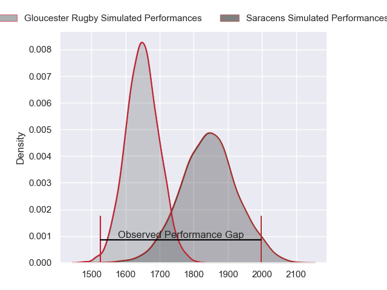
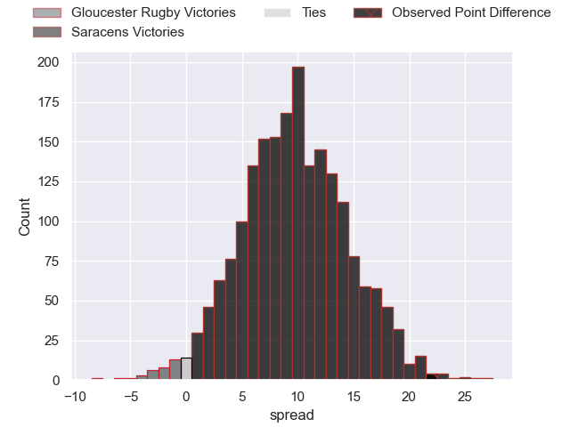
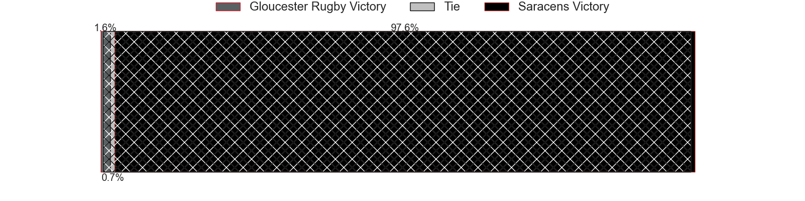
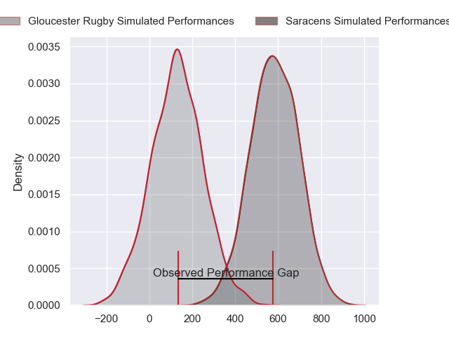
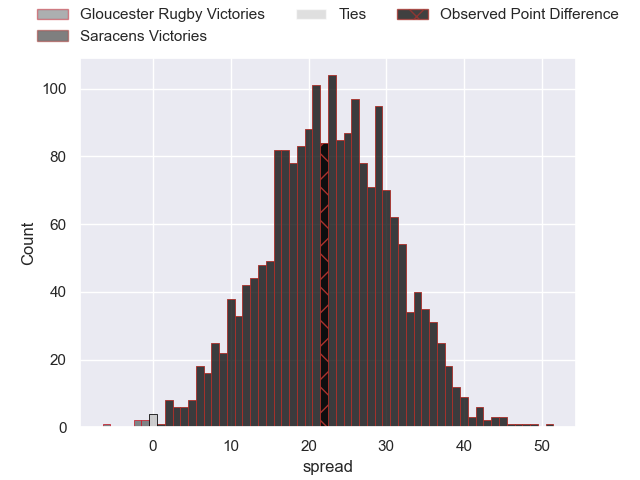
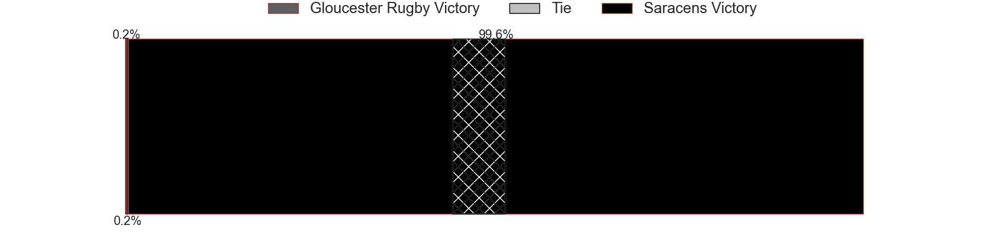

---  
layout: page  
title: Gloucester Rugby at Saracens; 24-46  
date: 2024-04-20 18:00:00 -0500  
categories: "Gallagher Premiership 2023" match review  
---
# Gloucester Rugby at Saracens; 24-46

# Club Level Predictions

The first set of predictions treats a club as the smallest object, as the club develops its members, organizes a gameplan, and deploys its players as needed for each match. This club model has a prediction of 0.747, which translates to predicting Saracens to win by 9.5.

Our Over/Under is 56.5 - and combined with the spread above, we have a predicted scoreline of 23 to 33

Each club has a rating and a rating deviation (similar to a Glicko rating), and expected performances can be generated. This allows for simulated matches and spreads like the ones below.
## Projected Performances - Club Model

## Projected Spreads - Club Model

## Projected Results - Club Model

# Player Level Predictions - Version 2

Treating teams instead as an entity made up of the currently active players, I have ratings for each player in an altogether different system. These can be combined to form team ratings once teamsheets are announced, weighting starters a bit higher than the reserves. After the match is played, players can be weighted by their minutes on the field, allowing for an accurate measure of the team's composition. With these compiled team ratings, we can make predictions, measure inaccuracy, and update the individual player ratings.
## Prediction without Player Minutes: Saracens by 24.7

Saracens by 17.8 on a neutral pitch

## Projected Performances - Player Model

## Projected Spreads - Player Model

## Projected Results - Player Model

|   Away Minutes | Away Player          |   Away Percentile |   Number |   Home Percentile | Home Player          |   Home Minutes |
|---------------:|:---------------------|------------------:|---------:|------------------:|:---------------------|---------------:|
|             41 | Mayco Vivas          |              9.64 |        1 |             99.61 | Mako Vunipola        |             51 |
|             41 | Santiago Socino      |             55.22 |        2 |             46.59 | Theo Dan             |             51 |
|             41 | Fraser Balmain       |             31.05 |        3 |             29.03 | Marco Riccioni       |             51 |
|             83 | Arthur Clark         |             41.35 |        4 |             93.83 | Maro Itoje           |             83 |
|             83 | Freddie Thomas       |             46.07 |        5 |             22.85 | Theo McFarland       |             59 |
|             53 | Albert Tuisue        |             89.75 |        6 |             91.78 | Juan Martin Gonzalez |             78 |
|             83 | Lewis Ludlow         |             42.55 |        7 |             96.07 | Ben Earl             |             83 |
|             83 | Jack Clement         |             14.9  |        8 |             19.2  | Tom Willis           |             65 |
|             53 | Caolan Englefield    |             74.21 |        9 |             73.78 | Aled Davies          |             65 |
|             83 | Charlie Atkinson     |             45.71 |       10 |             99.22 | Owen Farrell         |             59 |
|             63 | Jake Morris          |             46.74 |       11 |             89.94 | Tom Parton           |             51 |
|             61 | Sebastien Atkinson   |             34.36 |       12 |             97.03 | Nick Tompkins        |             83 |
|             83 | Louis Hillman-Cooper |             15.45 |       13 |             47.71 | Lucio Cinti          |             83 |
|             83 | Josh Hathaway        |             33.83 |       14 |             29.14 | Rotimi Segun         |             83 |
|             66 | George Barton        |             35.37 |       15 |             77.86 | Alex Goode           |             83 |
|             42 | Sebastian Blake      |             37.15 |       16 |             97.79 | Jamie George         |             32 |
|             42 | Harry Elrington      |             13.79 |       17 |             76.28 | Eroni Mawi           |             32 |
|             42 | Ciaran Knight        |            nan    |       18 |             96.43 | Oli Hoskins          |             32 |
|             30 | Danny Eite           |            nan    |       19 |             86.7  | Nick Isiekwe         |             24 |
|             17 | Robert Nixon         |            nan    |       20 |             97.76 | Billy Vunipola       |             18 |
|             30 | Charlie Chapman      |             35.73 |       21 |             14.16 | Gareth Simpson       |             18 |
|             22 | Jack Reeves          |            nan    |       22 |             43.38 | Manu Vunipola        |             24 |
|             20 | Ioan Jones           |            nan    |       23 |             34.73 | Olly Hartley         |             32 |

