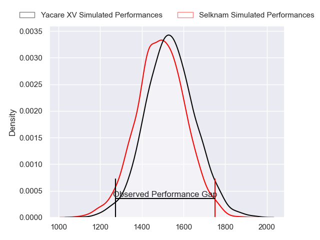
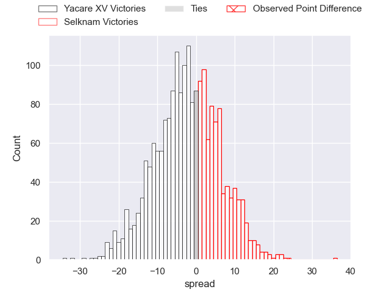
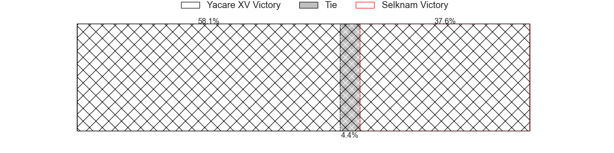
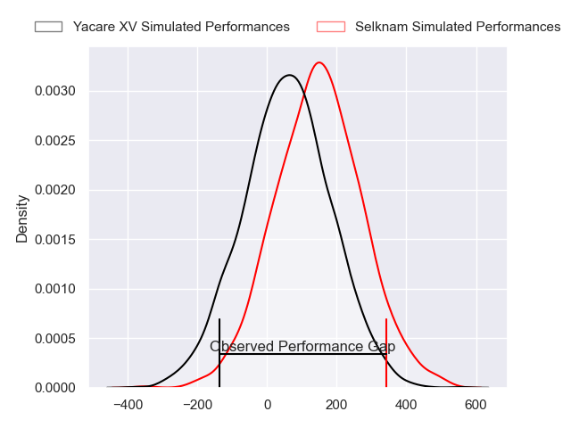
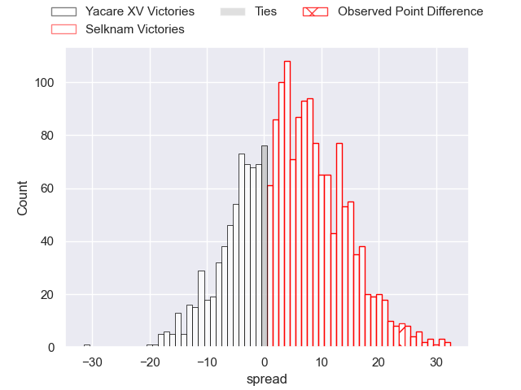
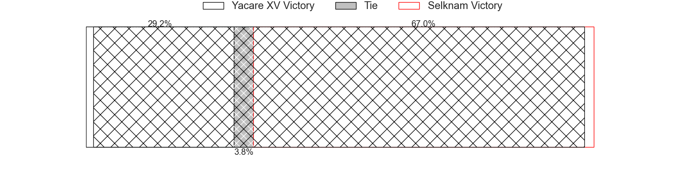

---  
layout: page  
title: Yacare XV at Selknam; 15-39  
date: 2024-04-20 18:00:00 -0500  
categories: "Super Rugby Americas 2024" match review  
---
# Yacare XV at Selknam; 15-39

# Club Level Predictions

The first set of predictions treats a club as the smallest object, as the club develops its members, organizes a gameplan, and deploys its players as needed for each match. This club model has a prediction of 0.44, which translates to predicting Yacare XV to win by 2.2.

Our Over/Under is 39.5 - and combined with the spread above, we have a predicted scoreline of 21 to 18

Each club has a rating and a rating deviation (similar to a Glicko rating), and expected performances can be generated. This allows for simulated matches and spreads like the ones below.
## Projected Performances - Club Model

## Projected Spreads - Club Model

## Projected Results - Club Model

# Player Level Predictions - Version 2

Treating teams instead as an entity made up of the currently active players, I have ratings for each player in an altogether different system. These can be combined to form team ratings once teamsheets are announced, weighting starters a bit higher than the reserves. After the match is played, players can be weighted by their minutes on the field, allowing for an accurate measure of the team's composition. With these compiled team ratings, we can make predictions, measure inaccuracy, and update the individual player ratings.
## Prediction without Player Minutes: Selknam by 4.3

Selknam by 1.9 on a neutral pitch

## Projected Performances - Player Model

## Projected Spreads - Player Model

## Projected Results - Player Model

|   Away Minutes | Away Player                 |   Away Percentile |   Number |   Home Percentile | Home Player             |   Home Minutes |
|---------------:|:----------------------------|------------------:|---------:|------------------:|:------------------------|---------------:|
|             59 | Ezequiel Reyes              |             44.74 |        1 |             44.17 | Javier Carrasco         |             70 |
|             23 | Axel Zapata                 |             15.46 |        2 |             75.3  | Diego Escobar           |             80 |
|             55 | Rolando Edgar Portillo      |             16.3  |        3 |             45.52 | Inaki Gurruchaga        |             70 |
|             50 | Ignacio Martinez            |             27.09 |        4 |             65.78 | Santiago Pedrero        |             80 |
|             80 | Mariano Garcete Elli        |             15.24 |        5 |              1.81 | Javier Eissmann         |             50 |
|             80 | Juan Cruz Perez Rachel      |             15.14 |        6 |             86.41 | Alfonso Escobar Alvarez |             80 |
|             80 | Felipe Puertas              |              4.77 |        7 |             70.56 | Clemente Saavedra       |             72 |
|             55 | Ramiro Nicolas Parada       |             17.96 |        8 |             16.46 | Raimundo Martinez       |             70 |
|             70 | Juan Cruz Strada            |             13.53 |        9 |             74.42 | Rafael Iriarte          |             64 |
|             80 | Joaquin Lamas               |             88.31 |       10 |             48.05 | Tomas Salas             |             80 |
|             13 | Ramiro Moyano               |             23.54 |       11 |             79.54 | Nicolas Garafulic Schar |             80 |
|             80 | Ramiro Amarilla             |             23.98 |       12 |             50.8  | Nicolas Saab            |             80 |
|             80 | Tomas Vanni                 |             16.69 |       13 |             41.04 | Domingo Saavedra        |             72 |
|             80 | Arturo Lopez                |             35.77 |       14 |             17.26 | Inaki Delguy            |             80 |
|             59 | Tomas McCall                |             14.5  |       15 |             68.7  | Luca Strabucchi         |             80 |
|             67 | Juan Daniel Gonzalez        |             10.06 |       16 |            nan    | Federico Albrisi        |             30 |
|             57 | Ignacio Palillo Neri        |            nan    |       17 |              2.75 | Marcelo Torrealba       |             16 |
|             30 | Lucio Anconetani            |             30.35 |       18 |            nan    | Inti Ubeda              |             10 |
|             25 | Ariel Nuñez                 |            nan    |       19 |             43.97 | Simon Donoso            |             10 |
|             25 | Rodolfo Alberto Rivadeneira |            nan    |       20 |            nan    | Baltazar Gurruchaga     |             10 |
|             21 | Camillo Blasco              |            nan    |       21 |             64.91 | Jose Ignacio Larenas    |              8 |
|             21 | Sebastian Urbieta           |             11.87 |       22 |            nan    | Santiago Edwards        |              8 |
|             10 | Gonzalo Bareiro             |            nan    |       23 |            nan    | nan                     |            nan |

