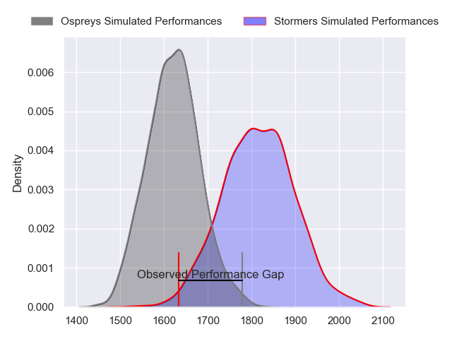
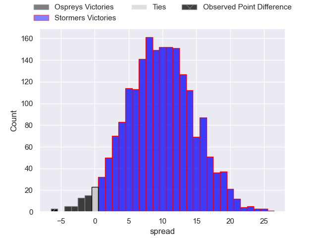
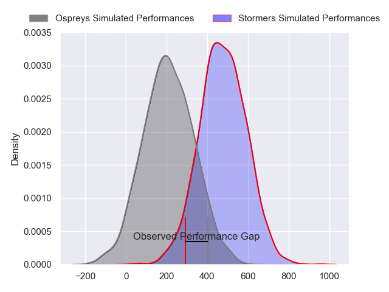
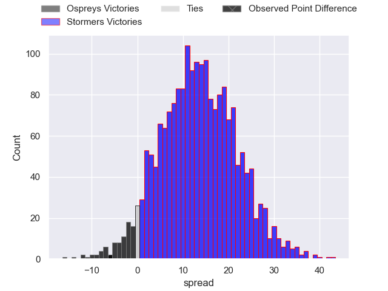
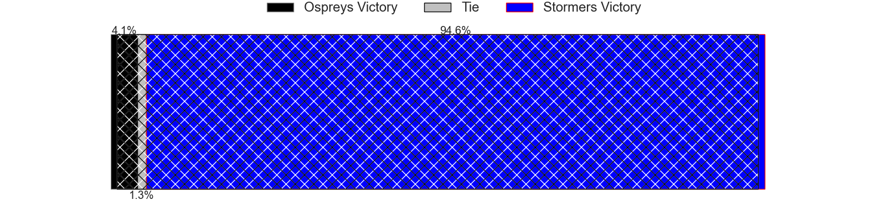

---  
layout: page  
title: Ospreys at Stormers; 27-21  
date: 2024-04-20 18:00:00 -0500  
categories: "United Rugby Championship 2023" match review  
---
# Ospreys at Stormers; 27-21

# Club Level Predictions

The first set of predictions treats a club as the smallest object, as the club develops its members, organizes a gameplan, and deploys its players as needed for each match. This club model has a prediction of 0.752, which translates to predicting Stormers to win by 9.8.

Our Over/Under is 38.5 - and combined with the spread above, we have a predicted scoreline of 15 to 24

Each club has a rating and a rating deviation (similar to a Glicko rating), and expected performances can be generated. This allows for simulated matches and spreads like the ones below.
## Projected Performances - Club Model

## Projected Spreads - Club Model

## Projected Results - Club Model

# Player Level Predictions - Version 2

Treating teams instead as an entity made up of the currently active players, I have ratings for each player in an altogether different system. These can be combined to form team ratings once teamsheets are announced, weighting starters a bit higher than the reserves. After the match is played, players can be weighted by their minutes on the field, allowing for an accurate measure of the team's composition. With these compiled team ratings, we can make predictions, measure inaccuracy, and update the individual player ratings.
## Prediction without Player Minutes: Stormers by 15.4

Stormers by 10.8 on a neutral pitch

## Projected Performances - Player Model

## Projected Spreads - Player Model

## Projected Results - Player Model

|   Away Minutes | Away Player            |   Away Percentile |   Number |   Home Percentile | Home Player          |   Home Minutes |
|---------------:|:-----------------------|------------------:|---------:|------------------:|:---------------------|---------------:|
|             65 | Nicky Smith            |             67.59 |        1 |             99.9  | Brok Harris          |             55 |
|             55 | Sam Parry              |             71.51 |        2 |             11.2  | JJ Kotze             |             61 |
|             55 | Rhys Henry             |             87.13 |        3 |             82.75 | Frans Malherbe       |             65 |
|             55 | Victor Sekekete        |             69.14 |        4 |             79.19 | Adre Smith           |             83 |
|             83 | Huw Owen-Sutton        |             66.51 |        5 |             32.89 | Gary Porter          |             48 |
|             83 | James Ratti            |             73.55 |        6 |              5.1  | Nama Xaba            |             55 |
|             73 | Harri Deaves           |             86.31 |        7 |             92.11 | Hacjivah Dayimani    |             55 |
|             83 | Morgan Morris          |             17.2  |        8 |             76.66 | Evan Roos            |             83 |
|             77 | Reuben Morgan-Williams |             76    |        9 |             19.16 | Stefan Ungerer       |             48 |
|             22 | Dan Edwards            |             61.28 |       10 |             71.03 | Manie Libbok         |             83 |
|             73 | Keelan Giles           |             18.58 |       11 |             88.29 | Ben Loader           |             83 |
|             83 | Owen Watkin            |             98.3  |       12 |             84.34 | Daniel du Plessis    |             83 |
|             83 | Keiran Williams        |             86.77 |       13 |             78.52 | Wandisile Simelane   |             55 |
|             83 | Luke Morgan            |             26.01 |       14 |             56.42 | Suleiman Hartzenberg |             83 |
|             83 | Max Nagy               |             80.95 |       15 |             96.99 | Warrick Gelant       |             83 |
|             28 | Lewis Lloyd            |             58.74 |       16 |            nan    | Scarra Ntubeni       |             22 |
|             18 | Garyn Phillips         |             65.11 |       17 |            nan    | Kwenzo Blose         |             28 |
|             28 | Ben Warren             |            nan    |       18 |            nan    | Sazi Sandi           |             18 |
|             28 | Adam Beard             |             94.74 |       19 |             75.12 | Ruben van Heerden    |             35 |
|             10 | Jeandre Rudolph        |             48.26 |       20 |             78.65 | Willie Engelbrecht   |             28 |
|              6 | Luke Davies            |             55.79 |       21 |             38.52 | Marcel Theunissen    |             28 |
|             61 | Jack Walsh             |             62.91 |       22 |             82.95 | Paul de Wet          |             35 |
|             10 | Evardi Boshoff         |              3.16 |       23 |             94.78 | Damian Willemse      |             28 |

