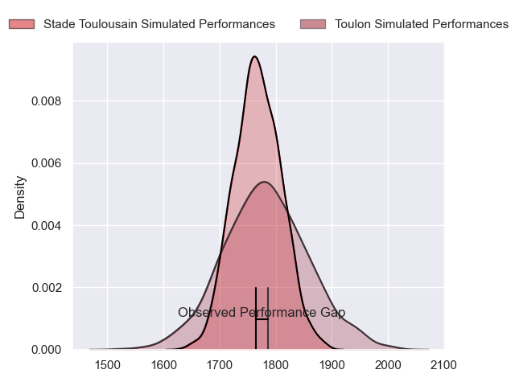
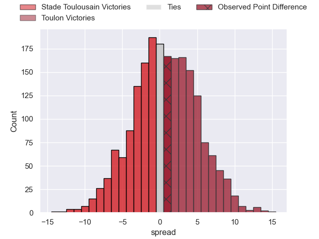
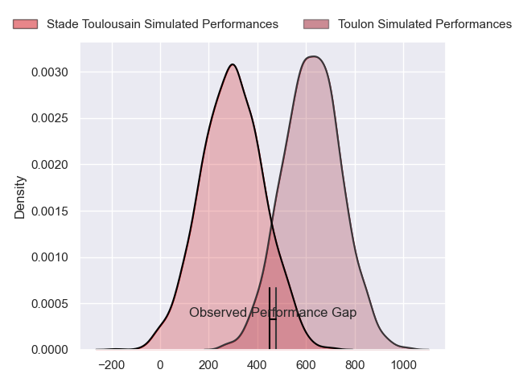
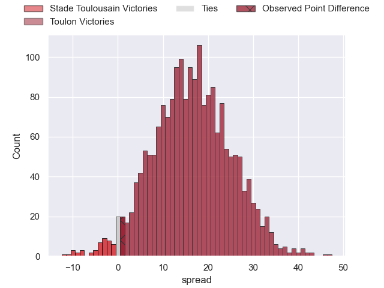
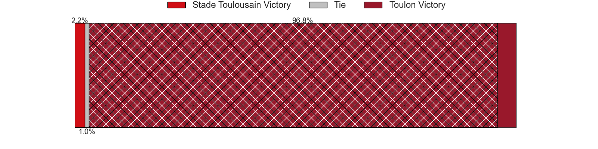

---  
layout: page  
title: Stade Toulousain at Toulon; 19-20  
date: 2024-04-20 18:00:00 -0500  
categories: "Top 14 Orange 2023" match review  
---
# Stade Toulousain at Toulon; 19-20

# Club Level Predictions

The first set of predictions treats a club as the smallest object, as the club develops its members, organizes a gameplan, and deploys its players as needed for each match. This club model has a prediction of 0.518, which translates to predicting Toulon to win by 0.6.

Our Over/Under is 40.5 - and combined with the spread above, we have a predicted scoreline of 20 to 20

Each club has a rating and a rating deviation (similar to a Glicko rating), and expected performances can be generated. This allows for simulated matches and spreads like the ones below.
## Projected Performances - Club Model

## Projected Spreads - Club Model

## Projected Results - Club Model

# Player Level Predictions - Version 2

Treating teams instead as an entity made up of the currently active players, I have ratings for each player in an altogether different system. These can be combined to form team ratings once teamsheets are announced, weighting starters a bit higher than the reserves. After the match is played, players can be weighted by their minutes on the field, allowing for an accurate measure of the team's composition. With these compiled team ratings, we can make predictions, measure inaccuracy, and update the individual player ratings.
## Prediction without Player Minutes: Toulon by 18.4

Toulon by 11.5 on a neutral pitch

## Projected Performances - Player Model

## Projected Spreads - Player Model

## Projected Results - Player Model

|   Away Minutes | Away Player         |   Away Percentile |   Number |   Home Percentile | Home Player            |   Home Minutes |
|---------------:|:--------------------|------------------:|---------:|------------------:|:-----------------------|---------------:|
|             72 | Rodrigue Neti       |             58.06 |        1 |             92.09 | Dany Priso             |             54 |
|             65 | Julien Marchand     |             99.02 |        2 |             62.67 | Teddy Baubigny         |             73 |
|             55 | David Ainu'u        |             89.04 |        3 |             69.3  | Beka Gigashvili        |             68 |
|             65 | Clement Verge       |             70.57 |        4 |             89.11 | David Ribbans          |             80 |
|             54 | Piula Fa'asalele    |             68.42 |        5 |             88.64 | Brian Alainu'uese      |             80 |
|             80 | Thibaud Flament     |             87.7  |        6 |             84.57 | Cornell du Preez       |             54 |
|             80 | Joshua Brennan      |             76.68 |        7 |             72.51 | Esteban Abadie         |             80 |
|             54 | Mathis Castro       |             64.86 |        8 |             98.28 | Charles Ollivon        |             80 |
|             71 | Paul Graou          |             45.05 |        9 |             96    | Baptiste Serin         |             72 |
|             80 | Baptiste Germain    |             10.51 |       10 |             82.31 | Paolo Garbisi          |             70 |
|             80 | Lucas Tauzin        |             77.25 |       11 |             91.22 | Gabin Villiere         |             80 |
|             80 | Santiago Chocobares |             18.08 |       12 |             79.73 | Duncan Paia'aua        |             48 |
|             65 | Sofiane Guitoune    |             96    |       13 |             92.35 | Leicester Fainga'anuku |             80 |
|             80 | Dimitri Delibes     |             76.46 |       14 |             69.48 | Seta Tuicuvu           |             80 |
|             80 | Thomas Ramos        |             95.74 |       15 |             85.71 | Melvyn Jaminet         |             80 |
|             15 | Guillaume Cramont   |             76.23 |       16 |             91.36 | Jack Singleton         |              7 |
|              8 | Benjamin Bertrand   |            nan    |       17 |             96.19 | Jean-Baptiste Gros     |             26 |
|             26 | Emmanuel Meafou     |             78.23 |       18 |             54.52 | Matteo Le Corvec       |              0 |
|             15 | Alexandre Roumat    |             93.37 |       19 |             69.62 | Swan Rebbadj           |             26 |
|             26 | Jack Willis         |             91.18 |       20 |             98.21 | Dan Biggar             |             10 |
|              9 | Arthur Retiere      |             93.92 |       21 |             80.21 | Ben White              |              8 |
|             15 | Paul Costes         |             55.46 |       22 |             88.06 | Jiuta Wainiqolo        |             32 |
|             25 | Joel Merkler        |             77.69 |       23 |             22.78 | Kieran Brookes         |             12 |

