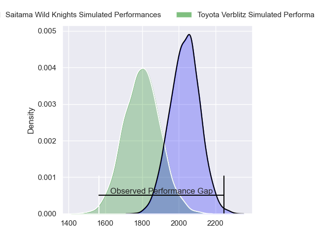
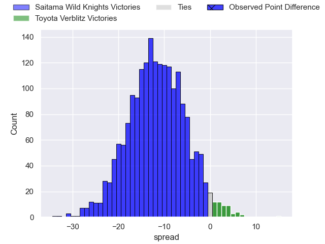
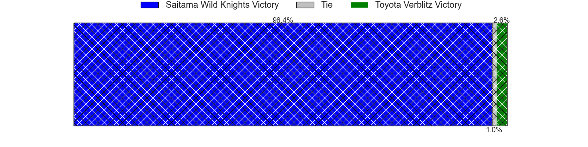
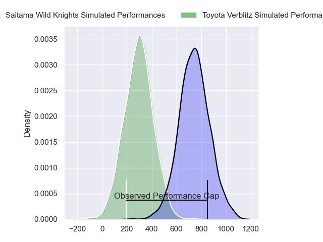
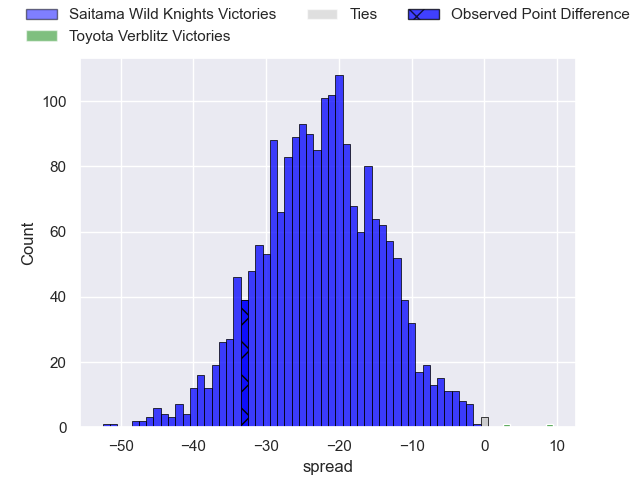
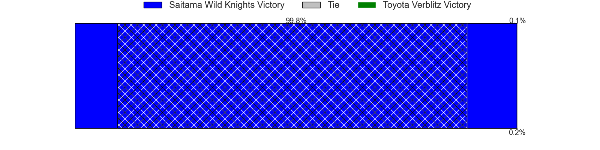

---  
layout: page  
title: Saitama Wild Knights at Toyota Verblitz; 40-7  
date: 2024-04-20 18:00:00 -0500  
categories: "Japan Rugby League One 2023" match review  
---
# Saitama Wild Knights at Toyota Verblitz; 40-7

# Club Level Predictions

The first set of predictions treats a club as the smallest object, as the club develops its members, organizes a gameplan, and deploys its players as needed for each match. This club model has a prediction of 0.212, which translates to predicting Saitama Wild Knights to win by 11.8.

Our Over/Under is 55.5 - and combined with the spread above, we have a predicted scoreline of 33 to 22

Each club has a rating and a rating deviation (similar to a Glicko rating), and expected performances can be generated. This allows for simulated matches and spreads like the ones below.
## Projected Performances - Club Model

## Projected Spreads - Club Model

## Projected Results - Club Model

# Player Level Predictions - Version 2

Treating teams instead as an entity made up of the currently active players, I have ratings for each player in an altogether different system. These can be combined to form team ratings once teamsheets are announced, weighting starters a bit higher than the reserves. After the match is played, players can be weighted by their minutes on the field, allowing for an accurate measure of the team's composition. With these compiled team ratings, we can make predictions, measure inaccuracy, and update the individual player ratings.
## Prediction without Player Minutes: Saitama Wild Knights by 20.4

Saitama Wild Knights by 23.8 on a neutral pitch

## Projected Performances - Player Model

## Projected Spreads - Player Model

## Projected Results - Player Model

|   Away Minutes | Away Player       |   Away Percentile |   Number |   Home Percentile | Home Player          |   Home Minutes |
|---------------:|:------------------|------------------:|---------:|------------------:|:---------------------|---------------:|
|             46 | Daniel Perez      |             59.98 |        1 |             91.42 | Shogo Miura          |             54 |
|             56 | Atsushi Sakate    |             88.76 |        2 |             60.04 | Ryusei Kato          |             54 |
|             46 | Taiki Fujii       |             86.89 |        3 |             87.85 | Runya Choi           |             40 |
|             80 | Jack Cornelsen    |             97.34 |        4 |             43.05 | Josh Dickson         |             80 |
|             56 | Lood de Jager     |             96.61 |        5 |             70.86 | Daichi Akiyama       |             80 |
|             61 | Ben Gunter        |             96.19 |        6 |             14.42 | Will Tupou           |             49 |
|             80 | Lachlan Boshier   |             98.69 |        7 |             69.13 | Kazuki Himeno        |             80 |
|             80 | Itsuki Onishi     |             90.52 |        8 |             83.54 | Pieter-Steph du Toit |             61 |
|             61 | Taiki Koyama      |             94.29 |        9 |             96.41 | Aaron Smith          |             49 |
|             80 | Rikiya Matsuda    |             98.7  |       10 |             99.74 | Beauden Barrett      |             80 |
|             80 | Marika Koroibete  |             94.51 |       11 |             52.34 | Yuichiro Wada        |             66 |
|             72 | Damian de Allende |             99.01 |       12 |             88.26 | Charlie Lawrence     |             49 |
|             61 | Dylan Riley       |             98.64 |       13 |              0.99 | Siosaia Fifita       |             80 |
|             80 | Koki Takeyama     |             97.6  |       14 |             58.63 | Shuhei Yamaguchi     |             80 |
|             80 | Kyohei Yamasawa   |             82.95 |       15 |             81.42 | Taichi Takahashi     |             80 |
|             34 | Craig Millar      |             73.87 |       16 |             47.16 | Yusuke Kizu          |             40 |
|             34 | Asaeli Ai Valu    |             97.49 |       17 |            nan    | Kaito Shigeno        |             31 |
|             24 | Esei Ha'angana    |             84.28 |       18 |             85.6  | Yuki Okada           |             31 |
|             24 | Shota Horie       |             96.99 |       19 |             81.64 | Isaiah Mapusua       |             31 |
|             19 | Tomoki Osada      |             69.47 |       20 |            nan    | Shunsuke Asaoka      |             26 |
|             19 | Shota Fukui       |             75.33 |       21 |            nan    | Ryuhei Arita         |             26 |
|             19 | Keisuke Uchida    |             97.89 |       22 |             57.09 | Ryusei Koike         |             19 |
|              8 | Ryuji Noguchi     |             97.2  |       23 |             83.12 | Tiaan Falcon         |             14 |

